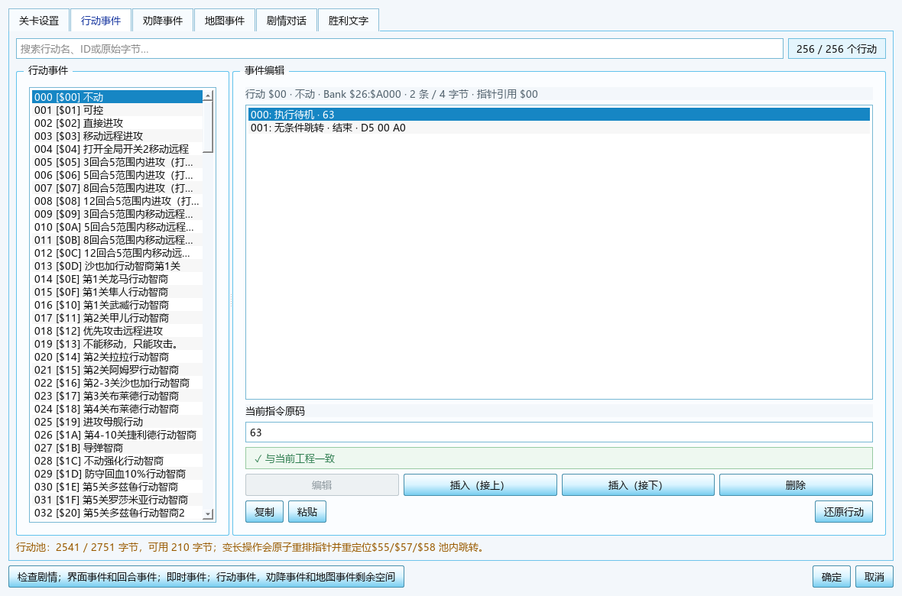
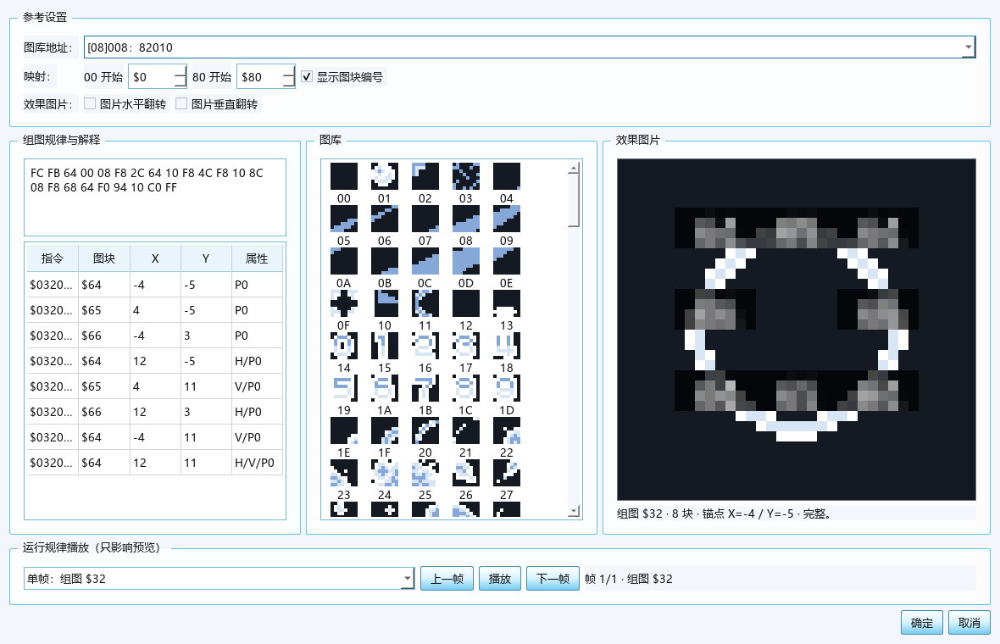

# 新DC篇完整修改器 3.0：图文使用说明

本工具用于编辑扩容后的 FC《第二次机器人大战》新 DC 篇 ROM。3.0 版恢复了参考 SRW2 修改器的窗口和操作顺序：先经过启动器，主窗口固定为战场地图，各类数据从“数据”菜单打开独立窗口；容量规划、机体包、音乐和工程验证等新功能集中在“扩展功能”或“工程”菜单。

> **安全原则（D1）：**编辑先在内存中进行；`Ctrl+S` 首次要求选择派生 ROM 文件名，不原地覆盖当前载入的基线。此后保存到所选派生文件，覆盖前先建立唯一时间戳 `.bak`；`references/` 始终只读。存档修改器仅写已由 SRAM 例程确认的槽位、校验和和活动战场字段；尚未完成地址和语义验证的旧版图像、动画及其余未知表只读显示，绝不猜测写入。

> **复刻进度：**当前版本还不是 `SRW2_patched.exe` 的全功能一比一成品。菜单或窗口存在不代表功能已经对齐；逐项状态、参考控件和验收证据见 `docs/research/legacy-modifier/SRW2一比一复刻差异矩阵.md`。

> **机体拼图操作更正：**效果图已按旧修改器改为“左键直接编辑命中图块、右键直接删除命中拼图项”；下文早期记载中的“左键替换、右键分层菜单”已废止。

> **2026-09-11 视频反馈优化：**改进地图对象联动、超容后的规划入口、数据库可读性与资源预览、剧情全局作用域/全文检索、窗口缩放与刷新性能；修正字模的真实编码，开放固定字模编辑。详细落实与仍未完成的功能见 `docs/research/legacy-modifier/视频反馈优化验收.md`。本轮没有更换 ROM 布局或音频引擎。

> **2026-09-11 截图反馈续改：**按“功能差异截图”逐项核对，补齐机体字段与配色、人物属性/精神/头像、武器特技与双方动画、战斗/系统/道具文字、成长和商店编辑；关卡设置改用实际分 Bank 指令，地图动画与规律读取真实记录，初始配置默认展示三组图标。各项容量和未完成项目以下文为准。

> **2026-09-11 全量读取补充：**“扩展功能 → 完整ROM数据读取”一次索引机体、人物、武器、地图与部署、文字、动画和关卡事件，并提供覆盖当前内存镜像每个字节的 HEX 页。数据库和属性计算器默认选中有实际数据的记录；占位槽中的 `00` 会明确显示为 ROM 原值。

> **目录调整说明：**项目按 `src/`、`tools/`、`tests/`、`output/`、`docs/` 五个核心目录整理，并独立保留 `references/`。此前的目录迁移只调整归类和调用路径；当前功能变化以本说明和本轮验收记录为准。

## 1. 启动与打开 ROM

推荐保持以下目录结构：

```text
扩容MMC3/
├─ output/
│  ├─ app/新DC篇完整修改器.exe              当前修改器
│  ├─ rom/DC_kuorong_464K.nes               推荐基线，464 KiB 托管资源池
│  ├─ patches/                               IPS 输出
│  └─ reports/rom-build/                     构建报告
└─ references/
   └─ rom/baselines/DC_kuorong.nes           兼容基线，200 KiB 托管资源池
```

单独复制 `output/app/新DC篇完整修改器.exe` 可以启动，不需要另装 Python 或 Qt；实际编辑仍需一份兼容 ROM。两个基线文件都是 1,310,736 字节，“464 KiB/200 KiB”表示可由修改器管理的扩展资源池，不是文件总大小。

开发者已配置 `.venv` 并安装开发依赖后，可直接双击项目根目录的 `打包DC修改器.bat` 重新打包。脚本调用正式 PyInstaller 流程、运行 EXE 自检，并将新 EXE、SHA-256 校验文本和修改器映射表生成到 `output/app/`。窗口显示 `[OK]` 后再使用新 EXE；显示 `[ERROR]` 时应保留完整错误输出进行排查。多人开发时应先完成代码合并，再由一人在一台电脑上生成最终成品；不要对同一 `output/app/` 并行打包。


1. 双击 `output/app/新DC篇完整修改器.exe`，先出现精简启动页；页面只显示红色“作者 断月残心”和“进入修改器”按钮。
2. 点击“进入修改器”。此时三页签工作区可见但没有关卡数据、编辑控件禁用；图块区是中性空位、画布不绘制任何地形，底部提示打开 ROM。不会暗中自动载入 ROM。
3. 按 `Ctrl+O` 或“文件 → 打开”选择 `output/rom/DC_kuorong_464K.nes`；保存时修改器会要求选择独立的派生 ROM，不覆盖推荐基线。
4. 修改器会校验 iNES 头、Mapper 和受保护 Bank；身份不符时拒绝载入。

点击进入后启动器窗口即销毁，不会作为隐藏窗口留在后台；关闭主窗口会结束修改器会话。若仍有未保存修改，修改器会先询问是否放弃。


载入成功后，关卡列表出现实际地图，图块区和画布从 ROM 的 CHR/地图数据绘制，“数据”“扩展功能”和“工程”菜单才会出现。窗口标题固定为 `SRW2扩容版修改器V1.0：<当前 ROM 绝对路径>`（全角冒号）；未保存状态只在底部状态栏显示，不再改变参考标题。数据库等窗口关闭后，只刷新当前页面，其余隐藏页面在访问时更新。

机体等记录列表在条目未增减时就地更新，不再每次暂存都清空重建；批量刷新结束后仅加载一次选中记录。带草稿跳转机体/武器时先保存目标编号，再暂存与刷新，避免读取已失效的列表项。

## 2. 主窗口：地图、初始配置与商店事件


主窗口只承载地图工作流，左侧关卡列表和右侧地图在三个页签间保持不变：

- **战场地图：**选择真实图块后在地图上绘制。左键和右键是两套独立笔刷，可分别绘制或吸取；两侧画笔预览各使用 40×40 紧凑框显示一个 32×32 单图块，不再放大到 64×64，也不会把同一图块重复平铺成 2×2。“全景适应”用于一次显示完整地图。关卡标题使用旧版游戏截图一致的宋体点阵风格和每字 40 像素单元显示；主地图页与剧情窗口共用同一渲染器。全部地图槽位会显示完整标题，不再因为通用 ROM 码表缺少“街”、数字或占位标签字符而漏字，也不会把 12×12 编辑字模机械放大成 4×4 粗块。

地图页左侧的“地图高度/地图宽度”现在可直接输入或用上下箭头调整，范围均为 1—32。尺寸变化先在当前地图草稿中重排地形格并刷新画布和 RLE 容量提示；提交前仍按该图容量、坐标及 8 KiB Bank 边界检查。高级地图数据窗口中的同名控件与主界面同步，保留前导字节等扩展操作。

- **初始配置：**三组旧修改器图标图库改为按需展开，每组两行、每行 8 个图标；收起时把空间留给部署明细，展开后的预览黑底也只覆盖图标像素区，不再形成大黑边。三组 CHR 路由随关卡加载而变化，切换关卡时地址选择器、图库预览和地图部署图标会一起切换：例如第1关为 `$34/$35/$36`，第4、5关为 `$34/$35/$3A`，后续还会使用 `$3C/$3E/$40/$44`，第28关起前两组可切为 `$46/$47`，不再把第三组错误固定为 `$3A`。敌军/客军六字节记录已按游戏真实顺序显示为“X、Y、驾驶员、机体、等级、行动”，最后一字节会用旧版行动名称（不动、直接进攻及各关专用行动等）可视化，同时保留十六进制原码；机体记录 `+2` 是四图块地图小图标的首图块编号，其中高两位选择当前关卡路由的三个槽位之一。地图直接显示敌军、客军及能由初始阵容确定的我方真实小图标，常驻阵营边框已经移除，仅以黑色底板保证透明图标在复杂地形上可见，选中时才显示黄色定位框。部署明细默认展开并可收起，显示各阵营数量、机体/人物名称、等级、行动和坐标。鼠标移到地图机体上会立即显示 ROM 中的驾驶员、人物五项补正、机体基础属性、按固定成长值或 ROM 成长曲线累计得到的当前等级属性、两件武器的射程/命中/特技/三地形火力以及行动名称，不再只显示一行简称。地图右键或双击已有机体会打开紧凑“配置设置”，可直接切换我方/敌方/客军、修改坐标、驾驶员、机体、等级、行动及我方队伍槽；右键“更改属性”会把对应机体直接定位到数据库，“加到属性计算器”会带入人物、机体与等级，“击落经验计算器”会带入敌方机体、等级和 ROM 固有经验。经验计算目前明确标为按等级比例估算，旧版特殊舍入边界未完成黄金样本验证；菜单还支持复制、剪切和粘贴。空地右键可新增三类配置，左键拖动可改坐标；“展开部署明细列表”仍保留全表批量调整。ROM 的 32 个初始配置表会逐关读取；空表明确说明单位由关卡事件生成，地图素材槽则明确说明没有独立部署记录。部署字段和参考版新增/删除结构对照已完成；固定部署槽不足时不会覆盖下一关数据，而是提示先执行容量规划。固定槽记录缩短或删除时会清零未使用尾部，避免旧部署字节残留；新增后再删除可恢复到新增前的逐字节状态。
- **商店事件：**切换到此页后，直接在地图格上右键可添加地图事件；已有紫色“事”或绿色“店”标记的格子可右键编辑、删除，同一格存在多条记录时会逐条列出。弹窗可切换“事件/商店”、选择限定人物和具体事件或商店，并允许用数值箭头微调坐标；确定、取消、删除按钮统一使用中文，删除商店时也会显示正确对象名称。双击已有标记同样直接打开该条记录；左侧列表用于定位，“打开全部事件记录”保留批量调整能力。空表明确表示该关没有记录，不是读取失败。所有改动仍先作为当前地图草稿，按“应用地图、部署与事件”后写入工程，并可撤销。

> **M03/M04 当前写入门禁：**参考版直接字段已完成逐字段保存与全新进程回读（M03 安全分母 1380，M04 为 103），新增/删除结构保存也已确认共享池与指针重排规则。正式界面现开放部署/事件表格、地图拖动、设置弹窗、增删及项目写回；固定布局容量不足时原子拒绝并提示容量规划。运行时图标路由、视口外无入口字段、参考 no-effect/forced-FF 字段仍不伪造写入；商店选择中 F0—F4 和 FF 可选，F5—FE 显示无效指针并禁选。

初始配置页的“展开机体图标库（只读）”入口始终显示在说明下方。第一关等空配置表确实由关卡事件生成单位，所以地图上没有部署机体图标；这不再影响三组图标库的查看入口。

我方四字节记录的第三项是运行时队伍槽，并非机体 ID。预览会从六组初始阵容开始，继续解释此前关卡事件中的加入、离队、换人与换机指令，重建当前关卡开场时可由 ROM 确定的槽位机体；有绑定的槽位绘制真实四图块图标，空槽不再显示误导性的数字圆点，但仍可在列表或原坐标右键编辑。机体图标不再绘制常驻阵营边框，仅选中编辑时显示临时黄色定位框。

左下支持按关卡名/ID搜索，关卡区使用较大的固定最低高度，三个页签都能看到更多关卡。缩放、全景适应、容量、草稿状态与“应用地图、部署与事件”直接显示在主界面；放大后地图可滚动。在初始配置/事件模式点击空地不会误画地形。切换关卡时，合法草稿会自动提交到本次内存会话；尺寸、坐标、容量或 Token 不合法时会阻止切换，并保留当前表单供修正。保存或输出 ROM 前也会自动尝试提交当前地图草稿。

关卡切换会复用部署下拉数据模型、地形图块、机体小图标、人物名称指针容量、成长表、说明文字和事件池解析结果；部署行减少时由 Qt 正常销毁单元格编辑器，之后需要更多行时创建新编辑器，避免复用已销毁控件。折叠的机体图标库只更新当前关卡地址，展开时才生成整页预览。修复后基准 ROM 前 12 关在本机可见离屏页面连续切换的首次平均耗时约 `0.032 秒/关`、最慢约 `0.078 秒`，反向往返平均约 `0.019 秒/关`、最慢约 `0.069 秒`；更换 ROM、名称指针表变化或从其他页面修改相关数据时，对应缓存会自动失效并重新读取，不会显示旧工程内容。

容量不够时，可从地图页“容量规划…”进入规划，超容地图草稿不会先被丢弃；返回后重新检查，再应用地图。例如默认第一关高度从 26 增加到 30 时，可先完成推荐分区，再提交扩大的地图。固定部署槽已经占满时，新增、复制或粘贴配置会在写入列表前明确显示当前/所需字节，并在紧凑配置窗口提供容量规划入口，不再留下 `154 / 148 B` 这类无法保存的部署草稿；应用扩展容量后即可继续新增。不会无提示占用其他类别的配额。

“编辑图块属性”已开放图库 A—G 的真实属性记录。颜色表1的三个 NES 色号同时显示实际色块、十六进制色号和四色组合预览；点击任一色块会展开随工具附带的 `FCEUX.pal` 完整 4×16、64 色面板，按 `$00—$0F`、`$10—$1F`、`$20—$2F`、`$30—$3F` 排列，也可在旁边直接输入色号。战场公用颜色表已由基准 ROM 的数据模板与运行时 `$0490—$049F` 双向验证：背景表为 `$0F $30 $10 $00`，颜色表2为 `$0F $30 $21 $02`，颜色表3为 `$0F $37 $27 $16`。窗口会显示颜色表2、3的真实只读四色条和完整色号；公用表不属于图库 A—G 的属性记录，所以本窗口不允许改写。旧版属性记录中的 `00/55/AA/FF` 字段会在“属性颜色表（原码）”列原样显示和写回，但参考修改器截图与模拟器游戏画面均证明它不能直接作为整个逻辑图块的预览调色板。顶部16个图库按钮、左右画笔、主地图及属性表图块缩略图因此统一按游戏内地形配色路由显示，避免草地和道路被错误染成蓝色；下拉框中的四色条只说明原码对应的颜色表，不代表左侧游戏效果缩略图必须使用该表。修改颜色表1真实色号时，实际使用该颜色组的游戏效果预览会按窗口草稿重绘，点“取消”前不会写入 ROM。每个图块仍可修改属性颜色表原码、防御补正、海属性以及空中、陆地、海上移动补正。`不能移动`、`不补正`、`补正1格`至`补正15格`分别对应已验证的 0—16 编码。应用后作为一次工程事务，可撤销/重做；“还原为打开 ROM 时的值”只恢复窗口草稿，仍需点“应用”。图库 H 没有确认到对应属性记录，因此仍为只读兼容预览。所有区域均已取消手工近似 RGB，统一使用 ROM 的真实 NES 色号。

图库 A—H 的位图0均按参考修改器与游戏画面固定使用背景表 `$0F $30 $10 $00`，在顶部图库、左右画笔、属性窗口和地图实例中显示为同一个灰阶背景块；不会再随图库主题错误显示为绿色、紫色或太空色。

部分扩展 ROM 漏写了 A—D 水面位图5的海属性最高位。工具依据旧修改器备份及一致的水面 CHR 在界面中勾选并提示，点击“应用”才补写该标志；原始解码数据保持可审计。

所有游戏内颜色预览共用同一份随程序附带的 `FCEUX.pal`，测试会逐字节检查内置 64 色表与该文件一致。地图、地图图标、机体主体、碎片和人物头像均通过这份色表显示；透明/背景索引统一按 `$0F` 处理。人物头像正面使用记录中的三个真实色号，背景层按像素索引 1/2/3 使用 `$20/$10/$00` 亮/中/深灰，合成时保留两层各自色表；通用 CHR/字模编辑器使用便于辨认位平面的工作色。

地图、部署和触发点可在容量规划后自动搬入地图分区。单条记录不能跨越一个 8 KiB PRG Bank，界面会在提交前检查边界和总配额。

## 3. “数据”菜单：参考工具的独立窗口

“数据”菜单保持参考工具的顺序和快捷键：

| 命令 | 快捷键 | 当前行为 |
|---|---:|---|
| 数据库 | `Ctrl+D` | 机体、人物、武器等六页独立窗口 |
| 文字库 | `Ctrl+W` | ROM 点阵预览、固定字模绘制/替换、保守新增编码、页/全库导入导出 |
| 地图动画 | `Ctrl+M` | 当前 ROM 动画、规律、调用位置及已验证参数编辑 |
| 文字转换 | `Ctrl+Z` | 文字与 Token 双向转换，不修改 ROM |
| 剧情事件 | `Ctrl+J` | 六页事件独立窗口 |
| 导出机体 | `Ctrl+F` | 按旧版协议批量导出 001—255 机体、每项五张 BMP |
| 导出头像 | `Ctrl+L` | 参考版不可触发，按 D2 保留为置灰入口 |
| 属性计算器 | — | 使用当前人物、机体、武器与“其他”实时公式参数计算命中、双击和伤害 |
| 存档修改器 | — | 独立打开 8 KiB SRAM，按打开→读取→写入内存→备份并保存的四阶段编辑 |
| 其他 | `Ctrl+T` | 编辑已验证的双击/伤害/命中公式、11 项道具效果和 6 组初始阵容 |

数据库和剧情事件窗口采用整窗事务：页内“暂存/应用”只是写入当前窗口会话；右下“确定”会自动提交仍未暂存的合法表单并保留全部修改，“取消”会恢复打开窗口前的 ROM 字节、资源分配和撤销历史。

### 3.1 扩展入口：完整 ROM 数据读取


打开“扩展功能 → 完整ROM数据读取”后，八个页签直接读取当前工程的内存镜像：

- “机体、人物、武器、地图与部署、文字、动画、关卡事件”按已验证边界列出全部记录，不只显示当前选中项。默认推荐 ROM 分别读取 255、199、255、100、1258、1177、8359 条；关卡事件数包含 1448 条按 256 个 ID 展开的 Bank `$26` 独立行动指令、2637 条兼容全局事件块指令和 4274 条分 Bank 关卡脚本指令。
- 每行保留 ID、文件偏移和完整原始字节；已经确认的语义同时拆成单独列。筛选框会搜索当前表的编号、名称、地址、正文和原码。
- 双击结构化表中的一行会跳到“完整 HEX”页的对应文件偏移。HEX 页覆盖当前 ROM 的全部 1,310,736 字节，并显示 iNES 头、PRG 8 KiB Bank 或 CHR 1 KiB Bank 的位置换算。
- 这是只读核对入口。原始字节已被完整读取，但没有证据的位或字节不会被猜成字段，也不会因此开放写入。保存前仍以各编辑页的校验范围为准。

### 3.2 数据库


数据库包含“机体修改、人物修改、武器修改、战斗对话、其他修改1、其他修改2”六个页签，底部统一提供查找上一个、查找下一个、确定和取消。

- 数据库首次打开会读取六个主页面及其子表；窗口关闭后会保留并复用已经解析的界面，未修改时“取消”不再重复扫描全部文字、列表和机体图像，因此随后再次打开和关闭可以立即完成。若期间从其他窗口修改了 ROM，数据库会在下次打开时自动重新同步；这项缓存不会改变“确定”保留、“取消”整窗回滚的事务规则。
- 数据库支持缩放和滚动；首次打开默认定位到人物 `$04` 和同时具有实际属性、可见机体图库的机体 `$09`，避免占位 ID 的全零值或空图库被误认为没有读取。所有占位槽仍可从左侧选择。机体页按参考工具整理为“左侧机体目录、上方紧凑战斗预览、下方基本设置/机体属性/机体武器三栏、底部全局查找与确定/取消”；在常用窗口尺寸下无需横向或纵向滚动即可看全。完整 16 字节、类型/标志原码、名称引用、外观记录摘要和机体字段地址不再占用日常界面；底层数据仍随记录读取和保存。人物页常驻显示可变长属性记录与 7 字节头像记录，武器页常驻显示 6 字节属性与名称 Token。机体页主画面使用与旧修改器一致的 128×128 方形战斗画布并放大两倍显示，不再附加横向黑边。主体以 Y=120 为基线；碎片脚本头按 `X、Y` 顺序读取，Y 从画布底边换算，并按 NES OAM 规则将可见起点下移 1 像素，与游戏内精灵位置一致；敌方碎片采用游戏的 `$78` 右侧锚点，不再整体向右偏移一个8像素图块。两层分别使用机体三色与碎片三色；“显示机体”“显示碎片”可独立核对，“机体拼图”“碎片图库”直达对应资源预览。图标区按旧版压缩为“机体图标：预览、更改图标、编辑图标”一行；“更改图标”会先选机体出现关卡，再显示该关卡动态路由的三组、共 48 个真实图标，写回路由位置值而非固定图库号；“编辑图标”可修改四块真实 CHR。默认导入/导出为旧修改器兼容的 16×16、24 位、BGR、bottom-up、无 Alpha BMP；导入时也兼容 PNG 和旧素材四色。数据库取消会回滚图标绑定和像素修改。
- 机体页会按可用宽度自动使用三栏、两栏加整行武器区或单栏布局；参考旧修改器，常见的 1525 像素宽度优先保持“基本设置、机体属性、机体武器”同排，仅在更窄窗口中换行，避免水平滚动和右侧裁切。机体类型与三个图片地址常驻可编辑；重复的“调整配色与图库…”和“原始图库、脚本与技术详情”入口已从主页移除，拼图与碎片编辑由专用按钮进入。修改器中所有可增减的整数/小数输入框统一显示加宽、高对比度的上下箭头；明确设为只读展示的尺寸框仍不显示按钮。
- 机体类型与图片地址区采用旧版对齐方式：四种机体类型使用等高下拉框，三个图片地址也使用同高、同边框的下拉选择器；每个地址项按“[十六进制图库号]三位十进制图库号: 六位文件偏移”显示，例如“[37]055: 10DC10”。常规窗口会为六位偏移和右侧箭头预留足够宽度，不再遮挡末尾字符；窄窗口仍允许框内文字省略并保持页面无横向滚动，展开列表仍显示完整地址。
- 机体主页不再显示重复的“外观记录”“机体字段”说明，也不再展示机体图标的图库、图块选择器和地址文本；这些路由值继续作为内部状态参与读取与保存。图标区按旧修改器收紧为“机体图标：预览、更改图标、编辑图标”单行。基本设置中的“名称引用与原始记录”入口已从日常界面移除，底层兼容数据仍会随记录正确保存。常用窗口宽度会优先采用基本设置、机体属性、机体武器同排布局，并缩短三组面板高度，使两件机体武器无需上下滚动即可查看。
- “机体图标设置”窗口按旧修改器改为紧凑布局：关卡和图标编号位于顶部“图标选择”区域，下方固定显示三组、每组 16 个连续黑底图标，01～48 编号单独置于图标上方；不再使用带单格大边框和滚动条的表格。当前图标只显示细红色选择框，底部按钮统一为“确定 / 取消”。切换关卡仍会按该关卡真实动态路由刷新三组图库。
- 数据库机体页同时按 Windows 125% 显示缩放验证：属性数值框、特殊技能按钮和三栏间距采用旧版紧凑宽度，在约 1220×787 逻辑像素（对应录像中的 1525×984 物理像素）下右侧详情不再生成横向滚动条；战斗预览、基本设置、全部属性和两件机体武器保持在同一屏内，不会因拖动整页左右错位。
- 机体主页的图标栏按旧修改器布局保留“机体图标：”、黑底预览和右侧纵向的“上传图标 / 更改图标”；移除多余分组边框，预览放大为 48×48，按钮与上下留白一并调整，避免图标与按钮拥挤。“上传图标”进入真实 CHR 像素与 BMP 导入导出编辑器；编辑器把 16×16 图标画布放在左侧，四色画笔紧凑纵排在右侧，当前画笔以黄框标识。导入时只接受宽、高都为 16 像素的 BMP 或 PNG，其他尺寸会显示实际宽高并拒绝写入，不再隐式拉伸。“更改图标”进入按关卡动态路由的 48 图标选择器。机体类型和三个图片地址下拉框收窄为与内容相称的旧版宽度。机体武器栏也按旧版改为每槽上方显示标签与“转到武器”，下方由武器下拉框独占整行；长武器名称和两个跳转按钮均能完整显示，整页不需要横向拖动。
- 机体、人物和武器的左侧目录支持右键操作：“复制当前记录”会记住来源，在目标 ID 上选择“粘贴到当前ID”即可复制；也可直接选择“复制到其他ID…”或“还原当前记录”。机体页把复制、粘贴、导出、导入和还原做成目录下方的常驻按钮，仍可使用原右键菜单；人物目录可直接导出当前正面/背面头像 BMP；武器没有已验证的独立导出协议，因此不显示伪导出入口。粘贴复用各页面现有的已验证字段、共享记录警告、事务和撤销机制，不复制尚未确认的隐藏语义。切换工程会自动清空复制来源，避免跨 ROM 粘贴。
- 三类数据库均可在“直接修改名称”中输入新名称。写入只使用当前名称原槽，保留原指针与相邻记录；编码后超过原槽容量会被拒绝。名称记录被多个 ID 共用时会列出全部受影响 ID 并要求确认。若还要切换“名称引用”，请分两次应用，避免误改新引用指向的共用文字。
- 机体的 16 字节属性记录也可能由多个 ID 共用。修改能力字段或使用“写入原始记录”时会列出全部受影响机体，并默认停留在“取消”；只有明确确认后才会同时写入这些共用 ID。名称与武器仍按各自的引用规则处理。
- 名称引用和原槽内直接改名，以及移动、速度、强度、防御、HP、成长、基础金钱、基础经验、特技、变形关系和两个武器槽可以编辑。机体图片区现可像旧修改器一样直接编辑“我方/敌方 × 小型/大型”四种机体类型、碎片图片地址、机体图片地址1和大型机图片地址2；调整后战斗预览立即刷新。小型机切换为大型机时，修改器会把变长的外观记录安全迁移到已验证空间，不会把第10字节写进相邻机体；之后进行机体扩容也会保留该记录。此前“升级还需”实际对应基础金钱，现已纠正标签；ROM 字节以十位为单位，界面与旧修改器、游戏效果一致地显示完整金额，例如原值 `120` 显示为 `1200`，上下箭头每次增减 `10`。基础经验为原值，游戏另行计算等级差等修正。机体特技改为可点击的组合按钮：低三位可选择无、T防御系统、相对转移装甲、VPS防御系统、重力波罩、海市蜃楼隐形系统、重力漩涡或用盾防御；`$08` 视层装甲反射、`$10` 先制攻击、`$20` 一击脱离、`$40` 异次元连接系统、`$80` 扭曲力场可继续勾选组合，因此不会破坏新DC组合值。变形下拉按旧版编码提供无、二段、三段和四段各形态，只改机体类型字节的高六位并保留地形低两位。“转到武器”会切换至武器页并定位关联武器。
- 地形选择只改低两位，保留变形标志。机体页直接显示机体与碎片各三枚大色块，色块同时显示两位十六进制 NES 色号；点击任一色块会打开与地图图块一致的 4×16、完整 64 色 NES 颜色表，选色后即时刷新战斗预览。颜色统一在数据库机体页编辑；机体拼图子窗口不再重复显示颜色控件，只读取当前六个色号生成真实预览，从而把空间完整留给参考设置、代码、图库和效果图。所有直接选色仍属于数据库事务，最后按“取消”会完整恢复。大型机有两个机体图库，小型机只有一个。记录 `+1～+3` 是机体颜色并进入运行时 `$0476～$0478`，记录 `+4～+6` 是碎片颜色并进入 `$0479～$047B`。色块和预览使用随工具附带的 `FCEUX.pal`，因此显示器上的 RGB 与 NES 色号是明确对应关系。机体拼图窗口按旧版操作顺序重排为顶部“参考设置＋主体代码编辑”、下方“图库＋效果图”；参考设置中的每个图库同时显示十六进制页号、三位十进制页号和当前 ROM 的真实文件偏移，例如 `[$37] 十进制 055 · 文件偏移 0x10DC10`。主体代码区提供“清除、8×8、7×9、9×7、10×6、查看效果”入口。图库区一次显示一个 8×8 图库；大型机勾选“调换图库拼图”后切换到机体图库2，所选图块号同步切换为 `$40—$7F`，取消勾选回到图库1的 `$00—$3F`，该开关本身不改写游戏的图库顺序。“战斗合成”页右侧先解析主体的 `F3`、`FD 20`、`F9`、原始图块和 `FF`，再解析碎片脚本的 `X/Y` 坐标、换图、位移及水平/垂直翻转指令并按精灵层叠加；友方左侧与敌方右侧基准均按旧修改器全记录对照。全部 255 个机体记录均须能完整解码。主体和碎片原始图库均可单击选择图块，右键导入 BMP、复制/粘贴/删除图块、复制/粘贴/清空图库；8×8 图片按单图块导入，标准 64×64 或 64×128 图片按图库导入，其他尺寸会自动等比压缩、以背景色居中到当前图库画布后再按当前真实 NES 四色量化，不再因尺寸不同拒绝上传。“显示图块编号”会叠加本地图块号。战斗合成画面左键会用当前所选图库图块替换命中的最上层图块，右键可明确选择替换或删除主体/碎片层；重新编码会保留全部坐标、顺序与翻转标志。“拼图脚本原码”仍允许按旧工具方式直接编辑两段十六进制脚本并先验证、刷新效果；主体可按 8×8 图块移动或清除，碎片可逐像素移动、水平/垂直翻转或清除。图库像素、图库地址和脚本全部先保存在子窗口草稿，确定时作为一次事务写入；拼图脚本会重排整个扩容资源池并更新全部指针，不会用变长脚本覆盖相邻机体。资源超出容量、出现未知指令或图库被其他窗口同时改变时会拒绝保存。子窗口确定后，数据库“取消”仍能恢复；主窗口也可撤销。碎片和物理武器仍共用图库，修改时应结合两者核对。
- 机体拼图子窗口的机体类型可直接在我方/敌方、小型/大型四种模式间编辑；由小型切换到大型时会安全迁移变长记录。“战斗合成”内嵌模块现按旧修改器的固定比例复制：左侧是 `240×480` 图库区，右侧是 `480×480` 效果区，红色横纵线标出旧版战斗原点，上下左右移动按钮环绕效果区。顶部“参考设置”只保留机体类型和主体图库地址1/2，地址下拉框内同时显示十六进制库号、三位十进制库号和文件偏移；碎片图库地址放在“碎片原始图库”页。“显示图块编号”会同时在左侧图库和右侧效果图标注真实十六进制图块号，选中框与旧版一样使用红色。效果图左键会直接打开命中的最上层 `8×8` CHR 图块编辑器，右键直接删除该拼图项；图块编辑器支持四色画笔、右键吸色、`8×8` BMP/PNG 导入、旧版 24 位 BMP 导出和还原。此子窗口的图库与合成预览固定使用旧修改器的黑、绿、蓝、浅色素材工作色，不加载当前机体的实战配色。导入单个 `8×8` BMP 只替换当前图块，不改动拼图代码；导入其他尺寸的机体 BMP 时会按原图宽高比自动选择 `8×8`、`7×9`、`9×7` 或 `10×6` 旧版布局，等比压缩并居中、分割为连续 CHR 图块，同时生成匹配的 `F3/FD 20/F9/FF` 主体拼图代码。主体页和碎片页均提供“导入BMP”和“导出BMP”；可见按钮导出当前 `64×64` 主体图库或 `64×128` 碎片图库，右键图库还可单独导出当前 `8×8` 图块；导出统一为旧版兼容的 24 位 BMP。
- 机体拼图窗口的当前正式布局以旧修改器单页为准：窗口不显示“战斗合成 / 碎片原始图库 / 拼图脚本原码”等额外页签，也不在图库下方摆放额外的整库导入、导出按钮。顶部紧凑排列“参考设置”和“代码编辑”，下方恢复旧版两块清晰边框区域：左侧依次显示图库提示、红色当前图块编号、`240×480` 图库和两个开关，右侧由四个移动按钮环绕 `480×480` 效果图；确认与取消固定在底部。数据库里的“机体拼图”和“碎片图库”分别直达各自页面，隐藏页面不会再把主体窗口撑宽。图库左键仅选择图块，右键菜单按旧版提供“导入图片、复制/粘贴/删除图块、复制/粘贴/清空图库”；效果图左键编辑命中图块、右键删除命中拼图项。单图块编辑器仍支持 `8×8` BMP 导入和旧版 24 位 BMP 导出。
- 机体拼图窗口按 Windows 125% 显示缩放进一步收缩为旧修改器的屏幕尺寸：窗口逻辑尺寸约 `690×708`，图库与效果图逻辑尺寸分别为 `192×384`、`384×384`，在 125% 屏幕上对应旧版约 `240×480`、`480×480` 的观感。编号文字改用低透明度底色，并在编号之后重新绘制清晰的半透明图块网格，所以勾选“显示图块编号”不会再吞掉边框线。该窗口的控件和画布不再显示鼠标悬浮说明或嵌入预览，避免遮挡正在核对的图块。
- 机体拼图窗口的机体类型为四项固定下拉选择，不接受自由输入；控件尺寸与图库地址框对齐并保留展开箭头。左侧主体图库把图库地址1和图库地址2各自的 8×8 图块上下连续拼接，每个图块对应 8×8 像素；大型机显示两个真实图库，小型机没有第二图库时仍保留清楚的下半页图块网格。图库与效果图网格提高了线条对比度，两块区域也使用更清楚的边框。效果图只绘制主体机体和主体图块编号，不再叠加碎片层；碎片继续由数据库中的“碎片图库”单独核对。效果图四个移动按钮使用独立通道，不覆盖预览；代码字号与快捷按钮已缩小。整个机体拼图窗口固定为 730×708，不能拖动改变大小。
- 机体图片地址下拉框在地图标题字体载入后仍保留完整地址的首选宽度，窄窗口可收缩以避免横向滚动。机体拼图窗口的当前图块编号区保持固定高度，左侧图库与右侧效果图顶部对齐。
- 参考图中的“上传机体、清除机体、上传碎片、清除碎片”已经通过上述图库草稿操作开放；它们替换的是当前已分配 CHR 图块，不会猜测或追加新的图形空间。“新增”仍保持禁用，因为新增外观记录的指针重定位关系尚未完成差分验证。“更改图标”已经按旧修改器的关卡选择、动态三图库路由和 01～48 编号接通，另提供真实 CHR 像素编辑。
- 图标绑定和机体大小类型转换已经开放；仍不支持任意拆分或追加图形空间。主体与碎片脚本编辑只在已经完成机体扩容绑定的工程中开放，以便安全重排变长记录。属性记录内的变形关系编码已经开放，但它不等于改写战斗图库大小类型。
- 人物页列出完整的 `$01—$C8` 人物槽，分别编辑目录名称和战斗名称，并开放双方战斗音乐、精神值与成长、五项修正、24 种精神及全局消耗、“击落不消失”和头像设置。两套名称指针共用 395 字节固定池，保存时会去重重排并保留其他人物文字；容量不足会在写入前拒绝并保留表单草稿。人物列表下方保留参考版“添加”入口，但当前名称、属性和头像三个固定池都没有剩余容量，所以按钮禁用并在提示中说明原因，点击不会写 ROM。`$C8` 是只有目录名称、属性和头像的保留槽，没有战斗名称或音乐选择器。头像页与原修改器一样只显示一张 64×64 合成预览，“显示正面/显示背景”可独立开关两层；可编辑图库、位置和配色，并上传 32×32 图像。属性与头像记录可能共用；勾选“同时修改共用属性记录/头像记录”后，暂存时会再次列出全部受影响人物并默认取消；头像上传会按实际 CHR 图块列出所有正面或背景使用者。精神菜单最多显示按顺序排列的前 6 项，消耗值对全部人物生效。
- “数据 → 导出机体”（`Ctrl+F`）使用 Windows 系统保存对话框选择位置。保存后在所选位置旁创建固定的 `导出的机体/` 目录，顺序导出 001—255（不含 000）共 255 个子目录；每个目录包含 `<名称>[效果].bmp`、`<名称>[机体].bmp`、`<名称>[碎片].bmp`、`<名称>[图标1].bmp`、`<名称>[图标2].bmp`。目录编号为三位十进制，使用全角冒号；246—255 即使名称为空也保留冒号。前三图为 128×128、49206 字节，后两图为 16×16、822 字节，全部为 24 位 BGR、bottom-up BMP。导出读取当前内存 ROM，不修改工程；已有 `导出的机体` 目录时会先询问，确认后只覆盖同名 BMP，不删除其他文件。
- 旧版五图协议已经对用户提供的 1275 张基准完成整文件比对：目录、文件名、BMP 头和像素全部一致。可运行 `.\.venv\Scripts\python.exe tools\verify_legacy_unit_export.py` 复核；结果写入 `output/verification/m18-unit-export-verification.json`。机体槽位 009/010 的负坐标碎片按旧版整块裁切，效果图叠加时黑色碎片像素透明，图标1按旧版 255 槽位阵营表配色。
- “数据 → 导出头像”（`Ctrl+L`）按 D2 决策保留参考版菜单位置但永久置灰，状态提示为“参考版此入口不可触发”，不会启动增强导出。头像 BMP 功能统一放在“数据库 → 人物 → 头像设置与上传”：先在人物列表选择人物，再点击“导出当前头像…”（人物列表右键菜单也提供同一命令），选择输出根目录后在 `<十进制ID>：<名称>` 子目录生成 `[背面].bmp`、`[正面].bmp` 和 `[效果].bmp`；“扩展功能”不再保留重复按钮。三张图均为 32×32、24 位、无透明通道的 BMP；正面使用人物头像记录中的三个 NES 色号，背景按像素索引 1/2/3 使用 `$20/$10/$00` 亮/中/深灰，并按各自真实图库及 4×4 图块位置导出；效果图把正面的非透明像素覆盖到背景上，两层保留各自色表。人物页按参考七字节顺序显示图库与位置：正面图库低位选择 2KB 窗口的前/后半并折算为头像1—4，背景使用独立图库的头像1—4；单幅合成预览与上传量化使用相同的分层色表。名称中的 Windows 非法路径字符会替换为下划线，任一目标文件已存在时会先询问是否覆盖。导出读取当前工程，不修改 ROM。
- `.dcunit` 机体包没有删除；它作为超集功能继续从“扩展功能 → 机体导入与CHR图像”的机体包区域导入和导出，不再占用参考版 `Ctrl+F` 入口。
- 人物页的“战斗台词绑定”包含一次/二次/三次攻击规则、攻击命中/受阻、六种防御结果和变形起飞绑定。直接台词可选择文字段 `$00/$01/$04/$05/$07` 与对话编号；特殊攻击规则可修改人物/机体条件、武器/机体条件、文字段和编号。共用同一台词记录时，提交会列出全部受影响人物并默认取消。变形绑定可添加、清空并限定机体范围，正文对应“战斗对话”页的 `05 · 防御特殊对话`；固定表最多 15 项，满容量时须先清空旧项。为保持已验证的记录边界，特殊攻击规则当前只改既有项、不增删规则。
- 武器页列出完整的 `$01—$FF` 武器槽，开放名称、特技、射程、命中、距离修正方式和三种地形攻击值，并用“我方武器动画 / 敌方武器动画 / 使用此武器的机体”三个子页签显示双方实际动画脚本和反向引用。属性指针旁会列出共用同一六字节记录的武器 ID；直接修改、复制、还原或编辑共享动画参数时，会列出全部受影响武器并默认取消。“代码编辑”展开当前敌我模式的等长十六进制编辑区；“规律”打开共用的背景、运行、组图规律与调用窗口；“动画测试”先暂存当前表单，把工作 ROM 导出到 `output/verification/weapon-animation-XX.nes`，再用随附 Mesen 启动，进入装备该武器的战斗核对实际播放。当前 `$01—$FF` 已满，参考版“添加”也不生成新武器；动画脚本继续采用既有记录的等长参数编辑。
- 武器射程和特技共用一个字节，同时修改后保存工程会保留两部分；重新打开 `.dcmod` 不会丢失特技高位。
- 武器页可反查使用它的机体，并跳回对应机体；机体页面也可直接导入/导出当前 `.dcunit` 包。包格式边界不变，不能冒充参考工具的五张 BMP 导出。
- 战斗对话按当前 ROM 的四个真实文本组和编号列出正文，随机台词另列分支；右侧可在“按列表”和“按内容”两个视图间切换，内容视图以 `++` 分隔同一记录的随机分支。选中后直接改文字并暂存，两个视图同步更新。控制 Token、F8 随机目录和未改字形的别名编码保持原样；同一物理正文的全部引用一起生效，若多个引用存在不同草稿会阻止提交。
- 战斗对话允许在同一 8 KiB Bank 的已验证安全文字段内重排：Bank `$2A` 的 00/01 组共享 5432 字节，Bank `$0E` 的 04/05 组共享 6294 字节。基准 ROM 两池都已占满，所以要增长一条文字，必须先在同一 Bank 缩短其他文字释放相同或更多字节；两个 Bank 不能互借容量。界面状态会显示当前 Bank 的占用、容量和剩余字节。提交会原子更新正文、F8 子指针和根指针表，超出总容量、单条无法放入安全段或无法编码时保留草稿并零写入；Bank `$2A` 的系统文字及 Bank `$0E` 的非文字间隙不会被当作容量。
- 系统文字和道具说明仍使用同一编辑方式，但继续限于各自原记录容量，不参与战斗对话重排。可运行 `.\.venv\Scripts\python.exe tools\report_m08_battle_text_compatibility.py` 复核安全池、别名、保护间隙、重开和超容原子拒绝；报告位于 `output/verification/m08-battle-text-compatibility.json`。
- “其他修改1”包含经验与命中补正、系统文字、成长方式三个子页。经验表显示等级 1—99 的升级阈值、当前累计和还需经验；可编辑升级阈值以及 4×16 武器距离命中补正，后一级累计经验低于前一级时会拒绝提交。成长表按编号 201—253 显示每级 0—15 的数值，“成长修改(16进制快捷修改)”可一次编辑前 60 级的 60 位十六进制串，等级 61—99 保持原值。214—253 在当前 ROM 共用一条记录，修改会同步影响共用编号；低于 201 的固定成长值在人物/机体属性中设置。当前受支持 ROM 的运行时比较指令、99 项累计经验和每条 50 字节成长记录共同确认等级上限已是 99，界面会显示真实值。旧版 3778 字节的 60→61 样本来自当前产品不支持的 `audit.nes`，不能套用；“更改等级上限”对超过 99 级的未验证重排继续禁用。可运行 `.\.venv\Scripts\python.exe tools\report_m09_other1_compatibility.py` 统一复验 4×16 命中、99 项经验、221 条系统文字、53 个成长槽、单半字节/60 位快捷编辑、214—253 共享和 99 级兼容性；报告位于 `output/verification/m09-other1-compatibility.json`，其中嵌入原 `m09-level-cap-compatibility` 结论。
- “其他修改2”按参考窗口恢复为同屏双栏：左侧“道具”面板同时显示 24 项表格、独立的名称/价格编辑框和当前道具说明；右侧“商店”面板同时显示 F0—FE 列表、商店设置和七段店员对话，不再分成三个额外子页签。选中道具后，名称、价格和说明会联动到同一记录。名称使用新 DC Token 编码并整体重排固定的 184 字节文本池，局部改名会保留未改字形的原始 Token 别名，“还原”则精确恢复指针和文本池字节；单独改价格不会触碰名称指针或文本池。价格按旧窗口显示为 ROM 原值的 10 倍，因此输入必须是 0—99990 之间且能被 10 整除。24 项价格已逐项通过参考程序“单字段修改、保存、关闭、全新进程重开”验证，确认从 `0x15723` 起按小端 `u16` 连续排列。名称无法编码、总长度超限或价格非法时会阻止“确定”。
- 有效商店可修改商品、店员和对话起始编号。当前 ROM 的 F0—F3 各有四件商品、F4 只有一件；商品数量固定，不会把后一条记录覆盖为额外商品。F5—FE 仍可在列表中查看，但其指针指向地图事件表，所以设置和对话区会禁用并显示原因。七段对话与系统文字共用记录；两页同时修改同一段时会阻止提交，先放弃一页草稿再保留另一页即可。可运行 `.\.venv\Scripts\python.exe tools\report_m10_other2_compatibility.py` 复验 24 名称/价格/说明、名称池重排和超容拒绝、F0—F4 三类单字段差分、F5—FE 禁写及 35 次店员对话无操作往返；报告位于 `output/verification/m10-other2-compatibility.json`。参考 EXE 逐字段保存黄金与用户签收仍未完成，报告通过不等于动态对齐。


切换机体、人物或武器记录时会自动暂存合法改动；非法下拉值或字段会阻止切换。即使点过暂存，只要最后按“取消”，本次数据库会话仍会整体回滚。

### 3.3 剧情事件




剧情事件窗口包含“关卡设置、行动事件、劝降事件、地图事件、剧情对话、胜利文字”六页，支持缩放。只有关卡设置和地图事件显示章节侧栏；行动与劝降为全局表，不跟随当前章节误筛选。“关卡设置”内还有“界面事件、回合事件、即时事件”三个子页。三个子页在主窗口只显示参考式反汇编列表；双击一条指令才打开等长参数/原码编辑窗口，返回后列表会同步刷新。

- 关卡设置从真实的分 Bank 指针读取三类事件，显示当前关卡的完整指令列表、文本摘要和原码。可暂存等长参数修改，保留操作码与长度边界。第一关的初始配置表为空，出击通过界面事件安排；地图上的空配置列表并非遗漏了事件部署。
- 已确认的增援、加入、阵营转换、撤退等动作只能使用等长兼容模板或等长原始字节修改，不插入、删除或重排脚本。
- 行动页直接读取 Bank `$1A:$9BC0` 的 256 项指针和 Bank `$26:$A000—$AABE` 脚本池，列表 ID/名称与默认“行动名称”配置对应。基准 ROM 去重后为 45 个有效物理脚本，使用 2541 / 2751 字节，可用 210 字节；`$03/$FF` 的真实共用指针保留。
- 行动指令可复制、粘贴为草稿、编辑，也可用“插入（接上）/插入（接下）”在当前指令前后新增一条。变长写入会原子重排整个行动池、更新 256 项指针，并重定位 `$55/$57/$58` 的池内绝对跳转；重复的单字节 `DF` 空行动只占一份物理空间。超出 2751 字节、删除后使跳转悬空、使记录越界或留下空记录时会在写入前整体拒绝。这项变长能力只对独立行动表开放，关卡设置和地图事件仍保持等长。
- 劝降页只开放 ROM 中 4 条已确认规则；其余占位槽不会伪装成可用事件。
- 剧情文本支持 Unicode 与原始 Token 无损往返。当前开放 `$32/$33/$36/$37/$38/$39/$3A/$3B` 八组共 1837 个索引；未知控制参数和未改字形的 Token 别名都按原始字节保留。`$37` 是分离指针/数据布局：`$00` 指向非文本结构并固定只读，`$01—$33` 共 51 个文本槽支持等长原位编辑；该组不自动搬移到 16 KiB 剧情扩容 pair。
- 剧情/胜利页可选择文本组、搜索完整正文；列表优先显示中文摘要，双击直接打开文字编辑。码表设置和 Token 解析默认折叠，需要时再展开。
- 关卡设置左侧“初始胜利文字”已绑定 Bank `$3D:$8000` 起的 13 条连续关卡记录，不再使用占位文案。前 13 个已验证关卡支持按当前正文字节数等容量编辑；切换关卡或点外层“确定”会自动提交合法草稿，无法编码、含提前 `FF` 结束码或改变容量时会保留输入并阻止切换。备用关卡保持明确只读。
- 直接修改 Unicode 页后，不必先点“编码到原始 Token”；切换记录或外层“确定”会自动编码并提交合法草稿，无法编码或超出容量时会阻止切换。如果 Unicode 和原始 Token 两边都改过，会先报冲突并保留两份输入；点“文字编码到Token”表示明确以 Unicode 内容为准。
- 对没有语义模板的事件指令，“结束本事件组”只切换操作码高位，其余原始字节保持不变并可撤销。
- 同一章节脚本物理指令可能同时出现在关卡设置和地图事件页；两页同时有草稿时，直接应用和外层“确定”都会在写入前报冲突，防止后一页覆盖前一页。独立行动表位于 Bank `$26`，不与这些 Bank `$1B/$1E/$1F` 章节脚本共用物理指令。
- 标题拼图预览已改为直接解析 ROM 真实图块：32 项指针表在文件 `0x16111`，每关三个 64 图块 CHR 页表在 `0x159AE`，不再用关卡列表文字模拟。因此第 1 关黑框显示的是 ROM 内实际“克鲁泽之影”，而不是列表占位名“伏击之战”。根据用户提供的原版/产品并排截图，标题像素索引 1/2/3 也应为亮→暗 `$20/$10/$00`，即 `#FCFCFC/#BCBCBC/#747474`：白色是主笔画，深灰是边缘。“代码编辑”的三页图库使用同一顺序。“代码编辑”可修改三个 CHR 页及 `FE X Y 宽度 + 两行图块 + FF` 脚本，并实时查看三页图库、分段与最终标题；当前只允许保持原记录字节数的原位写入，指针表不变。
- 底部“检查剧情；界面事件和回合事件；即时事件；行动事件，劝降事件和地图事件剩余空间”已经开放。参考 EXE 文件偏移 `0x1A0C57` 的处理器与 `0x194936` 容量函数证明点击后使用标题“提示”的消息框；产品同时按当前 ROM 的真实物理池列出八组剧情文本、界面+回合事件 Bank `$1E`、即时事件 Bank `$1B/$1F`，以及 Bank `$26` 独立行动池的占用/容量/剩余。劝降仍只报告 4 个已验证槽，地图事件仍是分 Bank 章节脚本的条件视图。检查只读，不修改 ROM；合法的窗口草稿会先按整窗事务暂存，非法草稿会阻止检查。
- 可运行 `.\.venv\Scripts\python.exe tools\report_m14_scenario_compatibility.py` 复核参考 72 控件树、96 组/4274 条分 Bank 事件、2637 条兼容全局事件、256 项独立行动表及其变长重排、4 个安全劝降槽、八组 1837 文本索引（含 `$37` 的 51 可写槽+1 只读非文本槽）、13 条初始胜利记录、32 组标题拼图和事务/撤销边界；报告位于 `output/verification/m14-scenario-compatibility.json`。`passed=true` 与 `delivery_status=implementation_complete` 表示实现侧范围闭环，仍不代表参考 EXE 动态黄金或用户验收。

### 3.4 文字库、地图动画与文字转换


文字库按 16×16 网格显示 ROM 实际字模、码表字符和地址。已修正旧版预览的错误：每个 18 字节字模是三条 4×12 竖条，每字节存两行的四位像素，0 表示前景；不是连续 144 位。文字库仍用于真实 ROM 固定字模读写；关卡标题预览采用独立的旧版标题显示路径，避免不完整通用码表造成整字缺失。

在兼容 MMC3 基线上，可左键画点、右键擦除；“写入文字”暂存当前字模，窗口底部与参考版一致只显示“确定”，按“确定”一次提交，直接关闭窗口则放弃整窗字库草稿。也可选择系统字体，将输入字符生成 12 像素预览，核对后写入；参考按钮“替换全部字体”在当前已验证安全范围内只处理选中的一页和已有单字码表映射，遇缺字时整批拒绝。普通写入只改字形，不改变码表；同一码的所有名称/剧情都会受影响。

每页有 224 个独立字模。E/F 列实际引用同一行 0 列，不可独立写；每行四个保留字节不会被清页或批量导入覆盖。“清空本页”需确认；页点阵 `.dcfont` 固定 4032 字节，按行从 0 到 D 列排列，不含 E/F 别名和行保留字节。

右键单击左侧字模网格可使用三类增强操作：导入/导出本页点阵；“自动分配新字符…”；导入/导出 `.dcfontset` 全字库。自动分配只会选“码表未占用、该 Token 在当前 ROM 全文件从未出现、18 字节字模为统一填充值”的槽，推荐 ROM 目前有 76 个，按页序和代码升序分配；已有字符、安全槽耗尽、系统字体缺字都会拒绝。新字的 18 字节字模和 Token→Unicode 映射在按“确定”时作为一个事务提交，可一起撤销/重做；映射写入 `.dcmod` 工程，文字转换和剧情文字页会共用它。ROM 本身不保存 Unicode 名称，所以只打开派生 ROM 时需同时打开原 `.dcmod`，或重新导入包含自定义映射的 `.dcfontset`。

`.dcfontset` v1 包含 12 页共 2688 个独立字模、48384 字节点阵和 UTF-8 自定义映射，导入会严格检查魔数、版本、长度、代码和值，并在完整校验后一次暂存；不包含 E/F 别名或 192 个行保留区。右键增强不增加参考版可见控件。2026-09-19 实际复核参考窗口未发现自动编码或文件导入/导出入口，因此该格式是新修改器的版本化产品协议，不宣称兼容未知的参考文件格式。可运行 `.\.venv\Scripts\python.exe tools\report_m11_font_compatibility.py` 复核，报告位于 `output/verification/m11-font-compatibility.json`。确定后仍需保存工程/派生 ROM；其他未核验 ROM 布局只读。


地图动画包含“动画、规律、调用”三个分类，直接读取当前 ROM。动画页显示真实指令、地址、共享编号和原始代码；选中指令后可修改已验证的等待、配色、图库、坐标、音乐/音效及循环次数，右键指令表可显示等长原码编辑区。“添加”会把当前动画复制到下一个 `$3F—$98` 预留槽，并把记录内循环地址重定位到副本；写入只使用当前表内已验证的 2306 字节全零池，空间或槽位不足时整项拒绝。参考按钮“代码编辑”仍按旧版动线打开“请输入动画指针”对话框；任意指针写回协议尚无黄金差分，确认输入只显示门禁说明，不修改 ROM。

规律页读取背景、运行和组图记录：已确认解释方式的运行规律可改帧、位移、音效和循环次数。组图前两字节按当前 ROM 渲染例程确认为有符号 X/Y 起点，但参考 EXE 现场采集证明这两个界面值在“确定→保存”后不会写入 ROM，冷启动仍回到原值，因此新修改器只读展示 X/Y，不提供微调按钮。组图代码当前只开放已有保存/不同 PID 重开黄金的首图块字节 `$00—$EF`；后续拼图命令、运行时令牌与记录边界保持原值。背景规律的 106 个指针槽并非统一定长记录；现已按 ROM 内 `$D3E8` 取指、`$D3F7` 分发表和 `$D4FD—$D8D9` 处理器逐项分类：75 条能完整到达唯一结束边界，其中 69 条含可编辑参数，只允许修改 `$00—$ED` 绘制数据及 `$F8/$F9` 的两个固定参数。其余 6 条完整记录没有安全参数，31 条含动态地址、运行时长度、指针换页、提前结束尾部或缺失结束边界，保持只读。操作码、资源调用、变长/运行时参数、`FE` 布局头、`FF` 结束码和指针始终锁定；即使保持总长度，也不能把控制码当普通正文改写。地图动画和三类规律的名称框可编辑；名称保存在 `.dcmod` 工程元数据中，不修改 ROM 字节或全局默认配置，只打开派生 ROM 时需同时打开对应工程才能恢复自定义名称。运行规律“添加”只使用 `$7D—$9C` 的 32 字节 `FF` 尾池：当前地图动画必须恰好一次引用所选规律，且该位置的“组图帧序列/坐标位移”角色与源项一致；复制和把该唯一引用改到副本作为一个事务执行。首次最多复制 31 字节，未引用、多次引用、角色冲突或容量不足都会拒绝。组图规律“添加”只使用未被运行规律引用的 `$EB—$F6` 可调用尾槽，在 `$B338—$B38F` 的 88 字节尾池内从后向前分配，并把 `$F7/$F8` 保留为控制操作码；保留 5 字节空组图后，首次最多复制 83 字节。调用页列出 86 个实际 `38 02 id` 位置，其中 76 个已由完整上下文或资料集地址/编号与当前 ROM 双证据核对，可更换已有动画编号；其余 10 个位置保持禁用和只读。M12 报告已为这 10 处逐条记录文件偏移、Bank/CPU 地址、邻近原码和锁定原因：`$3804A` 的参考编号与当前 ROM 冲突，`$38982` 仅对应到资料集疑似偏一字节的 `$38983`，其余位置没有地址与完整调用上下文的双重证据，均不按推测解禁。

已核对的调用下拉框可在同一窗口内连续更换编号，也可改回打开窗口时的原编号；“确定”后保存派生 ROM 并重新打开应保留最后选择。地址/原编号双证据以打开窗口时的 ROM 为准，后续每次仍检查当前调用指令和目标动画是否安全；这不会解禁其余 10 个只读调用。

原记录的操作码、可变长度字段、资源引用和跳转目标保持不变；非法或变长代码会阻止确定并保留输入。共享记录的改动会影响全部引用者。地图动画窗口使用本地草稿，动画副本、代码、调用和工程名称在“确定”时合并为一次撤销事务，“取消”不修改工程。



组图页的“动画拼图”会打开“物理拼图”：可切换真实 4 KiB CHR 预览窗口，调整 `00/80` 两段逻辑图块映射，查看 256 块图库、逐条图块地址/X/Y/调色板/水平或垂直翻转，并显示实际拼图。窗口还可选择已确认是“组图帧序列”的运行规律，逐帧、连续或循环播放；这些预览控件不写 ROM。当前 249/249 个组图记录均可完整解释，81 个帧规律中 79 个可离线完整播放；规律 `$12` 的循环次数来自运行时参数，`$21` 会切换运行时指针页，因此两项明确提示而不猜测。13 个组图使用 `$F0—$FF` 运行时图块令牌，对应块显示为未解析占位。运行/组图复制会连同引用或名称作为同一窗口事务提交并可撤销；指令体通用写回、任意通用搬移、37 条无安全参数或动态/不完整背景及其余 10 个调用仍未开放。

可运行 `.\.venv\Scripts\python.exe tools\report_m12_animation_compatibility.py` 复验六张指针表、地图/运行/组图/背景/调用的单字段差分、地图动画/运行规律/组图三类预留槽复制、非法写入拒绝、249 个物理拼图、离线播放及 10 个只读调用的逐项证据审计；报告写入 `output/verification/m12-animation-compatibility.json`。参考窗口三页签、组图首图块正向黄金与 X/Y 否定黄金汇总在 `output/verification/m12-reference-dynamic-2026-09-19.json`。报告通过代表当前安全实现范围完成，但仍不等于用户签收，其他逐字段参考黄金仍可继续补强。


文字转换使用参考修改器随附 `码表.ini` 的 2713 条非空映射（配置文件共 3328 行），控制字节 F2 按参考窗口显示为反斜杠。“文字转代码”和“代码转文字”都不会修改 ROM，适合在编辑剧情前核对 Token。打开 `.dcmod` 后，文字转换与剧情页还会叠加该工程由文字库自动分配的自定义字符；没有自定义映射时参考输出不变。ROM 编辑页仍在同一基础码表上增加换行、结束符和原始字节的可见占位符。

窗口初始尺寸为 473×483，可自由缩放；正常状态严格只保留参考窗口的两行标签、两个多行编辑框和两个 80×32 转换按钮，不显示额外状态栏或占位提示。产品当前以大写、空格分隔显示字节；无效十六进制和未编码字符不会覆盖已有结果，错误只用临时提示显示。可运行 `.\.venv\Scripts\python.exe tools\report_m13_text_conversion_compatibility.py` 复核码表、控制清单、重复字形首项编码及 ROM 零修改，报告位于 `output/verification/m13-text-conversion.json`。参考程序按钮的大小写/分隔符和非法输入动态行为仍须按 `docs/M13验收清单.md` 现场对照，不能用实现侧报告代替。

### 3.5 计算器、存档与其他


属性计算器已按参考窗口改为“敌方 / 我方”对称面板和逐行结果列表。人物下拉包含 001—200；机体下拉读取当前 ROM 的全部机体；武器下拉只显示当前机体实际装配的两个槽位，空槽显示“无”。当前推荐 ROM 会默认定位到人物 `$04`和第一台具有有效武器的机体 `$09`，装配武器为 `$07/$0B`。人物原码、精神、成长、补正与武器原码/特技/距离补正表改为下拉提示，不再挤占参考版面板。

等级只允许 1—60，切换人物、机体或等级时，按固定成长值或 201—253 成长曲线累计，再加人物强度/防御/速度/HP 补正；三项战斗数值按游戏上限 255，HP 按 9999 截断。三地形火力按参考计算器的显示值生成：`ROM 武器火力 × 当前武器乘数 + 8`；归档 C08 中的 `36/33/30` 因此显示为 `368/338/308`。如在“其他”窗口改了 M17 参数，下次“开始计算”会重新读取，不使用独立副本。

“开始计算”会分别输出我方和敌方的命中临界、最低命中速度、严格大于判定的双击边界、预计伤害、机体防御特技后实际伤害、剩余 HP 和击落次数。命中使用当前武器距离补正表的最大射程列后与 M17 临界值比较；伤害按目标机体的空/陆/海类型选用对应火力。本窗口始终只读，无确定/取消，计算不会写 ROM。两个“更改倍数”按钮按 D6 保持禁用，提示“参考版此功能损坏”；不会复刻参考版的运行时错误。实现侧机器门禁见 `output/verification/m15-attribute-calculator.json`，完整现场步骤见 `docs/M15验收清单.md`；参考 EXE 在当前自动环境需要提权，因此动态逐行对照与用户签收仍未代填。

存档修改器不依赖当前 ROM：未载入 ROM 时，“数据”菜单仍显示且只有“存档修改器”可用。窗口只接受恰好 8192 字节的 FCEUX/Mesen 电池存档；“读取存档”会检查三个固定槽位（文件偏移 `$1C81/$1D7E/$1E7B`，每槽 `$FB` 字节）及各自 16 位小端累加校验和，并以 `N：第NN关 · X人` 或 `N：没有数据` 显示摘要。关卡原码为 0—31，界面显示 01—32。

上表共 11 列，读取所选有效槽的 16 格常驻队伍；所选槽无数据时，以活动记录 `$1411` 的常驻区作为新槽模板。人物、机体、等级、机动/强度/防御/速度/HP 附加值及 EXP 均来自已确认字段；载入 ROM 时显示人物/机体名称并把附加值换算为最终属性，未载入 ROM 时名称显示十六进制 ID、属性列显示原始附加值。下表同为 11 列，读取活动战场的 18 格敌方快照；人物、等级、机动、强度、防御、速度和当前 HP 对应已确认 SRAM 数组，可编辑。活动 SRAM 不保存逐敌机体 ID 和金钱，只有当前 ROM 的关卡部署可唯一匹配时才显示推导出的机体名称与基础金钱，这两列始终只读，不会伪造写入。

“写入存档”只改内存副本：把上表写入所选槽并重算校验和，把下表写回活动战场已确认数组；此时磁盘文件不变。“保存存档文件”才原子覆盖所选 `.sav`，覆盖前在同目录建立唯一时间戳 `.bak`。表格改后未先点击“写入存档”时禁止落盘；关闭含未保存内存改动的窗口会询问保存、放弃或取消。完整现场步骤见 `docs/M16验收清单.md`；实现侧协议报告为 `output/verification/m16-save-compatibility.json`，用户签收仍需单独填写。

旧版“其他”窗口已连接下列经反汇编与三份兼容 ROM 交叉核对的字段：3 项双击公式、5 项伤害公式、命中阈值、11 项道具效果，以及 6 组“人物 / 机体”初始阵容。打开窗口时读取当前 ROM，按“确定”把全部值作为一个撤销事务写入，按“取消”不产生修改。人物和机体下拉框保留 ID 0，以便无损打开特殊或占位记录。全部数值使用 0—255；伤害公式第 3、5 项是除数，不能为 0。经参考 EXE 的 20 项单变量保存与重开实验确认，双击公式每项实际有三份运行时操作数；修改器会同步写入全部三个镜像，避免不同战斗路径取到旧值。载入时和每次写入前都会校验公式/效果立即数周边的固定 opcode、存储目标、跳转或调用目标；立即数本身是通配位，因此合法改过数值的 ROM 仍能重开，但代码上下文已移动或损坏时会拒绝写入。M17 机器门禁 `output/verification/m17-global-compatibility.json` 会同时复验 38 个物理落点、32 个逻辑字段和 33 份参考黄金用例。

M08—M18 的汇总机器门禁见 `output/verification/m08-m18-delivery-gate.json`，实现状态、每个模块的验收入口和未关闭范围集中记录在 `docs/M08-M18验收汇总.md`。

系统文字和成长方式位于数据库“其他修改1”；道具名称、价格及说明位于“其他修改2”。商店店员与对话的具体支持范围见对应页面和差异矩阵。

## 4. “扩展功能”菜单：新能力

新功能没有挤占参考工具的“数据”菜单，统一放在“扩展功能”：

| 入口 | 用途 |
|---|---|
| 完整ROM数据读取 | 七类结构化全表、文件偏移、完整原码及逐字节 HEX（只读） |
| 战斗背景音乐 | 修改双方战斗曲，导入 `$9D–$9F` 扩展曲槽 |
| 机体导入与 CHR 图像 | 导入/导出 `.dcunit`，编辑已验证的活动 CHR 图块 |
| 扩展容量规划 | 自动给地图、机体和剧情分配 Bank 并接通运行时 |
| 工程概览 | 查看 Mapper、哈希和可用资源 |
| 变更与验证 | 查看字节改动并运行完整结构检查 |

### 4.1 自动容量规划


推荐基线共有 464 KiB 托管空间。第一次需要扩展内容时，从“扩展功能 → 扩展容量规划”选择地图、机体和剧情额度，再点击“自动分区并接通”。推荐值为：

| 类别 | 推荐 | 规则 |
|---|---:|---|
| 地图 | `304 KiB` | 8 KiB 递增，共享给地形、部署和触发点 |
| 机体 | `48 KiB` | 可选 48/64/80 KiB；普通编辑选 48 KiB |
| 剧情 | `112 KiB` | 每 16 KiB 对应一个可变长文本组 |

三类配额按完整 Bank 固定边界，分配器会登记占用并禁止相互覆盖。规划完成后不需要手工填写运行时指针。`$61–$63` 是扩展音乐，`$64` 是双音频桥，`$7E–$7F` 是固定程序 Bank，均不会交给普通资源分配。

### 4.2 机体包和 CHR


`.dcunit` 当前携带 16 字节机体记录、名称引用和可选连续 CHR 图块。机体的两格独立武器表不在版本 1 包内，导入不会随包覆盖该表；导入前先核对目标 ID、共享记录提示和图块范围，再覆盖目标机体。


CHR 页提供真实 8×8 图块的放大绘制和 PNG/CHR 导入导出。NES 图块只有 0–3 四级像素索引，不自带颜色；批量导入前必须确认连续图块范围。

单块 CHR 画布属于窗口草稿：切换图块、切换图块页或按外层“确定”时会自动提交合法像素；像素值无效时阻止切换并保留原画布。CHR 和 `.dcunit` 导出会把当前合法画布直接叠加到导出内容，只在文件写入成功后提交草稿；取消文件选择或写入失败不会暗中改动 ROM。导入时会在确认后把已有合法画布作为可撤销基线保留。“取消”仍会回滚本次窗口事务。

### 4.3 战斗音乐


选择器可分别设置主动攻击曲和被攻击曲。扩展曲槽固定为 `$9D`、`$9E`、`$9F`，每槽占一个 8 KiB Bank。导入后必须运行完整检查，并在 Mesen 中验证播放、音效和切回旧曲。

“分配战斗曲”只给人物选择已有曲目，不会导入歌曲。要替换歌曲文件，展开“替换扩展曲数据 / 导入自己的曲子”；它会影响所有使用该曲槽的人物。技术导入区默认折叠，双音频引擎和导入格式不变。

## 5. 工程、撤销、验证与输出

“文件”菜单保持参考工具的打开、保存、退出命令和分隔位置；“完整ROM数据读取”已移至“扩展功能”，不再插入参考“数据”菜单：

- `Ctrl+O` 打开基线 ROM。
- `Ctrl+S` 首次要求选择派生 ROM 文件名（D1 超集安全行为）；之后继续保存到该派生文件，不再选择文件名。覆盖派生文件前自动生成不重复的时间戳 `.bak`。
- `Ctrl+Alt+S` 在“工程”菜单中执行“ROM另存为”。

`.dcmod` 工程、IPS 和构建功能位于“工程”菜单：

1. 使用“工程另存为”建立 `.dcmod`，以后按 `Ctrl+Shift+S` 保存工程。
2. 按 `F7` 打开“变更与验证”，处理全部错误；合法地图草稿会先提交，无效草稿会阻止检查并保留表单。
3. 使用“导出IPS”或 `Ctrl+B` 一键构建 ROM、IPS、工程副本和 JSON 报告。
4. 使用 `tools/vendor/mesen-0.9.9/Mesen.exe` 进入实际关卡、剧情和战斗验证。FCEUX 2.6.6 不适合验证本 1 MiB PRG Mapper 194 ROM。

所有“另存为”和资源导出操作（工程、ROM、IPS、机体包、CHR、音乐 Bank、扩展资源及字库模板）的默认目录均为 `output/exports/`。即使当前打开的是 `references/` 下的旧兼容基线，生成文件也不会默认写回只读参考目录。


输出前会再次检查 iNES 头、受保护 Bank、分区边界、运行时入口、文本容量和事件长度。有错误时不会生成正式 ROM/IPS。`references/` 内的任何路径均为只读目标；“ROM另存为”仍要求不同于当前打开的路径。覆盖已有派生 ROM 时会先建立唯一时间戳 `.bak`，连续快速保存不会覆盖前一份备份。

按 `Ctrl+Alt+Z` 撤销、`Ctrl+Alt+Y` 重做。撤销当前合法地图草稿时，修改器会先把它作为一个事务提交并立即撤销；无效草稿会被保留并阻止撤销。存在任何地图草稿时，重做会被阻止，避免清空已有重做历史。`Ctrl+Z` 保留给参考工具的“文字转换”，因此不能再作为工程撤销快捷键。

## 6. 草稿、确定与取消

- **记录切换：**机体、人物、武器、文本、事件和 CHR 图块等页面在切换记录前自动提交合法草稿。剧情窗口切换关卡或外层总览时也遵循同一规则；非法草稿会把选中项恢复到原记录。
- **地图切换：**切换关卡或保存前自动提交合法地图草稿。
- **非法输入：**长度、容量、Token、坐标或必选项不合法时，切换和“确定”会被阻止，不会悄悄丢弃表单。
- **确定：**独立数据窗口会先提交各页尚未应用的合法草稿，再保留整个窗口会话。
- **取消：**无论页内是否点过“应用/暂存”，都恢复窗口打开前状态。
- **磁盘保存：**独立数据窗口的“确定”只改变内存；仍需保存 `.dcmod` 或按 `Ctrl+S` 输出派生 ROM，当前载入的基线不原地覆盖。

## 7. 常见问题

### 进入修改器后为什么是空白

这是未载入态：三页签空壳仍可见，但关卡列表为 `0 个地图`、编辑区禁用；“文件 → 打开”和 `Ctrl+O` 仍可用。选择兼容 ROM 后，标题追加 ROM 路径、关卡列表载入，地图和数据菜单才会启用。不会为方便操作而自动打开或改写推荐基线。

### 为什么图块是空位、地图没有地形

未载入 ROM 时没有 CHR 图块和地图记录可读；旧空界面出现的一格绿色和纯色方块是占位画面，不是游戏地图，现在不再显示。打开 ROM 后应出现实际图块与关卡地形。若标题已追加 ROM 路径、关卡数大于 0，但图块仍不正确，请提供该画面的截图、ROM SHA-256、所选关卡/图库和任何错误提示，以便按同一基线逐格核对；静态截图不能证明参考版与新修改器逐像素一致。

### 为什么一些看起来完整的按钮不能点

这些按钮按参考工具保留对应布局和入口，但其 ROM 地址或联动语义尚未完成差分验证。查看 tooltip 可以看到只读原因。真实预览不代表已允许写入。

### 点“确定”后原 ROM 为什么没有变化

“确定”只保留到内存会话。按 `Ctrl+S` 首次选择一个新 `.nes` 文件，之后继续保存到该派生文件；也可用工程菜单保存 `.dcmod`。当前载入的基线和 `references/` 下的 ROM 均不会原地覆盖。

### 文本或地图为何阻止切换

先阅读错误提示。常见原因是文本组超过 16 KiB、结束 Token 缺失、地图记录跨 Bank、部署坐标越界，或尚未进行扩展容量规划。

### 输出 ROM 可以重新打开吗

可以。新 DC 扩容基线保存出的普通派生 ROM 即使没有自动容量规划表，只要固定代码认证、预留扩展区全零及完整性检查通过，也可用“文件 → 打开”或 `Ctrl+O` 在新会话中直接续改。带自动规划表的输出仍按规划布局与完整性检查重开；其他非基准哈希且无规划表的兼容 ROM、或预留区含未登记数据的 ROM 会被拒绝。普通派生 ROM 即使已经由地图页把事件表归一化到内置托管池，重开后也能继续执行首次自动容量规划；程序会先保留全部事件语义，再回收旧托管池安装扩展 Hook。若使用过高级资源分配，仍建议以原 `.dcmod` 续改，以保留资源 ID、名称和分配意图。旧版程序若弹出“只有带有效自动容量表的修改器输出 ROM 可以直接续改”，请换用本次更新的 EXE 重开；无需重复覆盖源 ROM。

## 8. 快捷键速查

| 快捷键 | 功能 |
|---|---|
| `Ctrl+O` | 打开 ROM |
| `Ctrl+S` | 首次选择派生 ROM；之后保存到该派生文件 |
| `Ctrl+D / W / M / Z / J` | 数据库 / 文字库 / 地图动画 / 文字转换 / 剧情事件 |
| `Ctrl+F / L / T` | 批量导出机体 / 置灰的参考头像入口 / 其他（增强头像导出无快捷键） |
| `Ctrl+Shift+O` | 打开 `.dcmod` 工程 |
| `Ctrl+Shift+S` | 保存 `.dcmod` 工程 |
| `Ctrl+Alt+S` | ROM 另存为 |
| `Ctrl+Alt+Z / Ctrl+Alt+Y` | 工程撤销 / 重做 |
| `Ctrl+B` | 一键构建 |
| `F7` | 完整检查 |

最后确认：载入的基线 ROM 仍在原处、派生 ROM 使用新文件名、已有派生文件的 `.bak` 可恢复、工程已保存、完整检查无错误，并已在 Mesen 中覆盖实际修改场景。`references/rom/source/新DC.nes` 是只读源素材，不能作为输出目标。对外发布时优先提供 `output/patches/` 中的 IPS、说明和 `output/reports/rom-build/` 中的报告，不直接分发可能受版权保护的 ROM。

## 9. 项目文档

目录整理不会改变 EXE、ROM、工程或快捷键的使用方式。维护与深入阅读入口如下：

- 根目录 `README.md`：项目概览、快速开始、目录结构和开发命令。
- `docs/新DC修改器已实现需求规格.md`：按需求编号汇总当前已交付能力、限制、非功能要求和验收证据。
- `docs/DC修改器设计与实现方案.md`：分层架构、功能边界和后续扩展条件。
- `docs/ROM定制修改器建设方案.md`：从本项目提炼的跨 ROM 定制修改器方法、风险分级、验证门禁和启动清单。
- `docs/research/legacy-modifier/SRW2一比一复刻差异矩阵.md`：参考 EXE 的逐功能现状、缺口和完成判据。
- `docs/提交记录.md`：已完成改动及对应验证记录。
- `output/pdf/DC修改器使用说明.pdf`：本说明书的生成版 PDF。
- `references/legacy_modifier/`：旧修改器与其配置快照，仅作逆向和交互参考，不是当前修改器源码。
