# 新DC篇完整修改器 3.0：图文使用说明

本工具用于编辑扩容后的 FC《第二次机器人大战》新 DC 篇 ROM。3.0 版恢复了参考 SRW2 修改器的窗口和操作顺序：先经过启动器，主窗口固定为战场地图，各类数据从“数据”菜单打开独立窗口；容量规划、机体包、音乐和工程验证等新功能集中在“扩展功能”或“工程”菜单。

> **安全原则（D1）：**编辑先在内存中进行；`Ctrl+S` 首次要求选择派生 ROM 文件名，不原地覆盖当前载入的基线。此后保存到所选派生文件，覆盖前先建立唯一时间戳 `.bak`；`references/` 始终只读。存档修改器仅写已由 SRAM 例程确认的槽位、校验和和活动战场字段；尚未完成地址和语义验证的旧版图像、动画及其余未知表只读显示，绝不猜测写入。

> **零经验用户入口：**随时按 `F1` 或选择“帮助 → 新手操作向导”。向导不要求理解 ROM 地址、Bank、指针或十六进制，会按“想修改什么”列出地图、部署、商店事件、机体、人物与头像、武器、剧情、字库、地图动画、存档等任务；选中任务后点“打开这个功能”即可直达对应页。尚未打开 ROM 时，仅开放“选择 ROM”和不依赖 ROM 的存档修改器，其余入口会明确显示“请先打开 ROM”。

> **复刻进度：**当前版本还不是 `SRW2_patched.exe` 的全功能一比一成品。菜单或窗口存在不代表功能已经对齐；逐项状态、参考控件和验收证据见 `docs/research/legacy-modifier/SRW2一比一复刻差异矩阵.md`。

> **机体拼图操作更正：**效果图已按旧修改器改为“左键直接编辑命中图块、右键直接删除命中拼图项”；下文早期记载中的“左键替换、右键分层菜单”已废止。

> **2026-09-11 视频反馈优化：**改进地图对象联动、超容后的规划入口、数据库可读性与资源预览、剧情全局作用域/全文检索、窗口缩放与刷新性能；修正字模的真实编码，开放固定字模编辑。详细落实与仍未完成的功能见 `docs/research/legacy-modifier/视频反馈优化验收.md`。本轮没有更换 ROM 布局或音频引擎。

> **2026-09-11 截图反馈续改：**按“功能差异截图”逐项核对，补齐机体字段与配色、人物属性/精神/头像、武器特技与双方动画、战斗/系统/道具文字、成长和商店编辑；关卡设置改用实际分 Bank 指令，地图动画与规律读取真实记录，初始配置默认展示三组图标。各项容量和未完成项目以下文为准。

> **2026-09-11 全量读取补充：**“扩展功能 → 完整ROM数据读取”一次索引机体、人物、武器、地图与部署、文字、动画和关卡事件，并提供覆盖当前内存镜像每个字节的 HEX 页。数据库和属性计算器默认选中有实际数据的记录；占位槽中的 `00` 会明确显示为 ROM 原值。

> **目录调整说明：**项目按 `src/`、`tools/`、`tests/`、`output/`、`docs/` 五个核心目录整理，并独立保留 `references/`。此前的目录迁移只调整归类和调用路径；当前功能变化以本说明和本轮验收记录为准。

## 1. 启动与打开 ROM

第一次使用只需记住五步：打开推荐 ROM → 按 `F1` 选择任务 → 在页面内选择对象并修改 → 点页面“暂存/应用”及独立窗口“确定” → 回到主窗口按 `Ctrl+S` 另存派生 ROM。这里有三级状态：页面“暂存/应用”只把当前表单交给独立窗口；独立窗口“确定”才交给主程序；`Ctrl+S` 才真正写出 `.nes` 文件。页面按钮因“没有变化”而变灰是正常状态；因容量或证据不足而受保护的入口会显示原因和安全替代路径。

为避免浏览长表格时误改数据，鼠标滚轮直接悬停在数字框或下拉框上不会改变当前值；需要用滚轮主动调整时按住 `Ctrl` 再滚动。所有模块的下拉弹层统一最多显示 10 行，超过部分使用滚动条，不再由人物、机体、武器或事件等长目录撑满屏幕。鼠标按下打开下拉后，即使保持按下并移动到其他条目再松开，也不会把悬停项误写成新值；弹层会继续保持打开，只有随后明确单击条目才会切换。点击上下箭头、键盘输入和方向键操作不受影响。

推荐保持以下目录结构：

```text
扩容MMC3/
├─ output/
│  ├─ app/新DC篇完整修改器.exe              当前修改器
│  ├─ rom/DC_kuorong_464K.nes               推荐基线，464 KiB 托管资源池
│  ├─ patches/                               IPS 输出
│  └─ reports/rom-build/                     构建报告
└─ references/
   └─ rom/baselines/DC_kuorong.nes           兼容基线，200 KiB 托管资源池
```

单独复制 `output/app/新DC篇完整修改器.exe` 可以启动，不需要另装 Python 或 Qt；实际编辑仍需一份兼容 ROM。两个基线文件都是 1,310,736 字节，“464 KiB/200 KiB”表示可由修改器管理的扩展资源池，不是文件总大小。

开发者已配置 `.venv` 并安装开发依赖后，可直接双击项目根目录的 `打包DC修改器.bat` 重新打包。脚本调用正式 PyInstaller 流程、运行 EXE 自检，并将新 EXE、SHA-256 校验文本和修改器映射表生成到 `output/app/`。窗口显示 `[OK]` 后再使用新 EXE；显示 `[ERROR]` 时应保留完整错误输出进行排查。多人开发时应先完成代码合并，再由一人在一台电脑上生成最终成品；不要对同一 `output/app/` 并行打包。


1. 双击 `output/app/新DC篇完整修改器.exe`，先出现精简启动页；页面只显示红色“作者 断月残心”和“进入修改器”按钮。
2. 点击“进入修改器”。此时三页签工作区可见但没有关卡数据、编辑控件禁用；图块区是中性空位、画布不绘制任何地形，底部提示打开 ROM。不会暗中自动载入 ROM。
3. 按 `Ctrl+O` 或“文件 → 打开”选择 `output/rom/DC_kuorong_464K.nes`；保存时修改器会要求选择独立的派生 ROM，不覆盖推荐基线。
4. 修改器会校验 iNES 头、Mapper 和受保护 Bank；身份不符时拒绝载入。

点击进入后启动器窗口即销毁，不会作为隐藏窗口留在后台；关闭主窗口会结束修改器会话。若仍有未保存修改，修改器会先询问是否放弃。

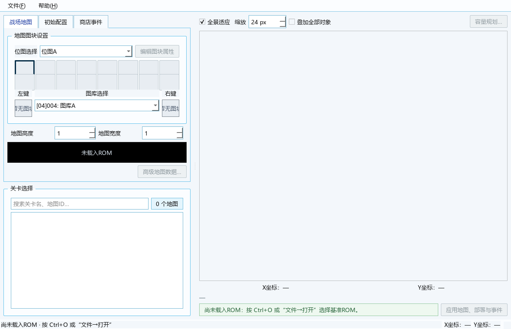

载入成功后，关卡列表出现实际地图，图块区和画布从 ROM 的 CHR/地图数据绘制，“数据”“扩展功能”和“工程”菜单才会出现。窗口标题固定为 `SRW2扩容版修改器V1.0：<当前 ROM 绝对路径>`（全角冒号）；未保存状态只在底部状态栏显示，不再改变参考标题。数据库等窗口关闭后，只刷新当前页面，其余隐藏页面在访问时更新。

机体等记录列表在条目未增减时就地更新，不再每次暂存都清空重建；批量刷新结束后仅加载一次选中记录。带草稿跳转机体/武器时先保存目标编号，再暂存与刷新，避免读取已失效的列表项。

## 2. 主窗口：地图、初始配置与商店事件

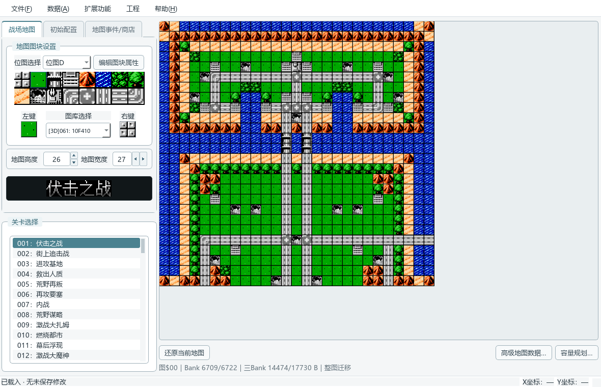

主窗口只承载地图工作流，左侧关卡列表和右侧地图在三个页签间保持不变。全局界面采用低饱和灰白底与青灰强调色：菜单、页签、分组、输入框、按钮、列表和滚动条使用统一的圆角与悬停/选中状态，减少大面积亮蓝和高反差渐变造成的视觉疲劳；各分区边框采用中等对比度，分组标题使用浅青灰标签底，当前页签增加细青灰强调线，以接近旧界面的区域辨识度而不恢复刺眼的亮蓝渐变。界面表面分为三层：窗口使用柔和灰蓝底，一级模块使用近白卡片，模块内部的分组使用浅青灰卡片，更深一层恢复更轻的近白底，因此嵌套区域不会再融成同一块背景。输入框默认近白，悬停与焦点使用渐进青灰边框；只读字段使用独立浅灰蓝底，禁用字段再降低对比度。选中按钮、列表/树表选中行、表头、进度条、滑块、分隔条和消息框也使用同一色系与明确状态。

该主题同时覆盖主窗口、数据库六页、地图三个内嵌页、剧情/行动/劝降页面、完整 ROM 数据页以及所有独立工具和编辑弹窗；树表、列表、普通表格、多行文本、禁用输入、单选/复选、分隔条、工具提示和底部按钮栏采用同一套状态颜色。弹窗中的“确定 / 保存 / 应用”自动使用青灰主按钮，“删除”类操作使用浅红危险按钮，取消保持中性，避免所有操作视觉权重相同。下拉框保留 Qt/Fusion 原生箭头，不用自定义空白按钮区遮盖；列表选中项无论是否持有键盘焦点，都统一使用深青灰底和白字。地图事件与商店未选中时仍分别保留紫色、绿色文字辨识类型，选中后不会再出现白字浅底。地图页保留旧版的原始边距、左右比例和左上对齐，不再用主题留白挤压工具区或画布；关卡列表使用 13 px 字号和 18 px 紧凑行高，在维持中文可读性的同时让同一高度多显示若干关卡。黑底像素素材仍保持原色，不因主题美化改变游戏资源。容量状态的完整悬浮详情按项目换行，避免单行提示横跨或超出修改器窗口。参考 Windows 125% DPI 下，打开 ROM 后整窗物理高度为 876 像素，与旧修改器一致：

界面验收不是只看顶层窗口：当前自动布局审计会递归渲染启动器、主窗口各状态、数据库六页、剧情六页、动画三页、ROM 浏览八页、机体拼图三态以及图标、头像、精神、条件、代码、成长、图块属性、碎片位置、武器运动等二三级弹窗，并单独保存复制/粘贴前后的机体、人物、武器右键菜单。100% 与 125% 缩放各检查 72 个可见状态；标准为无文字截断、无控件挤压、无意外横向/页面级纵向滚动条。Qt 默认英文按钮会在弹窗显示前统一转换为“确定、取消、关闭、保存、应用、是、否”等中文，但自定义动作文字保持不变。碎片位置编辑把坐标、图块号和翻转状态分成清楚的两区；武器运动模拟把宽高、X/Y、采样间隔拆成三行，不再把长标签与复选项挤在同一行。鼠标左/右键、双击、拖拽、组合键、条件启用项仍按旧版递归证据和自动回归分别验证，界面重排不改变 ROM 写入语义。

- **战场地图：**选择真实图块后在地图上绘制。左键和右键是两套独立笔刷，可分别绘制或吸取；两侧画笔预览各使用 32×32 紧凑框显示一个单图块，不再放大到 64×64，也不会把同一图块重复平铺成 2×2。“全景适应”用于一次显示完整地图。关卡标题使用旧版游戏截图一致的宋体点阵风格和每字 40 像素单元显示；主地图页与剧情窗口共用同一渲染器。全部地图槽位会显示完整标题，不再因为通用 ROM 码表缺少“街”、数字或占位标签字符而漏字，也不会把 12×12 编辑字模机械放大成 4×4 粗块。

地图页左侧的“地图高度/地图宽度”现在可直接输入或用上下箭头调整，范围均为 1—32。尺寸变化先在当前地图草稿中重排地形格并刷新画布和 RLE 容量提示。未接通扩展地图池时，地形保存完整沿用旧修改器的三级重排方式：100 张地图按编号连续编码到三个 PRG Bank；当前 Bank 放不下下一张地图时，会更新 ROM 中的两个运行时分界并把该图及后续地图级联搬到下一 Bank，同时整体更新指针。每个 Bank 可使用到已验证末尾 `$C000`，但单张地图不能跨 Bank。悬浮详情中“所在 Bank”表示当前地图经本次规划后所属 Bank 的占用，“三 Bank 合计”是三个地图 Bank 的已用/总容量之和；合计值不代表可将零散空间拼成一张跨 Bank 地图。为避免默认窗口宽度下截断，常驻行紧凑显示地图号及“`Bank`/“三 `Bank`”/“整图迁移”。推荐 ROM 初始常驻行为“图 `$00`｜`Bank 6709/6722`｜三 `Bank 14474/17730 B`｜整图迁移”；地图 `$00` 从 27 列增到 28 列时会自动把分界 `$22/$2A` 调整为 `$21/$29`，状态变为“图 `$00`｜`Bank 6453/6722`｜三 `Bank 14520/17730 B`｜整图迁移”，可直接保存。只有三级动态重排仍无法容纳时才要求容量规划。接通扩展地图池后继续显示统一共享池的已用/总容量。高级地图数据窗口中的同名控件与主界面同步，保留前导字节等扩展操作。

- **初始配置：**参考旧修改器把三组机体图标库改为常驻纵向结构：每组“图标地址下拉框在上、完整黑底图标带在下”，每条两行、每行 8 个图标；图标带本身不再弹出遮挡地图的悬浮说明。“展开/收起机体图标库”按钮和顶部初始配置介绍已移除；部署明细区域及“展开部署明细列表”按钮已移除。三组 CHR 路由随关卡加载而变化，切换关卡时地址选择器、图库预览和地图部署图标会一起切换：例如第1关为 `$34/$35/$36`，第4、5关为 `$34/$35/$3A`，后续还会使用 `$3C/$3E/$40/$44`，第28关起前两组可切为 `$46/$47`，不再把第三组错误固定为 `$3A`。敌军/客军六字节记录已按游戏真实顺序显示为“X、Y、驾驶员、机体、等级、行动”，最后一字节会用旧版行动名称（不动、直接进攻及各关专用行动等）可视化，同时保留十六进制原码；机体记录 `+2` 是四图块地图小图标的首图块编号，其中高两位选择当前关卡路由的三个槽位之一。地图直接显示敌军、客军及能由初始阵容确定的我方真实小图标，常驻阵营边框已经移除，仅以黑色底板保证透明图标在复杂地形上可见，选中时才显示黄色定位框。鼠标移到地图机体上会立即显示 ROM 中的驾驶员、人物五项补正、机体基础属性、按固定成长值或 ROM 成长曲线累计得到的当前等级属性，以及两件武器的名称、编号、射程、命中、特技、距离补正表和空/陆/海火力；空武器槽明确显示“无”。敌军/客军继续显示 ROM 行动名称，我方单位固定显示“行动：玩家自控”。地图右键菜单现按旧修改器顺序显示“添加配置 / 更改配置 / 更改属性 / 计算器 / 复制剪切粘贴 / 删除配置”；空地右键时只启用“添加配置”，若此前已经复制或剪切配置则同时启用“粘贴”，其他项目使用浅灰文字和灰色行底明确置灰；可用项目保持黑字白底，右键命中已配置单位后才启用该单位相关操作。“添加配置”不再先弹敌军、客军、我方三级子菜单，而是直接打开“配置设置”，再在窗口内选择类型。配置窗口采用旧版紧凑布局：类型单独一组，机师/机体与等级/行动各自并排，我方机组编号单列，确认按钮使用“确定”；机师和机体项恢复为 `[十六进制]十进制: 名称`，并按参考版映射只列出 `01—FF`，不会把通用名称服务中的 00 哨兵误当作可部署人物或机体。新增敌军/客军默认使用 01；若打开由旧产品版本产生的非法 00 记录，必须重新选择有效编号后才能确定。等级恢复为下拉项，不再固定生成 1—255，而是在每次打开窗口时调用当前工程的等级布局验证；推荐 ROM 由运行时比较指令、99 项经验表和 50 字节成长记录共同确认上限为 99，因此只显示 1—99。正常编辑时不再常驻说明文字和容量规划按钮；只有容量真的不足时才展开错误说明及容量规划入口。双击已有机体同样直接打开该窗口；右键“更改属性”会把对应机体直接定位到数据库，“加到属性计算器”会带入人物、机体与等级，“击杀经验计算器”会带入敌方机体、等级和 ROM 固有经验。经验计算目前明确标为按等级比例估算，旧版特殊舍入边界未完成黄金样本验证。左键拖动可改坐标；主界面的“编辑 / 添加 / 复制”按钮直接操作地图部署，不再打开部署明细大窗口。ROM 的 32 个初始配置表会逐关读取；空表明确说明单位由关卡事件生成，地图素材槽则明确说明没有独立部署记录。部署字段和参考版新增/删除结构对照已完成；保存时像旧修改器一样把 32 关记录按关卡顺序去重并整池重排，不再把相邻指针差误当成本关固定槽。推荐 ROM 的 32 关部署正文当前占用 1236 B；在 Bank `$24` 前七类资源不增长时，部署正文从 `$A455` 到下一段加载程序前 `$BF40` 的当前条件上限为 6891 B。这个 6891 B 不是部署独占池：Bank `$24` 的人物属性、机体属性、武器属性、真实姓名、战斗名称、机体名称、武器名称和初始配置八类资源整体还剩 5655 B。`$A940` 只是原始正文末尾和扩容 Hook 位置，并非容量上限。页签底部因此显示“本关字节｜部署正文占用｜Bank `$24` 共享余量”，悬浮说明另列“其他七项不变时”的当前部署上限；不再用 `1236/6891 B` 暗示部署独占 6891 B。整体剩余量耗尽时才原子拒绝并引导容量规划。新增后再删除可恢复到新增前的逐字节状态。
- **地图事件/商店：**地图上的地图事件和商店入口采用参考修改器的白底红字标牌，分别显示“事”和“商”；左侧列表继续用紫色/绿色底色区分类型。地图右键菜单分别提供“添加地图事件”和“添加商店入口”，已有记录的编辑、删除文字也会明确指出对象；双击已有标记同样可以编辑。左侧事件/商店列表也支持右键：右键命中的条目会先完成列表、内部记录和地图标记的联动选中，再按实际类型提供“编辑地图事件/商店入口”和“删除地图事件/商店入口”。“查看全部地图事件与商店”批量按钮已移除，新增仍从地图目标格右键进入，既有记录可从地图或左侧列表编辑、删除。设置窗口按“触发条件 / 触发内容 / 说明 / 操作”分区，使用“谁可以触发”“触发后”“执行哪个事件/进入哪家商店”等自然中文；当前不适用的目标框以清楚的禁用态保留上下文，说明使用独立浅青信息卡，确定、删除和取消具有明确主次。人物和地图事件两个长下拉框都只显示 10 行，每次展开回到首项，避免当前高编号把列表撑满整屏或把首项挤出视野。ROM 中人物 `$1D/$1E` 的正式显示名就是“？？？”，表示可正常选择和参与人物判断的未知人物，不是空白、占位或未分配人物槽。人物限定对地图事件和商店入口都真实生效：Bank `$0A` 的处理程序在 `$95E0` 先读取人物字段，`$FF` 直接通过，否则比较当前人物；到 `$9605` 才读取动作字段并区分事件或商店。旧修改器把地图事件的人物字段固定成 `$FF` 并置灰控件，属于旧界面限制，不是 ROM 限制。正常触发入口只处理我方行动槽 `$00–$0A`，敌方走从 `$0E` 起的另一条路径，所以 `$FF` 的准确含义是“任意我方人物”，不会让敌方触发。保存时按旧修改器规则对 32 关列表去重，每条记录 4 B，空表正文虽只有 `FF`，物理分配槽仍至少为 5 B。推荐 ROM 使用原始 `$9946–$9950` 10 B 与尾部 `$9ED4–$A000` 300 B 两个安全分段，合计 310 B；所有改动先作为当前地图草稿，按“应用地图、部署与事件”后写入工程，并可撤销。

设置窗口的常驻提示只描述当前选择的实际效果，不再展示“游戏本身会判断人物”或旧修改器限制等技术解释；相关原理仅保留在本文档和控件悬浮说明中。

> **M03/M04 当前写入门禁：**参考版直接字段已完成逐字段保存与全新进程回读（M03 安全分母 1380，M04 为 103），新增/删除结构保存也已确认共享池与指针重排规则。正式界面现开放部署/事件表格、地图拖动、设置弹窗、增删及项目写回；未扩展时分别以初始配置 6891 B 共享池和事件/商店 310 B 分段共享池为总量门禁，超限才原子拒绝并提示容量规划。接通地图扩展后，地形、初始配置、地图事件/商店共用分配的 8 KiB Bank 池。运行时图标路由和视口外无入口字段仍不伪造写入；旧版 forced-FF 的 29 个地图事件人物字段已由运行时代码证明为有效人物门槛，并按用户要求作为明确标注的增强能力开放。地图入口的商店选择只列出 ROM 真正定义的 F0—F4；F5—FE 都指向地图触发指针表，FF 也不属于该 15 项商店目录，因此均不作为商店选项显示。

初始配置页打开后三组图标库直接可见。右侧地图下方、位于“还原当前地图”上方的是配置预览栏和“编辑 / 添加 / 复制”三个直接操作按钮：左键点选已有机体后，预览栏持续显示阵营、记录序号、坐标、驾驶员、机体、等级/队伍槽及行动；我方记录的对应字段明确显示为“等级：队伍槽 `$XX`｜行动：玩家自控”，不再把行动字节误解成敌方 AI 行动。完整属性仍可通过预览栏或地图机体的悬浮提示查看；双击或点击“编辑”才进入修改。左键按住配置图标后，图标会保留抓取点偏移并逐像素跟随鼠标，松开时才吸附到目标格并提交坐标；可放置位置显示青色拖动边框，占用格或地图外位置显示红色边框，冲突松开后恢复原位。添加可在空关卡直接打开紧凑配置框，选中地图机体后编辑和复制立即可用；不再打开部署明细大窗口。敌军、客军和我方出击位共用同一套坐标占用检查：已有配置的格子不能再次添加或粘贴，拖动和“移到地图光标”遇到占用会保持原坐标，配置框会指出占用该格的阵营与记录序号；复制配置会自动放到距离原位置最近的空格。保存前还会再次检查全部三类记录，防止任何入口产生同格重叠。第一关等空配置表确实由关卡事件生成单位，所以地图上没有部署机体图标；这不影响三组图标库的常驻预览。

我方四字节记录的第三项是运行时队伍槽，并非机体 ID。旧修改器的“我方队员编号”并不是全局固定名单，也不是完整模拟游戏运行时队伍：槽 `$00—$05` 取自可编辑的六组初始阵容；随后专门累计三个章节事件分区中的 `$6F`“入队人员”记录，把其中的“槽号、人物、机体”按关卡/阶段顺序覆盖到对应槽。`$6E` 离队、`$4D/$4E` 换人/换乘属于运行时事件，不会从旧版配置下拉中删掉已经入队的人员。共享脚本的同一物理指令只在最早归属处处理一次，当前关显示进入该关前的入队快照。因此第 5 关显示 `$08` 罗莉莱/莱茵X1、`$0A` 蕾柯亚/玛拉塞而 `$06/$07/$09` 留空；第 13 关又会累计另外两个事件 Bank 中的 `$06` 姬娜/龙飞、`$07` 拉坎/扎古III和更新后的 `$08` 零/睿智之神。编辑任何分区的 `$6F` 事件后返回地图页，后续关卡名称与图标会重新计算；空槽只显示槽号且不伪造图标。真实图标不绘制常驻阵营边框，仅选中编辑时显示临时黄色定位框。

左下支持按关卡名/ID搜索，关卡区使用较大的固定最低高度，三个页签都能看到更多关卡。缩放、全景适应、容量、草稿状态与“应用地图、部署与事件”直接显示在主界面；放大后地图可滚动。在初始配置/事件模式点击空地不会误画地形。切换关卡时，合法草稿会自动提交到本次内存会话；尺寸、坐标、容量或 Token 不合法时会阻止切换，并保留当前表单供修正。保存或输出 ROM 前也会自动尝试提交当前地图草稿。

关卡切换会复用部署下拉数据模型、地形图块、机体小图标、人物名称指针容量、成长表、说明文字和事件池解析结果；部署行减少时由 Qt 正常销毁单元格编辑器，之后需要更多行时创建新编辑器，避免复用已销毁控件。初始配置页不在前台时仅更新当前关卡地址，切入该页时生成三组常驻预览。修复后基准 ROM 前 12 关在本机可见离屏页面连续切换的首次平均耗时约 `0.032 秒/关`、最慢约 `0.078 秒`，反向往返平均约 `0.019 秒/关`、最慢约 `0.069 秒`；更换 ROM、名称指针表变化或从其他页面修改相关数据时，对应缓存会自动失效并重新读取，不会显示旧工程内容。

容量不够时，可从地图页“容量规划…”进入规划，超容草稿不会先被丢弃；返回后重新检查，再应用。例如默认第一关高度从 26 增加到 30 时，可先完成推荐分区，再提交扩大的地图。初始配置、商店或地图事件新增后，界面按整个 32 关共享池重新计算；只有总池确实不足才在写入列表前明确显示当前/所需字节，并在紧凑配置窗口提供容量规划入口。应用扩展容量后，三类地图资源共用地图 Bank 配额，但任何单条记录仍不能跨越 8 KiB Bank。

“编辑图块属性”已开放图库 A—H 的真实属性记录。窗口顶部的“图库 A”至“图库 H”按钮可直接切换，切换时保留每个图库尚未应用的草稿，最后一次“应用”会把有变化的图库合并为一条可撤销操作。颜色表1仍可点击三个色块修改；公共颜色表2、3的只读四色组合预览位于图库切换栏右侧，下方只列当前图库的引用位图，不显示NES色号，避免把公用数据误认为当前图库可编辑字段。运行时跟踪确认每条逻辑记录是“16项颜色表、16项防御/海、16项空中通行、16项陆地移动、16项海上移动、三色、图库编号”，从文件偏移 `0x6010` 起排列；此前按 `0x6060` 起始分组会把 D 图形错配到下一组属性，现已纠正。颜色表原码 `$00/$55/$AA/$FF` 直接对应背景表/颜色表1/颜色表2/颜色表3，属性表和所有图块预览都从同一 ROM 字段读取。海属性严格取自防御字节 bit7：当前 ROM 只有 A5、B5 为“是”，C—H 全部为“否”，不按外观猜测或自动补写。空中字段为二值通行；陆地、海上字段使用 `$00—$10` 移动补正。图库 D 位图5应显示“颜色表2、85%、非海、空中可通行、陆补正2格、海不补正”。应用后可撤销/重做；还原按钮只恢复当前图库的窗口草稿，仍需点“应用”。

“回血”列来自实际回合结束程序，不是按图形猜测。Bank `$0A:$8FA0—$9009` 会读取当前地图格并取低四位，在 `$8FCA` 与一个全局图块编号比较；原值为 `$0A`，所以图库 A—H 的位图 A 都是回血格。游戏只支持一个全图库共用的回血图块，勾选另一行会自动取消上一行，也可以取消全部回血地形。命中后程序以最大 HP × `$1E` ÷ `$64` 计算，原值即30%；母舰搭载从同一计算入口执行，因此“回复%”也是地形与母舰共用的全局比例，可设为1%—100%。

图库 A—H 的位图0均按参考修改器与游戏画面固定使用背景表 `$0F $30 $10 $00`，在顶部图库、左右画笔、属性窗口和地图实例中显示为同一个灰阶背景块；不会再随图库主题错误显示为绿色、紫色或太空色。

所有游戏内颜色预览共用同一份随程序附带的 `FCEUX.pal`，测试会逐字节检查内置 64 色表与该文件一致。地图、地图图标、机体主体、碎片和人物头像均通过这份色表显示；透明/背景索引统一按 `$0F` 处理。人物头像正面使用记录中的三个真实色号，背景层按像素索引 1/2/3 使用 `$20/$10/$00` 亮/中/深灰，合成时保留两层各自色表；通用 CHR/字模编辑器使用便于辨认位平面的工作色。

地图、部署和触发点可在容量规划后自动搬入地图分区。单条记录不能跨越一个 8 KiB PRG Bank，界面会在提交前检查边界和总配额。

## 3. “数据”菜单：参考工具的独立窗口

“数据”菜单保持参考工具的顺序和快捷键：

| 命令 | 快捷键 | 当前行为 |
|---|---:|---|
| 数据库 | `Ctrl+D` | 机体、人物、武器等六页独立窗口 |
| 文字库 | `Ctrl+W` | ROM 点阵预览、固定字模绘制/替换、保守新增编码、页/全库导入导出 |
| 地图动画 | `Ctrl+M` | 当前 ROM 动画、规律、调用位置及已验证参数编辑 |
| 文字转换 | `Ctrl+Z` | 文字与 Token 双向转换，不修改 ROM |
| 剧情事件 | `Ctrl+J` | 六页事件独立窗口 |
| 导出机体 | `Ctrl+F` | 按旧版协议批量导出 001—255 机体、每项五张 BMP |
| 导出头像 | `Ctrl+L` | 选择根目录，按单个人物头像规则批量导出全部人物三图 |
| 属性计算器 | — | 使用当前人物、机体、武器与“其他”实时公式参数计算命中、双击和伤害 |
| 存档修改器 | — | 独立打开 8 KiB SRAM，按打开→读取→写入内存→备份并保存的四阶段编辑 |
| 其他 | `Ctrl+T` | 编辑已验证的双击/伤害/命中公式、11 项道具效果和 6 组初始阵容 |

数据库和剧情事件窗口采用整窗事务：页内“暂存/应用”只是写入当前窗口会话；右下“确定”会自动提交仍未暂存的合法表单并保留全部修改，“取消”会恢复打开窗口前的 ROM 字节、资源分配和撤销/重做历史。机体或碎片清除即使已经在确认框或拼图子窗口中确定，随后取消数据库也会同步恢复图库、脚本、指针目录、战斗预览和模块容量数字。

### 3.1 扩展入口：完整 ROM 数据读取

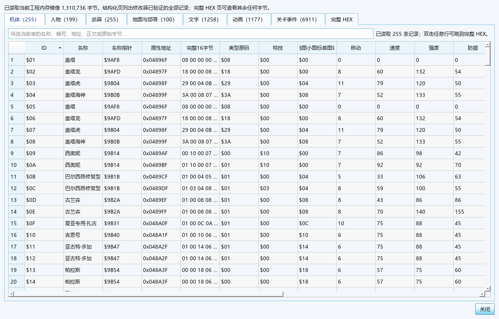

打开“扩展功能 → 完整ROM数据读取”后，八个页签直接读取当前工程的内存镜像：

- “机体、人物、武器、地图与部署、文字、动画、关卡事件”按已验证边界列出全部记录，不只显示当前选中项。默认推荐 ROM 分别读取 255、199、255、100、1258、1177、8359 条；关卡事件数包含 1448 条按 256 个 ID 展开的 Bank `$26` 独立行动指令、2637 条兼容全局事件块指令和 4274 条分 Bank 关卡脚本指令。
- 每行保留 ID、文件偏移和完整原始字节；已经确认的语义同时拆成单独列。筛选框会搜索当前表的编号、名称、地址、正文和原码。
- 双击结构化表中的一行会跳到“完整 HEX”页的对应文件偏移。HEX 页覆盖当前 ROM 的全部 1,310,736 字节，并显示 iNES 头、PRG 8 KiB Bank 或 CHR 1 KiB Bank 的位置换算。
- 这是只读核对入口。原始字节已被完整读取，但没有证据的位或字节不会被猜成字段，也不会因此开放写入。保存前仍以各编辑页的校验范围为准。

### 3.2 数据库

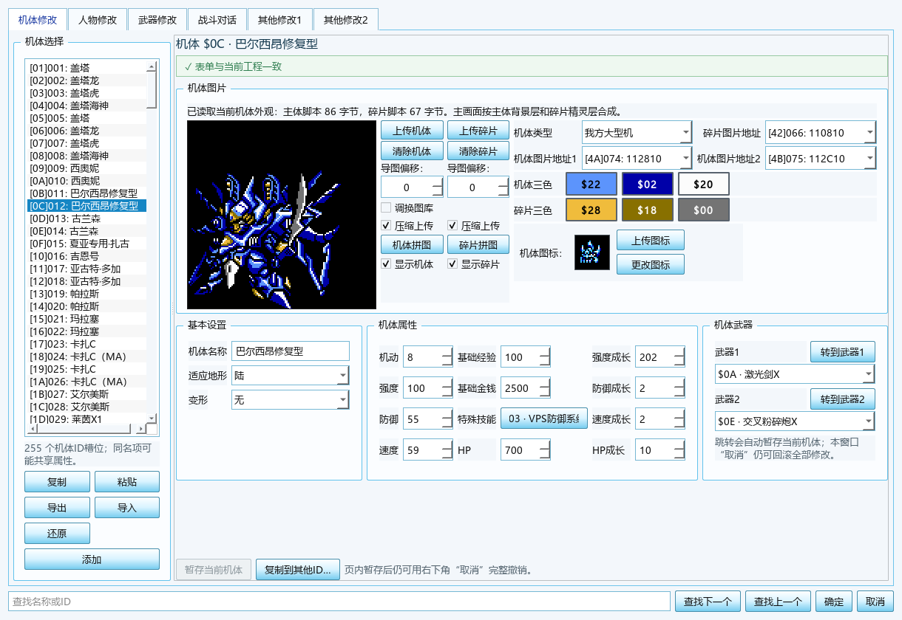

数据库包含“机体修改、人物修改、武器修改、战斗对话、其他修改1、其他修改2”六个页签，底部统一提供查找上一个、查找下一个、确定和取消。

- 原先集中在窗口底部的“内存分布”入口已经移除。现在每个数据库页签底部都有自己的“本模块内存”栏；点击“本模块明细…”可查看 ROM 地址、已用/容量、净增长空间、写入状态和共用关系。人物页的 Bank `$24` 八资源复合块为 `9529/15184 B`、当前共享余量 `5655 B`，由人物属性、机体属性、武器属性、普通名称、战斗名称、机体名称、武器名称和 32 关初始配置共同占用。普通名称、战斗名称和人物属性现已按旧修改器接通八资源整体重排，不再受 `395 B`、`477 B` 当前切片的假容量限制；任一记录增长时会同步重建目录、后移后续资源并重定位内部指针。头像配置则与机体战斗外观共用另一段 Bank `$04` 尾区，当前为 `2194/2992 B`、可净增 `798 B`。系统文字的 249 B 仍不能借给战斗对话；固定结构显示“可改值、不可增长”，表示现有字段可以正常编辑，并不表示该功能被禁用。
- 数据库字段的编码、值域、指针关系和运行时含义以旧修改器实测及游戏读取代码为准。固定字段仍在原位等长写入，已有安全池的变长资源在各自池内重排。机体名称按“未扩容 ROM”优先处理：未修改时不占扩展区；当前 255 个逻辑名称按旧版独立记录语义计为 `1456 B`，并严格保留旧修改器实证得到的 `6701 B` 净增长余量，总门禁为 `8157 B`。原生 CPU `$9AF8—$9DAC` 确实放不下时，最后才通过资源选择器 `$13` 分配独立名称 Bank pair，但不会把整组 16 KiB 都冒充成旧版可用容量。旧修改器的名称池本来就是独立资源，其保存上限为 `$BEB0`，并未借用初始配置；因此新版也不减少初始配置容量。先前实验版借部署尾部的 ROM 仍能读取，并会在下次改名时无损迁移。保存前会校验指针、扩展资源登记和受保护代码，越界或未知布局会整笔拒绝。
- 数据库首次打开只读取当前可见的机体页，人物、武器、战斗对话和两个“其他修改”页在第一次切入时读取；窗口关闭后会保留并复用已经解析的界面，未修改时“取消”不再重复扫描全部文字、列表和机体图像，因此随后再次打开和关闭可以立即完成。各模块底部的内存信息按当前 ROM 修订号共用一次完整扫描，重复切页不再重新解析全数据库；任何真实编辑、撤销、重做或取消回滚都会使缓存失效并重新计算。撤销补丁也改为先用原生块比较跳过未变化的 ROM 区域，不再为改几个字节逐字节扫描整份 ROM。若期间从其他窗口修改了 ROM，数据库会在下次打开时自动重新同步；这些缓存不会改变“确定”保留、“取消”整窗回滚的事务规则。
- 数据库机体页严格回到参考工具的信息结构：左侧机体目录；上方依次为 `256×256` 主预览、机体/碎片两列导入工具、纵向机体三色与碎片三色、纵向机体类型与“机体图片地址1、机体图片地址2、机体碎片地址”；机体图标固定在两列导入工具下方。导入工具保留独立浅色内嵌框；配色、类型与三个地址合并为一个 `292 px` 外观设置区，只保留一层外框和一条轻分隔线，颜色列为 `78 px`、地址列为 `190 px`，避免多层竖框挤占字段宽度。左侧目录选中态与四个主分组标题使用明确的青灰层级。下方按旧版比例并排基本设置、机体属性、机体武器。默认窗口为 `1050×670`，对应 Windows 125% 下约 `1312×838` 物理像素；页内不再显示额外的机体标题、草稿状态或“暂存当前机体”横条，当前合法表单由右下“确定”直接提交，“取消”整窗回滚。重复容量信息只在底部 `26 px` 的“本模块内存”栏显示。上传/清除/拼图按钮统一为 `82×25`，避免真实中文字体被裁切；导图偏移同宽且不显示上下微调按钮，直接输入十进制图块编号。图标操作为 `68×20`，武器跳转为 `76×22`，底部确定/取消为 `58×26`。默认尺寸下无横纵滚、无遮挡或底部裁切。保留新版的低饱和分组色、安全导入和实际容量门禁，不复制旧版的高风险落盘算法。战斗预览仍使用真实机体/碎片脚本、NES 调色板和敌我锚点。
- 机体/碎片两列导入工具利用页面原有下方余量增加纵向呼吸感：图片组高度调整为 300 px，但数据库窗口仍保持 `1050×670`。网格行距为 5 px，上下各留 2 px 缓冲，八个真实行共同均分剩余高度，不再由底部隐藏伸缩行独占；与机体图标栏间隔为 5 px。按钮、偏移框、复选项和拼图入口的顺序及尺寸不变。
- 机体页会按可用宽度自动使用三栏、两栏加整行武器区或单栏布局；参考旧修改器，常见的 1525 像素宽度优先保持“基本设置、机体属性、机体武器”同排，仅在更窄窗口中换行，避免水平滚动和右侧裁切。机体类型与三个图片地址常驻可编辑；重复的“调整配色与图库…”和“原始图库、脚本与技术详情”入口已从主页移除，拼图与碎片编辑由专用按钮进入。一般可增减数值仍显示清楚的上下箭头；导图偏移是图片导入起点，为减少两列工具区拥挤，特意采用无箭头的直接数字输入。
- 机体类型与图片地址区采用旧版对齐方式：四种机体类型使用等高下拉框，三个图片地址也使用同高、同边框的下拉选择器；每个地址项按“[十六进制图库号]三位十进制图库号: 六位文件偏移”显示，例如“[37]055: 10DC10”。常规窗口会为六位偏移和右侧箭头预留足够宽度，不再遮挡末尾字符；窄窗口仍允许框内文字省略并保持页面无横向滚动，展开列表仍显示完整地址。
- 机体属性区在旧版三列字段顺序不变的前提下略微加宽，基本设置与机体武器等量收紧；数值框由 58 px 加宽到 72 px，可完整显示四位基础金钱、三位成长值和上下箭头。属性标签保持常规字重，数字只做一级轻微增强，输入框采用较清楚的青灰边线和悬停/聚焦反馈；避免中间属性面板比基本设置和武器面板明显更黑。特殊技能主页改用十进制值（例如原码 `$10` 显示 `16`），并改为与同列数值框严格同宽、同高的组合选择控件；右侧箭头平时采用接近普通输入框的白灰底色，仅在悬停时转为浅青，点击数值主体或箭头均打开编辑窗口。该窗口把五项独立标志集中在浅绿组合面板内，把低三位基础防御特技明确标注为单选，并在底部实时显示十进制组合值和完整名称；确定为青色主操作，取消为中性操作。窗口高度收为 250 px，不再保留空白下半区。
- 机体主页不再显示重复的“外观记录”“机体字段”说明，也不再展示机体图标的图库、图块选择器和地址文本；这些路由值继续作为内部状态参与读取与保存。图标区按旧修改器收紧为“机体图标：预览、更改图标、编辑图标”单行。基本设置中的“名称引用与原始记录”入口已从日常界面移除，底层兼容数据仍会随记录正确保存。常用窗口宽度会优先采用基本设置、机体属性、机体武器同排布局，并缩短三组面板高度，使两件机体武器无需上下滚动即可查看。
- “机体图标设置”窗口按旧修改器改为紧凑布局：关卡和图标编号位于顶部“图标选择”区域，下方固定显示三组、每组 16 个连续黑底图标，01～48 编号单独置于图标上方；不再使用带单格大边框和滚动条的表格。当前图标只显示细红色选择框，底部按钮统一为“确定 / 取消”。切换关卡仍会按该关卡真实动态路由刷新三组图库。
- 数据库机体页同时按 Windows 125% 显示缩放验证：属性数值框、特殊技能按钮和三栏间距采用旧版紧凑宽度，在约 1220×787 逻辑像素（对应录像中的 1525×984 物理像素）下右侧详情不再生成横向滚动条；战斗预览、基本设置、全部属性和两件机体武器保持在同一屏内，不会因拖动整页左右错位。
- 数据库人物页按参考修改器恢复为单页同屏布局：头像设置在上方，名称、音乐、人物属性与精神在左侧，攻击/防御/变形台词在右侧；不再拆成“基本信息与头像、属性与精神、战斗台词”三个产品自创页签。人物列表约占窗口四分之一，参考版“添加”入口保持可见并已恢复旧版整体新增：创建下一人物 ID，同时重排属性、双名称、头像、战斗音乐和台词；任一共享区容量不足时整笔取消，数据库“取消”也会恢复新增前全部字节。现按程序真实默认窗口 `1050×670` 逻辑像素（Windows 125% 时约 `1313×838` 物理像素）验收，头像第三色、全部精神与变形对话同屏可见，详情区不产生横向或纵向滚动。头像导出仍可从人物列表右键进入，不再用额外按钮挤占头像主行。
- 同一轮全界面审计还校正了数据库机体与武器页：机体的基本设置、属性和两件武器在真实中文字体下仍保持同屏；武器的名称、六字节战斗参数、特技/距离补正改为紧凑上下区，双方动画紧随其后，功能范围和 ROM 原始记录折叠保留。武器动画页进一步吸收旧工具“信息紧邻操作”的优点：隐藏重复的页内代码按钮和长说明，把统一的代码编辑、规律、动画测试入口放在动画页签之前，压缩指令表的无效高度，使暂存、复制、还原及当前参数行在约 1220×787 逻辑像素下完整可见。在该尺寸下，机体、人物、武器三页详情均不产生横向滚动。战斗属性计算器继续保持敌我左右对照，存档修改器继续保持上下两张表，“其他”继续保持公式区与初始机体左右分区；三者不再被长下拉内容或固定尺寸强制撑出屏幕，可在不改变旧版操作顺序的前提下自由缩放。
- 机体主页的图标栏按旧修改器布局保留“机体图标：”、黑底预览和右侧纵向的“上传图标 / 更改图标”；移除多余分组边框，预览放大为 48×48，按钮与上下留白一并调整，避免图标与按钮拥挤。“上传图标”进入真实 CHR 像素与 BMP 导入导出编辑器；编辑器把 16×16 图标画布放在左侧，四色画笔紧凑纵排在右侧，当前画笔以黄框标识。导入时只接受宽、高都为 16 像素的 BMP 或 PNG，其他尺寸会显示实际宽高并拒绝写入，不再隐式拉伸。编辑器底部的“水平翻转图标”会镜像整个 16×16 四图块草稿，同时交换左右两个 8×8 图块的位置和各图块内的像素方向；操作立即更新预览，但只有点“确定”才写入当前数据库会话，点“取消”不会修改 ROM。连续翻转两次可逐像素恢复翻转前图标。“更改图标”进入按关卡动态路由的 48 图标选择器。机体类型和三个图片地址下拉框收窄为与内容相称的旧版宽度。机体武器栏也按旧版改为每槽上方显示标签与“转到武器”，下方由武器下拉框独占整行；下拉项统一使用三位十进制编号，例如 `007 · 双子光剑`、`011 · 交叉粉碎炮`，不再把 `$07/$0B` 十六进制原码混入日常选择界面。长武器名称和两个跳转按钮均能完整显示，整页不需要横向拖动。
- 机体图片区的类型和三个图库地址高度统一为 25 px，按旧版改为纵向窄列；机体/碎片导入工具恢复带中线的两列，图标工具在其下方对齐。两组三色改为 `25×24` 小色块加 `43×24` 可点击色号，避免六枚大色块喧宾夺主。上传、跳转/拼图、清除三类可用按钮分别使用较高对比的青、蓝、红色边框和底色；禁用态单独灰化。公用 NES 调色板保持 16×4 顺序，窗口收为 `544×150`，色格为 `32×30`、间隔 1 px，当前颜色使用深青选中框，在 125% 缩放下接近旧版物理尺寸且各格仍清楚分离。
- 机体目录下方不再重复摆放复制、粘贴、导出、导入和还原按钮，只保留“添加”容量说明。机体列表右键菜单严格按旧修改器的实窗顺序提供“复制机体、粘贴机体、导出机体、清除机体、清空全部”；没有复制来源时“粘贴机体”置灰。“复制机体/粘贴机体”现作为完整机体复制：同步属性、名称、两件武器、机体类别/舰长标志、机体三色、碎片三色、图库地址、主体拼图脚本和碎片拼图脚本；共用外观记录只拆分目标 ID，不联动其他机体。右键“导出机体”选择目录后，仅为当前机体创建“编号：名称”子目录并写出效果、机体、碎片、图标1、图标2五张 BMP，不再误导出 `.dcunit`。右键“清除机体”现在以一个事务清空当前槽的16字节属性、名称、两件武器、主体与碎片实际引用的图块，并置空两段拼图脚本；“同步同组贴图”开启时，同组主体/碎片脚本同步置空，关闭时只拆当前机体。“清空全部”仍只对 `$01—$FF` 的属性、名称和武器执行批量清空，避免跨全库破坏共享 CHR。两个入口都不弹确认窗口，支持一次撤销和数据库整窗取消；如需恢复 ROM 原值，使用明确标注的“还原”功能。人物和武器目录继续使用各自已验证的右键能力；人物可导出当前头像，武器不伪造独立导出协议。切换工程会自动清空复制来源，避免跨 ROM 粘贴。
- 机体和人物左侧目录中的真正空白/未分配槽按旧修改器显示：保留 `[十六进制]十进制:`（人物使用全角冒号）并让冒号后留空，不再把“空白/未分配机体槽”或“空白/未分配人物槽”当作列表名称。机体“基本设置”的名称输入框同样不显示内部判定词，空名称仅以灰色 `-` 占位；名称引用和复制目标等机体选择器以 `-` 表示空槽。以上均为界面显示规则，内部空槽判定、名称指针和 ROM 字节保持不变；在空槽上不输入名称直接切换或保存不会把 `-` 写入 ROM。ROM 中正式名称为“？？？”的可用人物不会被误判为空槽。
- 三类数据库均可直接输入新名称。名称按各自共享池总容量重排并同步指针；总量超过已验证池尾时才会拒绝。名称记录被多个 ID 共用时会列出全部受影响 ID 并要求确认。若还要切换“名称引用”，请分两次应用，避免误改新引用指向的共用文字。
- 当前 ROM 的机体 16 字节属性表可能让多个 ID 指向相同物理记录，但这只是存储压缩/复制结果，不是编辑限制。普通属性、特技、复制、粘贴、导入、还原和高级 16 字节写入都会在需要时自动把 255 个逻辑 ID 展开为独立记录，只修改当前机体，不再弹“共用属性联动修改”确认。高级原始记录仍会因包含未确认标志位保留一次通用安全确认，但确认文字明确为“仅写入当前机体”。该自动拆分使用选择器 `$71` 的独立核心镜像，不占用机体名称或初始配置容量；以后启用完整机体扩容时会无损迁入正式机体分区。
- 机体页所称“色块”现为小色块与相邻色号组成的紧凑字段，不再是整枚大按钮；点击小色块或色号均可打开完整 64 色板，保存、撤销与 ROM 字段含义不变。
- 名称引用和原槽内直接改名，以及移动、速度、强度、防御、HP、成长、基础金钱、基础经验、特技、变形关系和两个武器槽可以编辑。机体图片区现可像旧修改器一样直接编辑“我方/敌方 × 小型/大型”四种机体类型、碎片图片地址、机体图片地址1和大型机图片地址2；调整后战斗预览立即刷新。大型机在“机体类型”右侧显示“舰长”复选框，对应战斗外观类型字节的 `$20` 位；勾选后例如我方大型机由 `$80` 变为 `$A0`，取消后恢复 `$80`。小型机不显示且不能写入舰长位；大型机切换敌我方向、进入拼图窗口再确定都会保留舰长状态。小型机切换为大型机时，修改器会把变长的外观记录安全迁移到已验证空间，不会把第10字节写进相邻机体；之后进行机体扩容也会保留该记录。此前“升级还需”实际对应基础金钱，现已纠正标签；ROM 字节以十位为单位，界面与旧修改器、游戏效果一致地显示完整金额，例如原值 `120` 显示为 `1200`，上下箭头每次增减 `10`。基础经验为原值，游戏另行计算等级差等修正。机体特技改为可点击的组合按钮：低三位可选择无、T防御系统、相对转移装甲、VPS防御系统、重力波罩、海市蜃楼隐形系统、重力漩涡或用盾防御；`$08` 视层装甲反射、`$10` 先制攻击、`$20` 一击脱离、`$40` 异次元连接系统、`$80` 扭曲力场可继续勾选组合，因此不会破坏新DC组合值。变形下拉按旧版编码提供无、二段、三段和四段各形态，只改机体类型字节的高六位并保留地形低两位。“转到武器”会切换至武器页并定位关联武器。
- 地形选择只改低两位，保留变形标志。机体页直接显示机体与碎片各三枚大色块，色块同时显示两位十六进制 NES 色号；点击任一色块会打开与地图图块一致的 4×16、完整 64 色 NES 颜色表，选色后即时刷新战斗预览。颜色统一在数据库机体页编辑；机体拼图子窗口不再重复显示颜色控件，只读取当前六个色号生成真实预览，从而把空间完整留给参考设置、代码、图库和效果图。所有直接选色仍属于数据库事务，最后按“取消”会完整恢复。大型机有两个机体图库、小型机只有一个；大型机从图库1导入时容量会连续使用图库1和图库2共 128 个槽位，偏移 `$01` 后仍有 127 个，不会再被错误限制为单页 63 个。数据库主页不再显示容易挤压上传工具列的“调换图库”；需要从大型机图库2开始的高级操作仍在机体拼图窗口内完成。效果图中的红线表示游戏战斗屏幕可显示范围，不是机体中心十字线：我方机体的内部竖线在逻辑 `X=104`，敌方小型机按旧修改器镜像到逻辑 `X=24`；敌方大型机的右侧范围边界位于预览画布最外沿，因此内部只显示逻辑 `Y=24` 横线。记录 `+1～+3` 是机体颜色并进入运行时 `$0476～$0478`，记录 `+4～+6` 是碎片颜色并进入运行时 `$0479～$047B`。色块和预览使用随工具附带的 `FCEUX.pal`，因此显示器上的 RGB 与 NES 色号是明确对应关系。机体拼图窗口按旧版操作顺序重排为顶部“参考设置＋主体代码编辑”、下方“图库＋效果图”；参考设置中的每个图库同时显示十六进制页号、三位十进制页号和当前 ROM 的真实文件偏移，例如 `[$37] 十进制 055 · 文件偏移 0x10DC10`。主体代码区提供“清除、8×8、7×9、9×7、10×6、查看效果”入口。图库区一次显示一个 8×8 图库；大型机勾选“调换图库拼图”后切换到机体图库2，所选图块号同步切换为 `$40—$7F`，取消勾选回到图库1的 `$00—$3F`，该开关本身不改写游戏的图库顺序。“战斗合成”页右侧先解析主体的 `F3`、`FD 20`、`F9`、原始图块和 `FF`，再解析碎片脚本的 `X/Y` 坐标、换图、位移及水平/垂直翻转指令并按精灵层叠加；友方左侧与敌方右侧基准均按旧修改器全记录对照。全部 255 个机体记录均须能完整解码。主体和碎片原始图库均可单击选择图块，右键导入 BMP、复制/粘贴/删除图块、复制/粘贴/清空图库；8×8 图片按单图块导入，标准 64×64 或 64×128 图片按图库导入，其他尺寸会自动等比压缩、以背景色居中到当前图库画布后再按当前真实 NES 四色量化，不再因尺寸不同拒绝上传。“显示图块编号”会叠加本地图块号。战斗合成画面左键会用当前所选图库图块替换命中的最上层图块，右键可明确选择替换或删除主体/碎片层；重新编码会保留全部坐标、顺序与翻转标志。“拼图脚本原码”仍允许按旧工具方式直接编辑两段十六进制脚本并先验证、刷新效果；主体可按 8×8 图块移动或清除，碎片可逐像素移动、水平/垂直翻转或清除。图库像素、图库地址和脚本全部先保存在子窗口草稿，确定时作为一次事务写入；拼图脚本会按当前 ROM 的活动目录重排原生或扩展资源池并更新全部指针，不会用变长脚本覆盖相邻机体。资源超出容量、出现未知指令或图库被其他窗口同时改变时会拒绝保存。子窗口确定后，数据库“取消”仍能恢复；主窗口也可撤销。碎片和物理武器仍共用图库，修改时应结合两者核对。
- 机体拼图子窗口的机体类型可直接在我方/敌方、小型/大型四种模式间编辑；由小型切换到大型时会安全迁移变长记录。“战斗合成”内嵌模块现按旧修改器的固定比例复制：左侧是 `240×480` 图库区，右侧是 `480×480` 效果区，红色横纵线标出旧版战斗原点，上下左右移动按钮环绕效果区。顶部“参考设置”只保留机体类型和主体图库地址1/2，地址下拉框内同时显示十六进制库号、三位十进制库号和文件偏移；碎片图库地址放在“碎片原始图库”页。“显示图块编号”会同时在左侧图库和右侧效果图标注真实十六进制图块号，选中框与旧版一样使用红色。效果图左键会直接打开命中的最上层 `8×8` CHR 图块编辑器，右键直接删除该拼图项；图块编辑器支持四色画笔、右键吸色、`8×8` BMP/PNG 导入、旧版 24 位 BMP 导出和还原。此子窗口的图库与合成预览固定使用旧修改器的黑、绿、蓝、浅色素材工作色，不加载当前机体的实战配色。导入单个 `8×8` BMP 只替换当前图块，不改动拼图代码；导入其他尺寸的机体 BMP 时会按原图宽高比自动选择 `8×8`、`7×9`、`9×7` 或 `10×6` 旧版布局，等比压缩并居中、分割为连续 CHR 图块，同时生成匹配的 `F3/FD 20/F9/FF` 主体拼图代码。主体页和碎片页均提供“导入BMP”和“导出BMP”；可见按钮导出当前 `64×64` 主体图库或 `64×128` 碎片图库，右键图库还可单独导出当前 `8×8` 图块；导出统一为旧版兼容的 24 位 BMP。
- 主页面上传区分普通预览与压缩导入。未勾选“压缩上传”时只更新子窗口的临时预览，不写图库、不改拼图脚本；勾选后才自动分块并重建脚本。机体图片可使用任意 `1—128` 像素宽高（高级非压缩图库导入上限为 `64×64`）；宽高不是 8 的整数倍时不缩放、不裁剪、不居中，而是补背景到最近的 `8×8` 网格：我方机体以左下角为基准，敌方机体以右下角为基准。“导入自动微调”默认开启，旁边的数值框可设单轴上限 `1—7 px`，默认 `3 px`；开启时会在写入前比较该范围内的全部无损位置，任何会裁掉非背景像素的候选直接排除，且只有图块总数更少时才采用微移；关闭后严格保持原位置。开关和像素数在数据库机体图片区与拼图窗口中双向同步。碎片主页面上传仍严格使用原始 `128×128` 图片。主体固定网格去空并复用相同非空图块，碎片求解最少 `8×8` 覆盖。压缩导入只覆盖从“导图偏移”开始实际生成的图块，前缀和尾部未使用图块全部保持原值。若尺寸超限、搜索未证明全局最少或偏移后容量不足，整笔拒绝。拼图窗口图库右键的单图块/整图库导入仍是明确分离的高级编辑能力。旧版证据和本次产品增强边界见 `docs/research/legacy-modifier/M05机体与碎片导入规则.md`。
- 数据库机体页与拼图窗口中的“清除机体/清除碎片”只清除当前拼图脚本实际引用的唯一图块，并分别把主体脚本置为 `FF`、碎片脚本置为 `00 F0 00 00 FF`；同一图库中没有被当前脚本引用的素材全部保持原值。数据库主页按钮单击后立即写入当前数据库草稿，不弹确认窗口，也不构造隐藏拼图窗口。未登记机体扩容的 ROM 仍直接使用原生 Bank `$28/$29` 动态目录重排；随后按数据库“取消”仍会完整恢复图库、脚本、指针目录、预览、容量栏和撤销状态。图库右键“清空图库”是整库高级操作，只清实际右键选中图块所属的当前页，不改脚本；大型机在图库2任意图块右键后，清空、复制和粘贴均作用于 `$40—$7F`，不会错误落到图库1。列表右键“清除机体”则把上述主体/碎片清除与属性、名称、武器清空合并成一次事务。
- 2026-10-01 的记录级清空语义修复及“清除机体/清空全部”无确认弹窗操作已进入正式 `output/app/新DC篇完整修改器.exe`；该构建已通过 PyInstaller 归档检查和独立 `--self-test`，SHA-256 为 `6D2E1A6AE80655F0B37902035C78B4D39DD325257D428CBC15B4D34F3709A3B4`。
- 机体拼图窗口的当前正式布局以旧修改器单页为准：窗口不显示“战斗合成 / 碎片原始图库 / 拼图脚本原码”等额外页签，也不在图库下方摆放额外的整库导入、导出按钮。顶部紧凑排列“参考设置”和“代码编辑”，下方恢复旧版两块清晰边框区域：左侧依次显示图库提示、红色当前图块编号、`240×480` 图库和两个开关，右侧由四个移动按钮环绕 `480×480` 效果图；确认与取消固定在底部。数据库里的“机体拼图”和“碎片图库”分别直达各自页面，隐藏页面不会再把主体窗口撑宽。图库左键仅选择图块，右键菜单按旧版提供“导入图片、复制/粘贴/删除图块、复制/粘贴/清空图库”；效果图左键编辑命中图块、右键删除命中拼图项。单图块编辑器仍支持 `8×8` BMP 导入和旧版 24 位 BMP 导出。
- 机体拼图窗口按 Windows 125% 显示缩放收为紧凑的 `704×672` 逻辑尺寸；图库与效果图仍严格保持 `192×384`、`384×384`，在 125% 屏幕上对应约 `240×480`、`480×480`，因此像素核对比例不变。顶部参考设置与代码区压缩空白但不压缩文字，`10×6` 和“查看效果”均按完整中文宽度显示；下方两块内容区只保留移动按钮和两个开关需要的安全间距，不留大块空白，也不允许按钮侵入预览。碎片拼图保持独立的 `887×708` 尺寸，避免主体页的紧凑比例挤压双图库。编号文字改用低透明度底色，并在编号之后重新绘制清晰的半透明图块网格，所以勾选“显示图块编号”不会再吞掉边框线。
- 机体拼图窗口的机体类型为四项固定下拉选择，不接受自由输入；控件尺寸与图库地址框对齐并保留展开箭头。左侧主体图库把图库地址1和图库地址2各自的 8×8 图块上下连续拼接，每个图块对应 8×8 像素；大型机显示两个真实图库，小型机没有第二图库时仍保留清楚的下半页图块网格。图库与效果图网格提高了线条对比度；参考设置、代码、图库与效果图采用低饱和青灰分组色，模板和移动按钮使用浅青色，查看效果使用深青主色，清除使用浅红警示色。效果图只绘制主体机体和主体图块编号，不再叠加碎片层；碎片继续由数据库中的“碎片图库”单独核对。效果图四个移动按钮使用独立通道，不覆盖预览。整个机体拼图窗口固定为 `704×672`，不能拖动改变大小。
- 机体图片地址下拉框在地图标题字体载入后仍保留完整地址的首选宽度，窄窗口可收缩以避免横向滚动。机体拼图窗口的当前图块编号区保持固定高度，左侧图库与右侧效果图顶部对齐。
- 机体外观写入恢复为按逻辑机体 ID 独立处理：即使两个机体打开时指向相同的外观配置、主体脚本或碎片脚本，编辑当前机体时也会按需拆分指针，只修改当前 ID，不把其他机体的 ROM 外观记录同步改写。机体名称、适应地形、变形、机动、强度、防御、速度、HP、基础经验/金钱、成长、特殊技能和两件武器同样保持独立。界面中“相同效果机体的预览联动”属于纯显示需求，不能据此改变 ROM 指针或其他机体记录。
- 参考图中的“上传机体、清除机体、上传碎片、清除碎片”已经通过上述图库草稿操作开放；它们替换的是当前已分配 CHR 图块，不会猜测或追加新的图形空间。“新增”仍保持禁用，因为新增外观记录的指针重定位关系尚未完成差分验证。“更改图标”已经按旧修改器的关卡选择、动态三图库路由和 01～48 编号接通，另提供真实 CHR 像素编辑。
- 机体图片工具区和主体/碎片拼图窗口均提供“同步同组贴图”开关，两处状态互相带入。开启时，上传、清除或重新拼接主体/碎片会持续同步到原版同一主体或碎片指针组；例如推荐 ROM 的 `$09/$0A` 两个西奥妮，无论第几次更换任一成员，另一个都会显示同一套完整合成图。关闭时只修改当前机体的拼图脚本，因此可让巴库R/M保持不同造型；“压缩/复用”仍会共享两张图里逐像素相同的 `8×8` 图块。主体与碎片分别提交，修改主体不会顺带重绑碎片。配色、机体类型、三个图库地址、名称、地形、变形、数值、成长、特技和武器始终不会跟随。
- “压缩/复用”会在主体和碎片导入时进行跨机体图库复用：先在导图偏移允许的范围内查找逐像素完全相同的 `8×8` 图块，找到就让新拼图脚本直接引用原编号；只把不同图块写入全零空位。若安全空位不足，则回到原有的导图偏移顺序写入，不会伪称已经完成共用。复用不依赖机体名称，也不把近似图、仅颜色相近或需要翻转的图块误判为相同。实测巴库R/M主体分别需要64/68块，其中48块完全相同，联合图库只需84块；两张碎片图各16块且16块全部相同，联合后仍只需16块。主体84块超过小型机单图库64块，必须使用可引用两页的128块主体图库；碎片本来就是128块图库。
- 机体拼图与碎片拼图现重新按两份一手参考窗口拆分。机体拼图底部不再显示额外的“上传机体/导出 BMP/清除机体”按钮，导入、导出、复制、粘贴、删除及清空仍从图库右键菜单进入；顶部保留清除、四种模板和查看效果。碎片拼图顶部恢复机体类型、碎片/主体图库地址、碎片原码、清除、查看效果及水平/垂直整体翻转；参考设置按旧修改器改为上下两列，左列依次为“机体类型、碎片地址”，右列依次为“图库地址1、图库地址2”，每项标签在上、下拉框在下。四个操作按钮采用明确宽度并在两侧留白，地址下拉和按钮不再贴挤。左侧两个 1 KiB 物理图库按照旧版逻辑编号重新拼为连续 `16×8`：第一行 `$00—$0F`，随后 `$10—$1F`，直至 `$70—$7F`；左侧图库固定使用黑、绿、蓝、浅色素材工作色，不随当前碎片三色变化。右侧效果图同时绘制机体主体和碎片层，主体保持素材工作色，碎片层使用当前碎片三色，以便在同一幅图中明确区分两层。“显示图块编号”只控制左侧图库，右侧效果图始终保持无编号。碎片项列表支持单击选中，选中后左侧图库的红框会立即定位到该项引用的图块；效果图左键打开碎片项的位置/图块/翻转编辑，右键切换命中碎片项的水平翻转；所有修改仍先进入草稿，子窗口确定后才纳入数据库事务。
- 碎片图库右键“从所选图块导入图片”会自动勾选“显示图块编号”，让红框位置和十六进制编号在逐块选择期间保持可见。“是否自定义导入的位置？”会在耗时的最少图块分析之前立即出现；确认后状态栏明确显示正在分析。选择“是”后，每个生成图块依次使用同一个复用输入窗口，标题为“请输入：”、提示为“请输入图库的十六进制编号”。第一个输入框预填红框当前所选编号，之后每一框预填“上一框确认的编号 + 1”；预填值始终显示且可以手动改，手动改号后下一框继续从新编号加一。每确认一项，该图块会立即写入左侧图库草稿，红框同步移动到刚输入的位置，然后才询问下一项；不必等全部编号输入完才看到结果。按钮为“确认输入(O)/取消(C)”，任一输入框取消会恢复导入前的全部图库草稿、脚本和红框位置；选择“否”则直接从红框当前所选图块开始连续写入。用户要求保留的碎片最少图块生成规则不变。
- 图标绑定和机体大小类型转换已经开放；仍不支持任意拆分或追加 CHR 图形空间。未扩容 ROM 的主体与碎片脚本同样可变长编辑：修改器读取原生 Bank `$28/$29` 目录的“主体指针表→主体数据→碎片指针表→碎片数据→当前末尾”，按旧修改器方式整体重排并移动后续目录；重复指针只作为物理压缩，修改其中一个逻辑机体时自动拆分，不会联动其他机体。当前推荐 ROM 原生脚本容量为 `15344 B`，基线主体占 `4081 B`、碎片占 `3067 B`、剩余 `8196 B`。总量超出 Bank 尾时整笔拒绝。已登记的 48 KiB 机体布局仍使用一个扩展共享池，64/80 KiB 布局为主体和碎片提供独立扩展池。16 字节机体属性和归一化 10 字节外观配置是运行时固定结构，仍严格保持定长。属性记录内的变形关系编码已经开放，但它不等于改写战斗图库大小类型。
- 人物页列出完整的 `$01—$C8` 人物槽，分别编辑目录名称和战斗名称，并开放双方战斗音乐、精神值与成长、五项修正、24 种精神及全局消耗、“击落不消失”和头像设置。旧修改器冷启动样本已确认：普通名和战斗名是两套独立逻辑记录；人物属性的重复指针只是 ROM 压缩，旧版会自动拆分正在修改的人物。Bank `$24` 的八项目录现已全部识别，并以旧版的顺序和跨名称表去重规则整体重建；总容量为 15184 B，当前推荐 ROM 使用 9529 B、复合剩余 5655 B。人物普通名、战斗名或变长属性增长时，产品会原子重排全部八项，并动态重绑定后移的机体、武器、名称和初始配置解码器；只有整个复合块越过固定代码 `$BF40` 时才拒绝，失败不会留下半写入。“添加”使用同一套旧版资源顺序创建下一人物 ID，不要求扩容；成功后目录定位新 ID，超容和数据库取消都不会留下部分数据。`$C8` 有目录名称、属性和头像；战斗名称物理表仍保留其指针，但界面不把它当作正常战斗名称/音乐槽。头像页按旧修改器恢复单行顺序：64×64 合成预览、显示正面/显示背景、正面上传/背景上传、正面图库、背景图库、头像颜色1—3；每个图库的“图库号”和“头像编号”上下排列，不再横向挤成一行。正面图库、背景图库和三组颜色的标题统一顶线，第一排图库框、色块和色号框也处于同一水平线；整行剩余宽度平均分配到八个区域之间，不在右侧堆积空白。色号框不显示上下箭头，仍可直接输入两位十六进制数或点击色块打开 64 色调色板。“显示正面/显示背景”可独立开关两层；可编辑图库、位置和配色，并上传 32×32 图像。头像位于 Bank `$04` 的另一复合尾区：当前 71 条唯一头像正文占 497 B，后接机体战斗外观，两者当前合计使用 `2194/2992 B`、剩余 798 B。头像配置始终按人物 ID 独立编辑；修改重复记录中的一个人物时，会自动拆分目标并同步后移战斗外观，其他人物和全部机体外观保持不变。界面不再提供“同时修改共用头像记录”。头像上传修改的是 CHR 物理图块，因此仍会按实际图块列出所有正面或背景使用者。精神菜单最多显示按顺序排列的前 6 项，消耗值对全部人物生效。
- “数据 → 导出机体”（`Ctrl+F`）使用 Windows 系统保存对话框选择位置。保存后在所选位置旁创建固定的 `导出的机体/` 目录，顺序导出 001—255（不含 000）共 255 个子目录；每个目录包含 `<名称>[效果].bmp`、`<名称>[机体].bmp`、`<名称>[碎片].bmp`、`<名称>[图标1].bmp`、`<名称>[图标2].bmp`。目录编号为三位十进制，使用全角冒号；246—255 即使名称为空也保留冒号。前三图为 128×128、49206 字节，后两图为 16×16、822 字节，全部为 24 位 BGR、bottom-up BMP。导出读取当前内存 ROM，不修改工程；已有 `导出的机体` 目录时会先询问，确认后只覆盖同名 BMP，不删除其他文件。
- 旧版五图协议已经对用户提供的 1275 张基准完成整文件比对：目录、文件名、BMP 头和像素全部一致。可运行 `.\.venv\Scripts\python.exe tools\verify_legacy_unit_export.py` 复核；结果写入 `output/verification/m18-unit-export-verification.json`。机体槽位 009/010 的负坐标碎片按旧版整块裁切，效果图叠加时黑色碎片像素透明，图标1按旧版 255 槽位阵营表配色。
- “数据 → 导出头像”（`Ctrl+L`）现已实装为批量导出：选择一个输出根目录后，依次导出人物 1—200，每个人物均严格复用人物页“导出当前头像…”的规则，在 `<十进制ID>：<名称>` 子目录生成 `[背面].bmp`、`[正面].bmp` 和 `[效果].bmp`，完整成功时共生成 600 张 BMP。人物列表右键和人物页按钮仍用于只导出当前人物；“扩展功能”不设置重复入口。三张图均为 32×32、24 位、无透明通道的 BMP；正面使用人物头像记录中的三个 NES 色号，背景按像素索引 1/2/3 使用 `$20/$10/$00` 亮/中/深灰，并按各自真实图库及 4×4 图块位置导出；效果图把正面的非透明像素覆盖到背景上，两层保留各自色表。人物页按参考七字节顺序显示图库与位置：正面图库低位选择 2KB 窗口的前/后半并折算为头像1—4，背景使用独立图库的头像1—4；单幅合成预览与上传量化使用相同的分层色表。名称中的 Windows 非法路径字符会替换为下划线；批量导出发现同名目标文件时会汇总数量并询问是否覆盖，其他文件不会删除。导出读取当前工程，不修改 ROM；个别人物失败时继续其余项目，最后显示失败清单。
- `.dcunit` 机体包没有删除；它作为超集功能继续从“扩展功能 → 机体导入与CHR图像”的机体包区域导入和导出，不再占用参考版 `Ctrl+F` 入口。
- 人物页按参考版提供直接可读的头像和台词操作：正面/背景图库显示为“图库: 003”一类下拉项，位置显示为“头像1—4”，三枚颜色是可点击的真实 NES 色块并展开完整 64 色板；精神列表把消耗显示在名称旁，双击任一精神会打开“精神修改”弹窗。战斗台词的攻击命中/受阻和六种防御结果直接显示实际正文预览，点击后按文字组与正文选择，不要求初学者手工输入十六进制编号。
- 人物页双方战斗音乐恢复旧修改器的可读名称，不再只显示“音乐XX”：`$80—$93` 按旧版依次标注大卫、盖塔、加代、古莲、安东、地球/宇宙敌我、增援、升级、通关等用途，`$9D—$9F` 标注 `Ash to Ash / Dark Knight / Dark Prison`。旧版列表中仍存在但用途尚无可靠证据的 `$94—$9C`、`$A0—$A3` 也完整保留，并明确显示“用途未确认”，不猜测曲名；每一项悬停提示同时给出原始命令字节，保存仍写回原值。
- 数据库各页底部的容量条使用紧凑的“内存明细…”按钮，按钮与窗口右边缘、容量摘要之间保留一致间距。机体页的上传、清除、拼图、图标和“转到武器”按钮，以及拼图窗口的紧凑操作按钮，使用与其固定尺寸匹配的内边距，不再套用普通大按钮留白。人物战斗台词过长时只在按钮表面按可用宽度显示省略号，悬停仍显示完整正文和原始绑定，不会因长台词撑宽或截断整页。
- 人物页的“战斗台词绑定”还包含一次/二次/三次特殊攻击规则和变形起飞绑定。特殊规则可新增、删除、修改条件并通过正文选择器修改文字段和编号；条件单元格同时提示相同编号对应的人物/机体或武器/机体名称。台词保存现严格采用旧版的逻辑人物语义：即使当前 ROM 中多个人物复用同一物理记录，也只修改当前人物，保存器会自动拆分并重新去重，其他人物保持原值，不再弹出联动修改确认。原生数据区可使用到 Bank `$06` 固定代码 `$B510` 之前，容量不足才整次拒绝并保留草稿。变形绑定可添加、清空并限定机体范围，正文对应“战斗对话”页的 `05 · 防御特殊对话`；固定表最多 15 项，满容量时须先清空旧项。
- 武器页列出完整的 `$01—$FF` 武器槽，开放名称、特技、射程、命中、距离修正方式和三种地形攻击值，并用“我方武器动画 / 敌方武器动画 / 使用此武器的机体”三个子页签显示双方实际动画脚本和反向引用。属性指针旁会列出共用同一六字节记录的武器 ID；直接修改、复制、还原或编辑共享动画参数时，会列出全部受影响武器并默认取消。“代码编辑”和指令右键菜单支持对当前单武器动画插入、删除及完整脚本结构编辑；右键“编辑”只打开当前指令参数，右键“插入”严格恢复旧版实测的 12 项目录：F4 声音、F0 颜色、F2 光束图库、F3 光束规律、E0/E1 图库区、FD 移屏、FE 跳转、F9 创建物体、42/C2 运行规律、等待和 FF 结束，不再混入地图动画专用的 E2/F6。选定新指令后才进入参数页。F2、E0、E1 均显示旧版 256 项图库地址；F2 确定时询问是否为大型机体专用，否/是分别生成 `$F2 $03 $01` / `$F2 $04 $01`。F3 固定 `$F3 $22`，仅显示 `$01—$FF` 的 255 项命名规律。FE 同时显示重复次数和旧版 `000—199` 指令编号，保存为真实 CPU 目标并在重排时自动重定位。F9 严格是四字节“物体编号（00—FE）+ 初始 X/Y 坐标”；42/C2 是独立五字节规律，提供 `42/C2`、规律1/规律2和三列各 252 项命名运行规律，实测规律1/2 状态码为 `$69/$6A`。超过原指针槽时会移动后续脚本并更新指针，被引用指令被删或目标无法证明时拒绝保存。“规律”打开武器专用的光束组图、两套物理运行和物理图片规律四个页签；当前构建可浏览、查找、复制、导出及编辑工程名称，并已恢复四页共用的“运动规律模拟器”和光束/物理图片两类拼图入口。模拟器沿用旧版的黑底红轴、宽高、X/Y、鼠标跟随、移动、开始/结束及 X/Y 规律代码布局；直接读取当前规律，能离线展开普通坐标字节和 `$83` 计数循环，遇到依赖运行时状态的控制码会停止而不猜测。拼图读取当前记录的隐藏 X/Y 前置字节、真实 CHR 图库和图块命令，支持 `00/80` 映射、图块编号及水平/垂直翻转预览。旧版保存黄金已经证明四库不是四个独立定长区，而按“物理图片→光束组图→运行规律1→运行规律2”共用一个目录链接池；当前基准使用 `12141/12256 B`、剩余 `115 B`。规律代码现可在该共享范围内变长或缩短，保存时原子移动后续库并更新目录和记录指针；光束与物理图片的隐藏 X/Y 前缀也可用十六进制控件独立修改。代码、坐标、名称和容量都先停留在窗口草稿，取消零写入，确定一次提交并可撤销；超容或非法十六进制整笔拒绝。相同物理指针的别名记录究竟由旧版联动还是写时复制仍在取得保存黄金，图块编号增量控件也尚未恢复，因此武器规律仍不能标为完整还原。“动画测试”生成独立测试 ROM 和存档，不覆盖原 ROM。当前 `$01—$FF` 已满，“添加”只说明武器记录容量，不伪造新武器槽。
- **规律别名、图块增量与缩短口径更新：**旧版对已知共用光束记录 `$D6/$E1/$E2` 的单项保存黄金已经确认“写时复制”，不是联动修改：只编辑 `$D6` 时会为它建立独立 4 B 正文，`$E1/$E2` 继续共用旧正文，后续三库随池增长整体迁移。产品已按同一规则实现，复制/导出也读取当前未提交草稿。两套运行规律现在都恢复“图块编号增加”：输入十六进制增量后，只增加规律中的图块编号，循环、音效、跳转和结束参数保持不变；运行规律1/2 的旧版保存结果均已逐字节匹配。四库首记录缩短也已分别取得旧版整 ROM 黄金并由产品逐字节匹配，释放的空间会回收到同一共享池、后续目录向前移动、旧尾部清零。本条取代上一段中“别名语义、图块增量仍待验证”的旧状态；当前剩余缺口是引申窗口深层动作。
- **武器拼图草稿回写：**光束拼图和物理拼图不再是只读预览。光束图库按旧版使用 `40/80` 两段起点，物理图库使用 `00/80`；切换起点只改变图库显示编号，记录仍保存逻辑图块。旧版动态验证确认图库为左键选块：物理效果图左键修改当前项的图块和位置、右键切换当前项水平翻转，光束效果图左键替换命中项、右键删除命中项，没有“图库双击追加”或额外图块参数弹窗。物理整图水平/垂直翻转会以原点为轴改变全部坐标并切换对应翻转位。拼图“确定”只把结果交回规律窗口草稿并立即重算四库共享容量；拼图“取消”不改变草稿，数据库“取消”仍保持 ROM 零写入。物理拼图已改用旧版最短编码，可在隐式递增、保持、显式换图和三种位移形式间选择；现有记录无操作重编码以及整图水平/垂直翻转均与旧版字节完全一致。光束拼图使用独立的 `FE/F3/FD/F8/F9` 编解码器，压缩记录也可替换或删除图块；未操作时保留原始字节，发生编辑时按已验证语法生成紧凑记录并再次解码核对坐标、顺序和图块。旧版对同一画面的规范化字节选择仍在补齐，所以 M07 尚不能标为完整还原。
- 武器射程和特技共用一个字节，同时修改后保存工程会保留两部分；重新打开 `.dcmod` 不会丢失特技高位。
- 武器页可反查使用它的机体，并跳回对应机体；`.dcunit` 包只从“扩展功能 → 机体导入与CHR图像”导入/导出。数据库机体列表右键“导出机体”固定使用参考工具的当前机体五张 BMP 协议，两种格式不再混用。
- 战斗对话按当前 ROM 的四个真实文本组和编号列出正文，随机台词另列分支；右侧可在“按列表”和“按内容”两个视图间切换，内容视图以 `++` 分隔同一记录的随机分支。选中后直接改文字并暂存，两个视图同步更新。控制 Token、F8 随机目录和未改字形的别名编码保持原样；同一物理正文的全部引用一起生效，若多个引用存在不同草稿会阻止提交。
- 战斗对话允许在同一 8 KiB Bank 的已验证安全文字段内重排：Bank `$2A` 的 00/01 组共享 5432 字节，Bank `$0E` 的 04/05 组共享 6294 字节。基准 ROM 两池都已占满，所以要增长一条文字，必须先在同一 Bank 缩短其他文字释放相同或更多字节；两个 Bank 不能互借容量。界面状态会显示当前 Bank 的占用、容量和剩余字节。提交会原子更新正文、F8 子指针和根指针表，超出总容量、单条无法放入安全段或无法编码时保留草稿并零写入；Bank `$2A` 的系统文字及 Bank `$0E` 的非文字间隙不会被当作容量。
- 系统文字和道具说明仍使用同一编辑方式，但继续限于各自原记录容量，不参与战斗对话重排。可运行 `.\.venv\Scripts\python.exe tools\report_m08_battle_text_compatibility.py` 复核安全池、别名、保护间隙、重开和超容原子拒绝；报告位于 `output/verification/m08-battle-text-compatibility.json`。
- “其他修改1”严格按参考修改器保持同屏四列：系统文字、成长方式、升级经验、武器距离命中补正，不拆成产品自创的任务页签。经验表显示等级 1—99 的升级阈值、当前累计和还需经验；可编辑升级阈值以及 4×16 武器距离命中补正，后一级累计经验低于前一级时会拒绝提交。成长表按编号 201—253 显示每级 0—15 的数值，“成长修改(16进制快捷修改)”可一次编辑前 60 级的 60 位十六进制串，等级 61—99 保持原值。214—253 在当前 ROM 共用一条记录，修改会同步影响共用编号；低于 201 的固定成长值在人物/机体属性中设置。当前受支持 ROM 的运行时比较指令、99 项累计经验和每条 50 字节成长记录共同确认等级上限已是 99，界面会显示真实值。旧版 3778 字节的 60→61 样本来自当前产品不支持的 `audit.nes`，不能套用；“更改等级上限”可点击查看 99 级容量诊断，但超过 99 级的未验证重排不会写入。系统文字“添加”同样会解释固定指针表/文字池边界并保持零写入。可运行 `.\.venv\Scripts\python.exe tools\report_m09_other1_compatibility.py` 统一复验 4×16 命中、99 项经验、221 条系统文字、53 个成长槽、单半字节/60 位快捷编辑、214—253 共享和 99 级兼容性；报告位于 `output/verification/m09-other1-compatibility.json`，其中嵌入原 `m09-level-cap-compatibility` 结论。
- “其他修改2”按参考窗口恢复为同屏双栏：左侧“道具”面板同时显示 24 项表格、独立的名称/价格编辑框和当前道具说明；右侧“商店”面板同时显示 F0—FE 列表、商店设置和七段店员对话，不再分成三个额外子页签。选中道具后，名称、价格和说明会联动到同一记录。名称使用新 DC Token 编码并整体重排固定的 184 字节文本池，局部改名会保留未改字形的原始 Token 别名，“还原”则精确恢复指针和文本池字节；单独改价格不会触碰名称指针或文本池。价格按旧窗口显示为 ROM 原值的 10 倍，因此输入必须是 0—99990 之间且能被 10 整除。24 项价格已逐项通过参考程序“单字段修改、保存、关闭、全新进程重开”验证，确认从 `0x15723` 起按小端 `u16` 连续排列。名称无法编码、总长度超限或价格非法时会阻止“确定”。
- 有效商店可修改商品、店员和对话起始编号。当前 ROM 的 F0—F3 各有四件商品、F4 只有一件；F4 的商品 2—4 明确禁用，底层编解码器也会拒绝伪造四件商品的补丁。列表严格按旧修改器显示 F0—FC、FE，不显示旧版没有的 FD。F5—FC、FE 的商店元数据与地图事件指针表重叠，设置区保持禁写并直接说明会影响什么；但旧版这些行仍能编辑的七段系统文字已经保留，对话区继续可用，固定选择系统文字 195—201。当前字段目录共有 57 个禁写候选：九个无效行的 54 个店员/商品/对话起始字段，加上 F4 越界的 3 个商品栏。七段对话与“其他修改1”的系统文字是同一物理记录；两页同时修改同一段时会阻止提交，先放弃一页草稿再保留另一页即可。无效行只保存七段文字时，程序会保持地图事件 32 项指针表和商店目录逐字节不变。可运行 `.\.venv\Scripts\python.exe tools\report_m10_other2_compatibility.py` 复验 24 名称/价格/说明、名称池重排和超容拒绝、F0—F4 三类单字段差分、F5—FC/FE 的 63 个安全对话入口及地图事件重叠元数据禁写；报告位于 `output/verification/m10-other2-compatibility.json`。

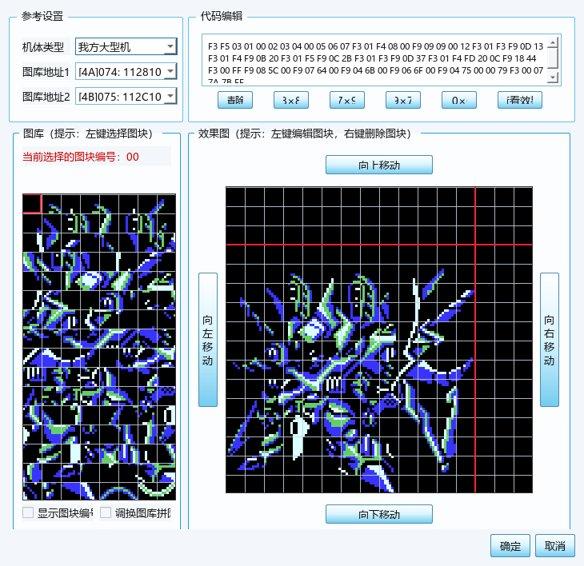

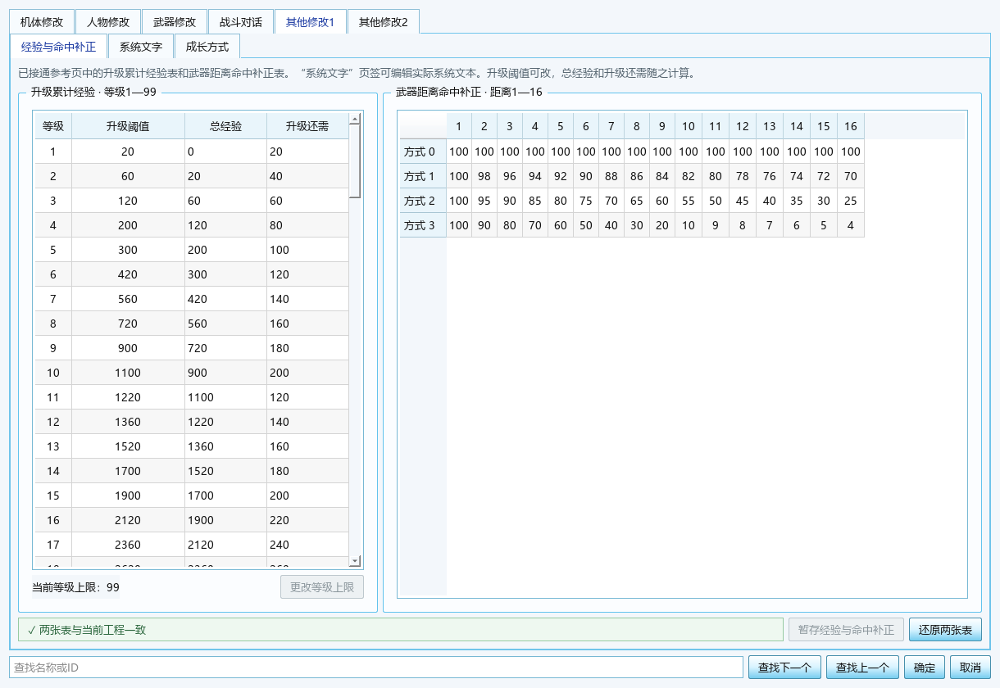

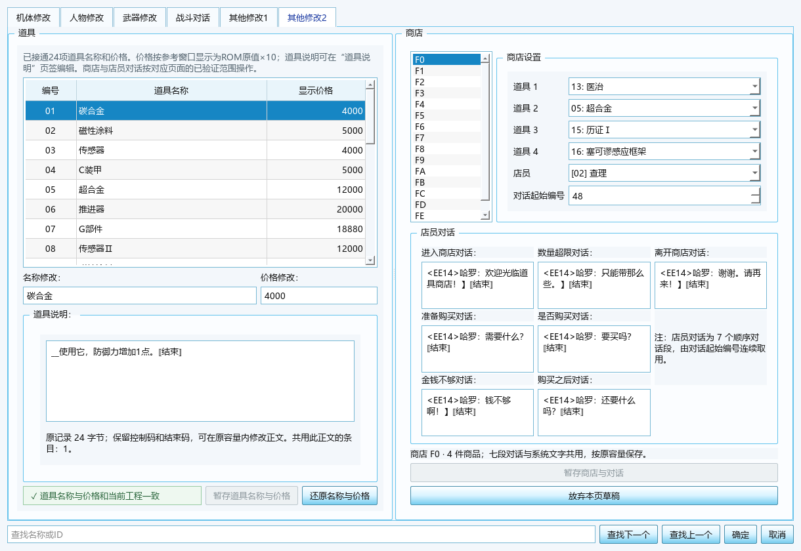

切换机体、人物或武器记录时会自动暂存合法改动；非法下拉值或字段会阻止切换。即使点过暂存，只要最后按“取消”，本次数据库会话仍会整体回滚。

### 3.3 剧情事件

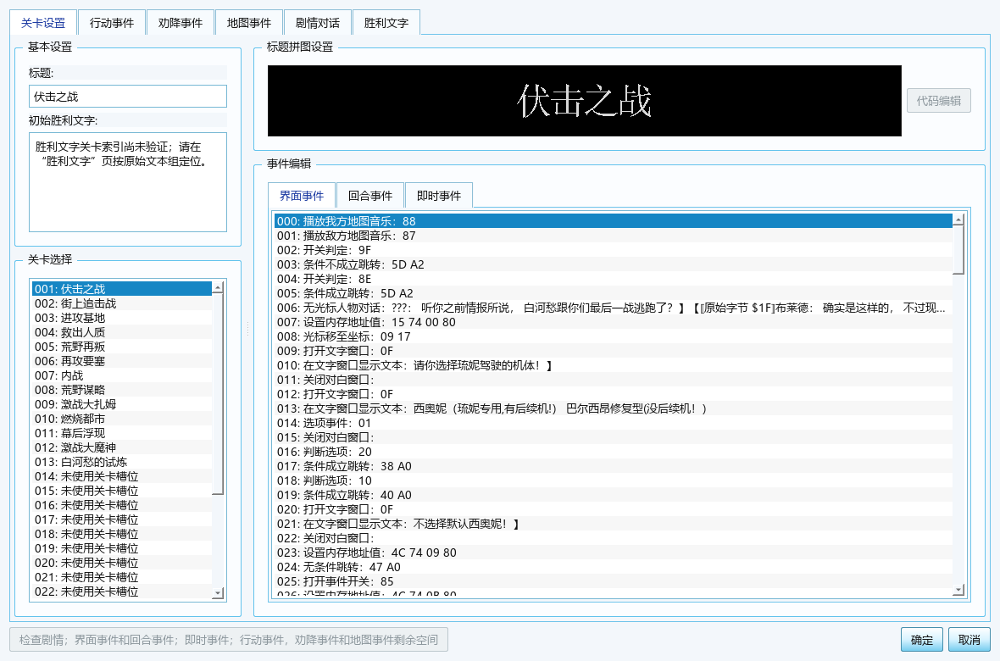

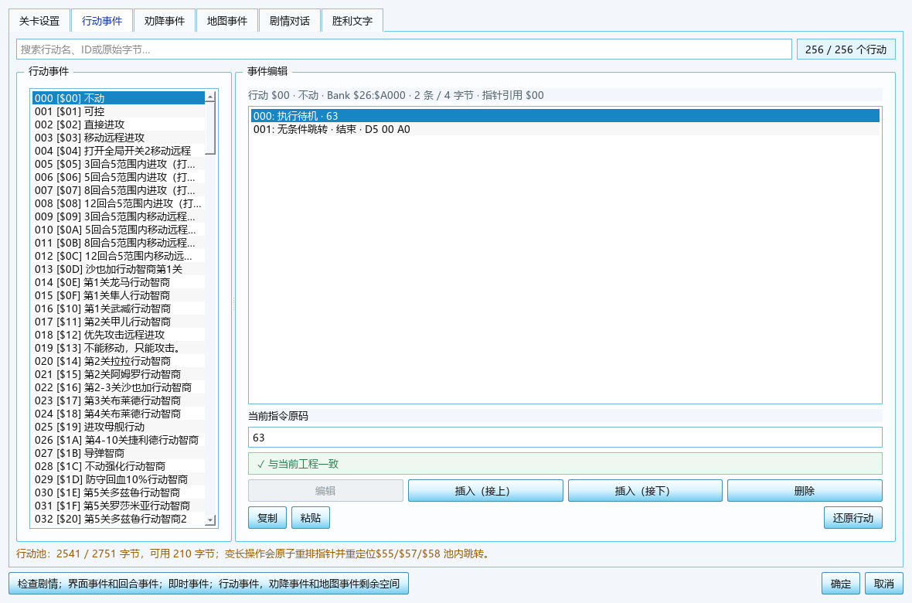

剧情事件窗口包含“关卡设置、行动事件、劝降事件、地图事件、剧情对话、胜利文字”六页，支持缩放。只有关卡设置和地图事件显示章节侧栏；行动与劝降为全局表，不跟随当前章节误筛选。“关卡设置”内还有“界面事件、回合事件、即时事件”三个子页。三个子页只显示参考式自然语言列表；右键“编辑”只打开当前操作码的专用参数窗口，不显示命令目录，也不能误换指令类型。右键“插入（接上/接下）”只打开旧版三页“事件指令”目录，窗口中不显示当前指令参数；单击目录中的命令后，才继续打开该命令自己的参数窗口，确定后完成插入。三页内容严格按旧版划分：第 1 页为触发条件，第 2 页为执行事件 1—4，第 3 页为执行事件 5—7及事件结束；按钮分组、合并命令和文案沿用旧版。右键菜单按参考顺序显示插入、添加增援、编辑、代码编辑、剪切、复制/全部、粘贴/全部、删除和清空；单条编辑、结构插入/删除、剪切和粘贴均接入当前章节事务。人物、头像、机体、道具、音乐、剧情文字组、事件开关、移动限制和状态位等具名参数使用下拉框并显示名称或位含义；坐标、数量、等级、HP、金钱、帧数和地址等真正数值才使用数字框，鼠标停留可查看原始十六进制值。事件列表不再拼接难懂的字段名和十六进制原码，而按旧版显示“判断：……？”、“是/否：转：…”、“文字显示：内容…”、“播放我方/敌方地图音乐…”等可直接阅读的结果；原码仍由独立“代码编辑”入口查看。独立行动表也只在主页面显示自然语言指令列表，不再内嵌当前原码和重复操作按钮；全部编辑、插入及代码操作从右键菜单进入，其中“插入（接上/接下）”使用同一两段式流程。劝降、地图、剧情对话和胜利文字列表支持右键打开相应编辑器。

- 关卡设置从真实的分 Bank 指针读取三类事件，显示当前关卡的完整指令列表、文本摘要和原码。可修改参数或整条合法指令，也可插入、删除；保存时在对应 Bank 内重排并维护入口和绝对跳转。第一关的初始配置表为空，出击通过界面事件安排；地图上的空配置列表并非遗漏了事件部署。
- 已确认的增援、加入、阵营转换、撤退等动作只能使用等长兼容模板或等长原始字节修改，不插入、删除或重排脚本。
- 行动页直接读取 Bank `$1A:$9BC0` 的 256 项指针和 Bank `$26:$A000—$AABE` 脚本池，列表 ID/名称与默认“行动名称”配置对应。基准 ROM 去重后为 45 个有效物理脚本，使用 2541 / 2751 字节，可用 210 字节；`$03/$FF` 的真实共用指针保留。
- 行动指令及三类关卡事件均可通过右键复制、编辑、代码编辑、接上/接下插入、删除与清空。Bank `$26` 独立行动表会重排 256 项对象池；界面/回合/即时事件分别在 `$1E/$1B/$1F` 固定池内移动后续记录并更新三张入口表。两条路径都会重定位 `$55/$57/$58` 绝对跳转；容量不足、删除被引用指令、目标悬空或命中 `$1B:$BE9B` 等重叠解释区时会在写入前整体拒绝。
- 劝降页只开放 ROM 中 4 条已确认规则；其余占位槽不会伪装成可用事件。
- 剧情文本支持 Unicode 与原始 Token 无损往返。当前开放 `$32/$33/$36/$37/$38/$39/$3A/$3B` 八组共 1837 个索引；未知控制参数和未改字形的 Token 别名都按原始字节保留。`$32/$33/$36/$38/$39/$3A/$3B` 即使尚未建立扩展计划，也会在各自已验证的原 Bank 安全池内自动重排指针和正文；总池不足时才需要缩短同组文字或使用容量规划。`$39` 严格止于 `$887E`，不会覆盖相邻运行数据。`$37` 是分离指针/数据布局：`$00` 指向非文本结构并固定只读，`$01—$33` 共 51 个逻辑槽对应 34 条物理文本记录，会在 `$9B4A—$9E27` 的 734 字节固定池内整体重排并保持别名。基准池已满，因此增长一条前必须先缩短同组另一条。
- 剧情/胜利页可选择文本组、搜索完整正文；列表优先显示中文摘要，双击直接打开文字编辑。码表设置和 Token 解析默认折叠，需要时再展开。
- 关卡设置左侧“初始胜利文字”已绑定 Bank `$3D:$8000` 起的 13 条连续关卡记录，不再使用占位文案。前 13 个已验证关卡支持按当前正文字节数等容量编辑；切换关卡或点外层“确定”会自动提交合法草稿，无法编码、含提前 `FF` 结束码或改变容量时会保留输入并阻止切换。备用关卡保持明确只读。
- 直接修改 Unicode 页后，不必先点“编码到原始 Token”；切换记录或外层“确定”会自动编码并提交合法草稿，无法编码或超出容量时会阻止切换。如果 Unicode 和原始 Token 两边都改过，会先报冲突并保留两份输入；点“文字编码到Token”表示明确以 Unicode 内容为准。
- 对没有语义模板的事件指令，“结束本事件组”只切换操作码高位，其余原始字节保持不变并可撤销。
- 同一章节脚本物理指令可能同时出现在关卡设置和地图事件页；两页同时有草稿时，直接应用和外层“确定”都会在写入前报冲突，防止后一页覆盖前一页。独立行动表位于 Bank `$26`，不与这些 Bank `$1B/$1E/$1F` 章节脚本共用物理指令。
- 标题拼图预览已改为直接解析 ROM 真实图块：32 项指针表在文件 `0x16111`，每关三个 64 图块 CHR 页表在 `0x159AE`，不再用关卡列表文字模拟。因此第 1 关黑框显示的是 ROM 内实际“克鲁泽之影”，而不是列表占位名“伏击之战”。根据用户提供的原版/产品并排截图，标题像素索引 1/2/3 也应为亮→暗 `$20/$10/$00`，即 `#FCFCFC/#BCBCBC/#747474`：白色是主笔画，深灰是边缘。标题拼图窗口按参考版恢复为顶部坐标/宽度和刷新按钮、中部黑底标题预览、下部三块图库横排；原始 `FE X Y 宽度 + 两行图块 + FF` 脚本移入“查看拼图代码”弹窗，避免普通界面拥挤。当前只允许保持原记录字节数的原位写入，指针表不变。
- 底部“检查剧情；界面事件和回合事件；即时事件；行动事件，劝降事件和地图事件剩余空间”已经开放。参考 EXE 文件偏移 `0x1A0C57` 的处理器与 `0x194936` 容量函数证明点击后使用标题“提示”的消息框；产品同时按当前 ROM 的真实物理池列出八组剧情文本、界面+回合事件 Bank `$1E`、即时事件 Bank `$1B/$1F`，以及 Bank `$26` 独立行动池的占用/容量/剩余。劝降仍只报告 4 个已验证槽，地图事件仍是分 Bank 章节脚本的条件视图。检查只读，不修改 ROM；合法的窗口草稿会先按整窗事务暂存，非法草稿会阻止检查。
- 可运行 `.\.venv\Scripts\python.exe tools\report_m14_scenario_compatibility.py` 复核参考 72 控件树、96 组/4274 条分 Bank 事件、2637 条兼容全局事件、256 项独立行动表及其变长重排、4 个安全劝降槽、八组 1837 文本索引（含 `$37` 的 51 可写槽+1 只读非文本槽）、13 条初始胜利记录、32 组标题拼图和事务/撤销边界；报告位于 `output/verification/m14-scenario-compatibility.json`。`passed=true` 与 `delivery_status=implementation_complete` 表示实现侧范围闭环，仍不代表参考 EXE 动态黄金或用户验收。

### 3.4 文字库、地图动画与文字转换

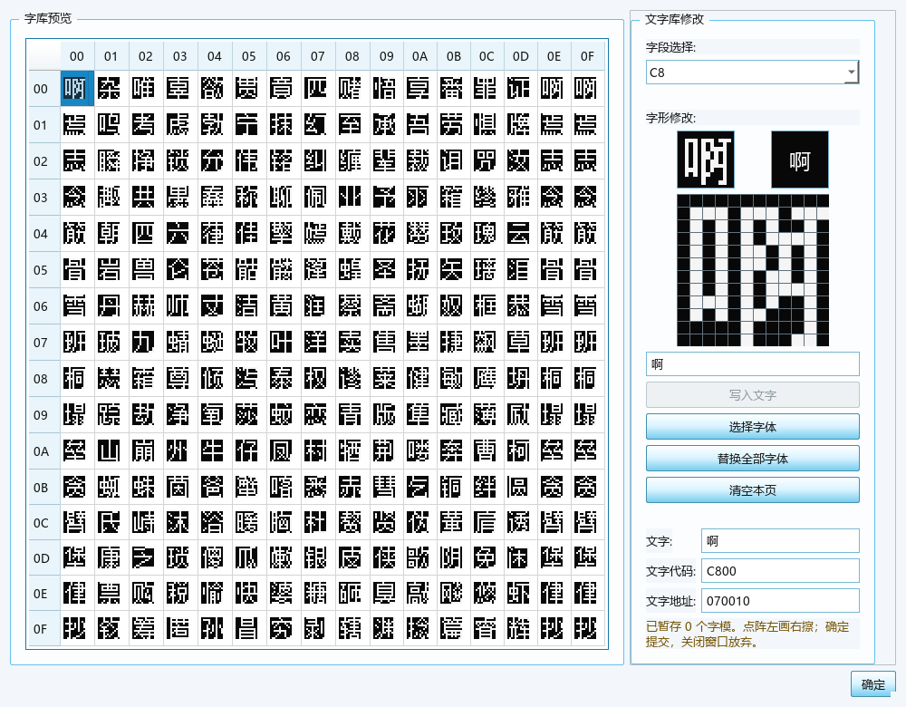

文字库按 16×16 网格显示 ROM 实际字模、码表字符和地址。已修正旧版预览的错误：每个 18 字节字模是三条 4×12 竖条，每字节存两行的四位像素，0 表示前景；不是连续 144 位。未映射且 18 字节为统一填充的安全空槽会显示为与网格一致的低对比度空格，不再把全 `00` 填充误画成刺眼的白色实心块；选中后右侧标题会明确显示“未使用”。已有映射或包含真实点阵的字模仍按 ROM 原样预览。文字库仍用于真实 ROM 固定字模读写；关卡标题预览采用独立的旧版标题显示路径，避免不完整通用码表造成整字缺失。

当前界面将字模矩阵恢复为连续深色预览面，行列标题使用浅灰蓝底，当前字模以蓝绿色底和暖金描边双重标识，避免仅靠轻微底色区分而看不清选中项。右侧修改区收紧为“字库页、当前字形、批量操作、字形信息”四个层级，主操作使用蓝绿色、清页使用低饱和警示色；默认窗口高度可完整显示所有操作，无须滚动查找按钮。

在兼容 MMC3 基线上，可左键画点、右键擦除；“写入文字”暂存当前字模，窗口底部与参考版一致只显示“确定”，按“确定”一次提交，直接关闭窗口则放弃整窗字库草稿。也可选择系统字体，将输入字符生成 12 像素预览，核对后写入；参考按钮“替换全部字体”在当前已验证安全范围内只处理选中的一页和已有单字码表映射，遇缺字时整批拒绝。普通写入只改字形，不改变码表；同一码的所有名称/剧情都会受影响。

每页有 224 个独立字模。E/F 列实际引用同一行 0 列，不可独立写；每行四个保留字节不会被清页或批量导入覆盖。“清空本页”需确认；页点阵 `.dcfont` 固定 4032 字节，按行从 0 到 D 列排列，不含 E/F 别名和行保留字节。

右键单击左侧字模网格可使用增强操作：导入/导出本页点阵；“自动分配新字符…”；导入/导出 `.dcfontset` 全字库；“检测未使用文字…”；“清除未使用的自定义字模…”；“安全回收未使用内置文字…”；“恢复已回收的内置文字…”。初始自动分配只会选“码表未占用、该 Token 在基准 ROM 全文件从未出现、当前工作 ROM 也仍为零引用、18 字节字模为统一填充值”的槽。剧情/战斗通道可使用 B/C/D 十二页，推荐 ROM 初始 76 个安全槽，回收后 561 个；人物、机体、武器、道具和系统资料名称只使用 `C8—CB/D8—DB` 八页，初始 20 个安全槽，回收后 302 个。右键手工分配也默认使用名称兼容的 C/D 页。已有字符、安全槽耗尽、系统字体缺字都会拒绝。

现在不必先进入字库页手工分配：在剧情、战斗对白、胜利文字、系统/商店对白，以及人物、机体、武器、道具名称字段中输入码表没有的汉字，应用时会自动生成 12×12 字模、分配本通道的安全 Token，并与原字段写入合并为一次事务；一次撤销会同时撤回字段、字模和工程映射。编码前还会拒绝名称字段中的 B 页原始代码，避免“编辑器能解码、游戏名称渲染器却不能显示”。同一个新字如果先在剧情 B 页分配、后来又用于名称，工程会为名称补建 C/D 页兼容别名；两份字模和映射可随 `.dcmod`、`.dcfontset` 保留，各通道编码时自动选择正确别名。

推荐 ROM 的现有名称记录已按真实表逐项审计：机体 255 条、人物 199 条、武器 255 条、道具 24 条均只引用 C/D 页，未发现跨页违规，因此不会为了“整理”而无谓搬动现有文字。只有新增文字或跨通道复用时才按需建立兼容别名。

“检测未使用文字”会排除 12 页字模存储区后扫描整份 ROM，分别报告已引用字模、可安全回收的零引用内置文字、零引用自定义文字、已回收内置文字和“无映射但有图形”的旧字模。自定义清理会移除零引用工程映射并清空对应 18 字节字模；内置回收则在提交前再次扫描引用，把仍为零引用的内置代码从工程码表停用并清空字模，使代码进入自动分配池。两类操作都先进入窗口草稿，按“确定”才以一次可撤销事务提交。

“恢复已回收的内置文字”从打开工程时的不可变基准 ROM 恢复仍未重新分配的字模与内置映射；已经分配给新文字的代码不会被覆盖。安全判定固定以基准 ROM 的原有空槽为起点，避免清空点阵后字节模式变化产生新的误报。无映射但有图形的遗留字模仍只报告，因为缺少可证明的文字身份。回收状态和新映射均写入 `.dcmod` 工程；ROM 本身不保存 Unicode 名称，因此续改应打开 `.dcmod`。

`.dcfontset` v1 包含 12 页共 2688 个独立字模、48384 字节点阵和 UTF-8 自定义映射，导入会严格检查魔数、版本、长度、代码和值，并在完整校验后一次暂存；不包含 E/F 别名或 192 个行保留区。“写入文字”在点阵尚未变化时会保持灰色，这是避免无变化提交的状态，不是功能未开放；在 12×12 点阵中左键绘制或右键擦除后按钮立即启用。右键增强不增加参考版可见控件。2026-09-19 实际复核参考窗口未发现自动编码或文件导入/导出入口，因此该格式是新修改器的版本化产品协议，不宣称兼容未知的参考文件格式。可运行 `.\.venv\Scripts\python.exe tools\report_m11_font_compatibility.py` 复核，报告位于 `output/verification/m11-font-compatibility.json`。确定后仍需保存工程/派生 ROM；其他未核验 ROM 布局只读。

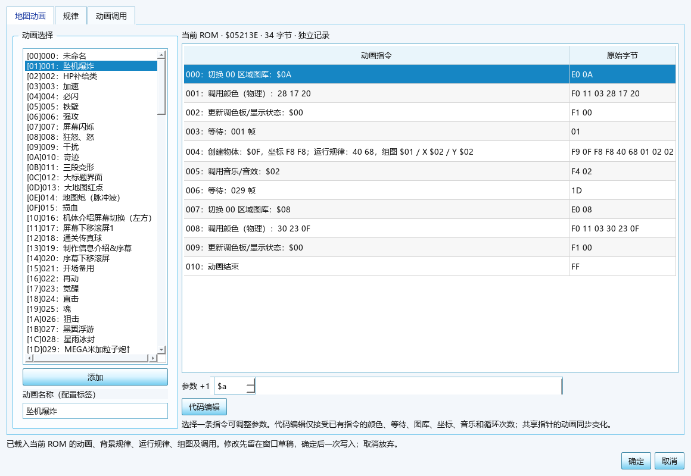

**当前框体布局：**地图动画窗口现为 `900×650`；在 Windows 125% 缩放下实测物理高度约 812 px，与旧版截图的 818 px 接近，不再被 Qt 首次布局自动撑到屏幕可用高度。左侧“动画选择”与右侧“动画编辑”使用同级、顶端对齐的框体，宽度约为 `3∶7`；底部草稿状态位于低饱和信息框内。地图动画指令行高为 14 px，仍保持至少 23 行完整可见。

当前地图动画页保持 `900×650` 紧凑尺寸，左栏收窄，指令列表使用紧凑行高，一次可见至少 23 行。指令区使用旧修改器的白底/浅灰交替行和单一选中色。主列表严格采用旧版反汇编口径：隐藏 `F1` 刷新行；F9“创建物体”与紧随其后的 `40/42/C0/C2`“调取物体运行规律”是两条独立指令；坐标字节按旧版显示为 `000—255` 无符号十进制（例如 `$F8` 显示 `248`），不再转成 `-8`；图库、颜色、音乐、状态和规律代码保持两位大写十六进制，等待帧数、循环次数和屏幕有符号位移使用十进制。坠机爆炸因此显示“当前动画共 9 项动作”，真实 12 条底层指令只保留在悬浮说明和安全写入模型中。

地图动画主区按用户最终选择恢复为旧版式的“自然语言指令列表 + 底部代码编辑”结构：不显示表头、实时容量条、常驻结构按钮或内嵌参数网格，把高度完整留给动作列表；F9“创建物体”和 `40/42/C0/C2`“调取物体运行规律”各占一条真实指令和一行自然语言说明。双击某条实际指令可打开对应的颜色、声音、图库、物体或规律设置窗口；右键仍可插入、编辑、复制、粘贴、删除和清空。所有修改只更新本窗口草稿，点击整窗“确定”才写入工程/ROM，点“取消”全部放弃。F9 详情窗口显示物体编号与实际 X/Y 坐标；独立规律指令显示状态、取图和 X/Y 运行规律，其编号继续受真实表边界限制。

插入第一层恢复旧版窄栏和原顺序，如“F4定义声音、F0定义颜色、F3定义光束规律、F6写入IO端口2001”；第二层按指令显示“颜色设置、声音设置、物体设置”等专用分组，颜色窗口恢复三色并排、色块和“光束颜色/物理颜色”选择。尚未证明长度的 E2 仍按旧版列出但禁用，避免仅为外观一致而写坏 ROM。指令列表上方的内存进度条会按未保存草稿实时更新。左栏的主入口为“游戏内真实预览”：它将当前未保存草稿写入隔离测试 ROM，由随附 Mesen 运行游戏自身的地图动画解释器、PPU、调色板和场景数据，再播放逐帧抓取的真实游戏画面。`$00` 使用开始界面原生标题场景，其余动画在活动战场精神场景触发。播放器提供从头播放、播放/暂停、上一帧、下一帧、进度拖动和 0.5/1/2 倍速；预览只写入 `output/verification` 和 Mesen 测试存档，不覆盖当前 ROM/SRAM。“快速结构预览（非实机）”只用于即时检查组图、配色和等待结构，不作最终游戏效果依据。

地图动画 `$00` 已依据当前 ROM 脚本、资料中原 `$0C` 记录及调用位置命名为“开始界面标题组合动画”。它的等待、屏幕移动、循环次数和九色调色值均可通过专用参数框修改；九色指令使用 3×3 色块布局。该动画连续使用的 `F7 70 xx` 是固定三字节背景位置指令，只开放最后一个有符号 X 轴偏移，状态代码 `70`、操作码及循环地址继续锁定并由编辑器维护。

地图动画包含“地图动画、规律、动画调用”三个分类，直接读取当前 ROM。动画页已移除“原始字节”列，使用与旧修改器一致的单列自然语言描述；选中指令后可改参数，也可插入、编辑或删除完整指令。保存结构变化时不是只挪后一条记录，而是压实整个动画池：地图动画池共 7890 字节，推荐 ROM 的 60 条唯一脚本实际使用 5584 字节，原来分散的 2306 字节空洞都可重复利用；缩短任意脚本会立即增加剩余容量。重排会保持共享指针关系，并同步更新本脚本、其他脚本及跨记录的 `FE` 循环目标；删除仍被引用的目标、遇到无法证明的跳转或总量超过池尾时整项拒绝，不产生部分写入。“添加”仍会把当前动画复制到下一个 `$3F—$98` 预留槽，并把记录内循环地址重定位到副本。参考按钮“代码编辑”仍按旧版动线打开“请输入动画指针”对话框；确认当前表中的既有指针后定位对应记录。不存在的指针会明确拒绝且不修改 ROM；任意指针表改绑到未知地址的协议仍不开放。

规律页把“背景规律 / 运行规律 / 组图规律”恢复为协调的三列并排布局，便于同时核对名称、列表和内容。已确认解释方式的运行规律可改帧、位移、音效和循环次数。组图前两字节按当前 ROM 渲染例程确认为有符号 X/Y 起点，但参考 EXE 现场采集证明这两个界面值在“确定→保存”后不会写入 ROM，冷启动仍回到原值，因此新修改器只读展示 X/Y，不提供微调按钮。组图代码当前只开放已有保存/不同 PID 重开黄金的首图块字节 `$00—$EF`；后续拼图命令、运行时令牌与记录边界保持原值。背景规律的 106 个指针槽并非统一定长记录；现已按 ROM 内 `$D3E8` 取指、`$D3F7` 分发表和 `$D4FD—$D8D9` 处理器逐项分类：75 条能完整到达唯一结束边界，其中 69 条含可编辑参数，只允许修改 `$00—$ED` 绘制数据及 `$F8/$F9` 的两个固定参数。其余 6 条完整记录没有安全参数，31 条含动态地址、运行时长度、指针换页、提前结束尾部或缺失结束边界，保持只读。操作码、资源调用、变长/运行时参数、`FE` 布局头、`FF` 结束码和指针始终锁定；即使保持总长度，也不能把控制码当普通正文改写。地图动画和三类规律的名称框可编辑；名称保存在 `.dcmod` 工程元数据中，不修改 ROM 字节或全局默认配置，只打开派生 ROM 时需同时打开对应工程才能恢复自定义名称。运行规律“添加”只使用 `$7D—$9C` 的 32 字节 `FF` 尾池：当前地图动画必须恰好一次引用所选规律，且该位置的“组图帧序列/坐标位移”角色与源项一致；复制和把该唯一引用改到副本作为一个事务执行。首次最多复制 31 字节，未引用、多次引用、角色冲突或容量不足都会拒绝。组图规律“添加”只使用未被运行规律引用的 `$EB—$F6` 可调用尾槽，在 `$B338—$B38F` 的 88 字节尾池内从后向前分配，并把 `$F7/$F8` 保留为控制操作码；保留 5 字节空组图后，首次最多复制 83 字节。调用页用“精神：毅力”“地图武器：范围修理”等自然语言显示已知用途，技术地址和证据原因收进高级诊断。页面仍列出 86 个实际 `38 02 id` 位置，其中 78 个可更换已有动画编号，其余 8 个保持禁用和只读。

已核对的调用下拉框可在同一窗口内连续更换编号，也可改回打开窗口时的原编号；“确定”后保存派生 ROM 并重新打开应保留最后选择。地址/原编号或同址保存黄金以打开窗口时的 ROM 指令边界为准，后续每次仍检查当前调用指令和目标动画是否安全；这不会解禁其余 8 个只读调用。

为了让初学者能判断“为什么不能改”，背景选择后会直接显示可编辑参数数量，或动态地址、运行时长度、指针换页、尾部/结束码不完整等具体只读原因及相对偏移。调用表增加“状态/原因”列：78 个可写位置显示证据类型，8 个只读位置逐项显示编号冲突、地址偏差、仅有编号语义或嵌入数据未证等原因；禁用下拉框的提示使用同一说明，不再只显示笼统禁用。

背景/运行/组图规律仍按各自已验证参数门禁；非法动态代码会阻止确定并保留输入。地图及敌我动画主脚本允许完整指令级结构编辑，并自动维护已证明的 `FE` 控制流。共享记录的改动会影响全部引用者。地图动画窗口使用本地草稿，动画副本、代码、调用和工程名称在“确定”时合并为一次撤销事务，“取消”不修改工程。

武器动画插入目录中除“动画结束”外的 11 类参数窗口（F4、F0、F2、F3、E0、E1、FD、FE、F9、42/C2、等待）均遵守两级取消：参数窗口点“取消”只返回指令选择器，不插入指令；随后关闭选择器并在数据库点外层“取消”，不会改动动画池、指针、工程撤销栈或磁盘 ROM。该链路已在旧修改器隔离副本上逐项执行并以主窗口真实保存复核，11 类路径的保存前后 ROM 哈希一致；因此新版也以“参数窗草稿 → 武器页草稿 → 数据库事务”三级隔离实现，不能用关闭窗口后界面看似恢复代替零写入验证。选择“FF 动画结束”是旧版的直接动作，不再打开参数窗；鼠标左键和键盘聚焦后按空格都会执行，按钮右键则保持选择器原样且不写入。它会在所选行前结束当前逻辑武器的动画。若该脚本原本被多个武器共用，保存时按旧版创建当前武器的私有物理记录，其他武器继续指向原脚本，并同步搬移后续指针与 `FE` 循环目标；若原脚本本来独立，则只在所选指令位置插入一个 `FF` 并后移后续池，不复制整条记录。我方共享首行/中间行、我方独立首行、敌方共享首行、敌方独立末动作五类旧版整 ROM 黄金均已由新版逐字节匹配；在已有结束行或其后的空代码行再次选择 FF，旧版保存为零差分，新版同样不建立草稿。数据库撤销/重做也包含在回归中。

指令目录的按钮手势也按旧版分别处理，而不是只验证鼠标左键：F4 至等待的 11 项在按钮获得键盘焦点后按空格，会打开与左键相同的参数窗口；FF 按空格直接执行。12 项按钮的右键都不打开菜单、不关闭选择器且不建立草稿。上述 36 个“按钮×手势”组合已经在旧版隔离副本逐项实跑；参数窗全部取消、数据库外层取消后再调用主窗口保存，ROM 仍逐字节等于基准。

动画内容列表的旧版产品菜单共九项：插入、编辑、剪切、复制、复制全部、粘贴、粘贴全部、删除、清空。复制/粘贴以旧版的一条可见指令组为单位；普通粘贴会从当前所选位置开始替换，并一并移除该可见行后属于它的隐藏附属指令，不是插入。需要增加新指令时请使用“插入”。剪切等于先复制当前指令再删除；复制全部保存除结束符外的完整动画，粘贴全部替换目标动画；删除只移除当前非结束指令，清空只留下结束符。确定保存时按武器编号重建动画池并按完整脚本内容去重，所以修改共享动画只拆分当前武器，其他武器保持原内容；粘贴全部或清空得到重复脚本时自动复用地址。上述五类破坏性保存已逐项匹配旧版整 ROM 哈希；窗口会话内剪贴板、数据库草稿和外层取消仍保证磁盘 ROM 零差分。

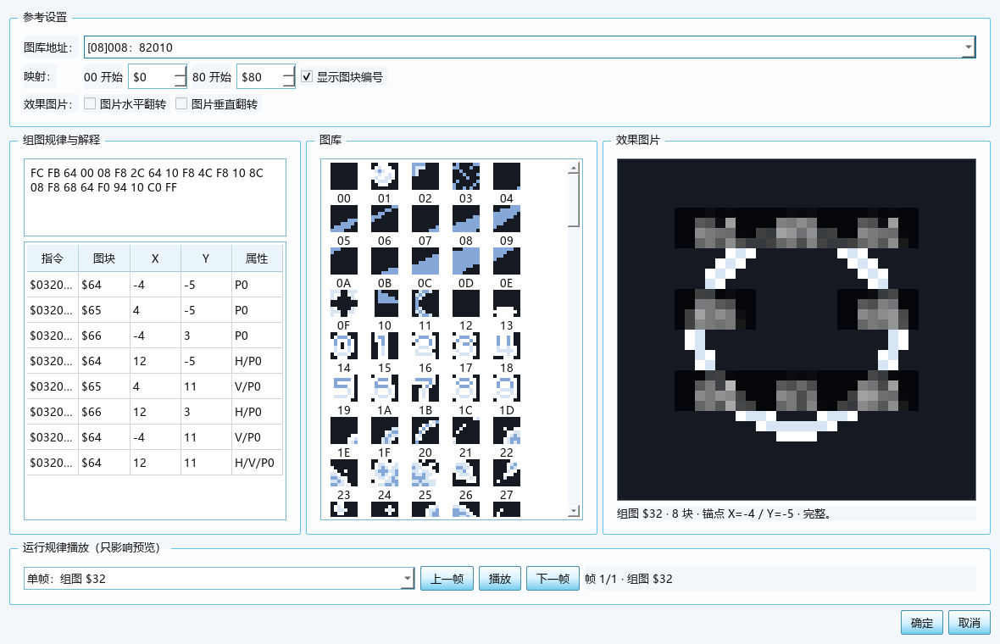

组图页的“动画拼图”会打开“物理拼图”：可切换真实 4 KiB CHR 预览窗口，调整 `00/80` 两段逻辑图块映射，查看 256 块图库、逐条图块地址/X/Y/调色板/水平或垂直翻转，并显示实际拼图。窗口还可选择已确认是“组图帧序列”的运行规律，逐帧、连续或循环播放；这些预览控件不写 ROM。当前 249/249 个组图记录均可完整解释，81 个帧规律中 79 个可离线完整播放；规律 `$12` 的循环次数来自运行时参数，`$21` 会切换运行时指针页，因此两项明确提示而不猜测。13 个组图使用 `$F0—$FF` 运行时图块令牌，对应块显示为未解析占位。运行/组图复制会连同引用或名称作为同一窗口事务提交并可撤销；指令体通用写回、任意通用搬移、37 条无安全参数或动态/不完整背景及其余 8 个调用仍未开放。

可运行 `.\.venv\Scripts\python.exe tools\report_m12_animation_compatibility.py` 复验六张指针表、地图/运行/组图/背景/调用的单字段差分、地图动画/运行规律/组图三类预留槽复制、非法写入拒绝、249 个物理拼图、离线播放及 8 个只读调用的逐项证据审计；报告写入 `output/verification/m12-animation-compatibility.json`。参考窗口三页签、组图首图块正向黄金与 X/Y 否定黄金汇总在 `output/verification/m12-reference-dynamic-2026-09-19.json`。报告通过代表当前安全实现范围完成，但仍不等于用户签收，其他逐字段参考黄金仍可继续补强。

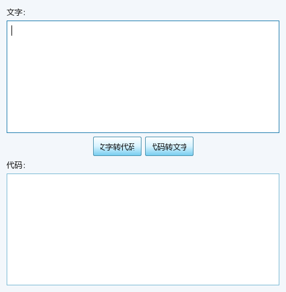

文字转换使用参考修改器随附 `码表.ini` 的 2713 条非空映射（配置文件共 3328 行），控制字节 F2 按参考窗口显示为反斜杠。“文字转代码”和“代码转文字”都不会修改 ROM，适合在编辑剧情前核对 Token。打开 `.dcmod` 后，文字转换与剧情页还会叠加该工程由文字库自动分配的自定义字符；没有自定义映射时参考输出不变。ROM 编辑页仍在同一基础码表上增加换行、结束符和原始字节的可见占位符。

窗口仍保持文字区、双向转换按钮、代码区六个可见控件，不增加状态栏或确认按钮。文字区与代码区使用白底圆角输入卡片，聚焦时显示蓝绿色边框；“文字 → 代码”为蓝绿色主按钮，“代码 → 文字”为浅色次按钮，方向通过箭头明确区分。错误继续用临时提示显示，不会覆盖已有转换结果。

窗口初始尺寸为 473×483，可自由缩放；正常状态严格只保留参考窗口的两行标签、两个多行编辑框和两个 80×32 转换按钮，不显示额外状态栏或占位提示。产品当前以大写、空格分隔显示字节；无效十六进制和未编码字符不会覆盖已有结果，错误只用临时提示显示。可运行 `.\.venv\Scripts\python.exe tools\report_m13_text_conversion_compatibility.py` 复核码表、控制清单、重复字形首项编码及 ROM 零修改，报告位于 `output/verification/m13-text-conversion.json`。参考程序按钮的大小写/分隔符和非法输入动态行为仍须按 `docs/M13验收清单.md` 现场对照，不能用实现侧报告代替。

### 3.5 计算器、存档与其他

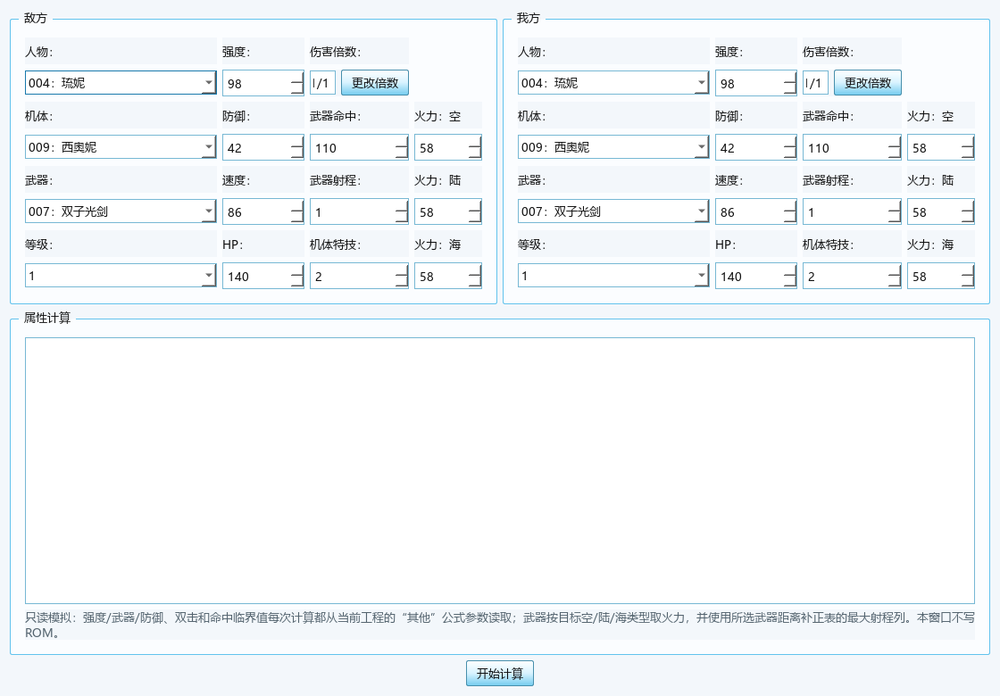

属性计算器已按参考窗口改为“敌方 / 我方”对称面板和逐行结果列表。人物下拉包含 001—200；机体下拉读取当前 ROM 的全部机体；武器下拉只显示当前机体实际装配的两个槽位，空槽显示“无”。当前推荐 ROM 会默认定位到人物 `$04`和第一台具有有效武器的机体 `$09`，装配武器为 `$07/$0B`。人物原码、精神、成长、补正与武器原码/特技/距离补正表改为下拉提示，不再挤占参考版面板。窗口采用1000逻辑像素默认宽度、940最小宽度，两侧第一列预留145像素，在完整显示常用武器名的同时避免横向拉伸过度。敌方使用低饱和暖灰、我方使用浅青灰、计算区使用中性冷白；字段标签改为透明底，分区更清楚且不形成大面积色块。

等级只允许 1—60，切换人物、机体或等级时，按固定成长值或 201—253 成长曲线累计，再加人物强度/防御/速度/HP 补正；三项战斗数值按游戏上限 255，HP 按 9999 截断。三地形火力与游戏及参考计算器使用同一“最终火力”口径：`floor(强度 × 强度系数 ÷ 强度除数) + ROM 武器地形火力 × 武器系数`，尚未扣除目标防御。默认人物/机体/武器组合因此显示 `floor(98×13÷10)+5×10=177`，不是此前误判的 58。如在“其他”窗口改了 M17 参数，下次计算会重新读取，不使用独立副本；手工改变强度时三地形最终火力也会同步刷新。

“开始计算”会分别输出我方和敌方的命中临界、最低命中速度、严格大于判定的双击边界、预计伤害、机体防御特技后实际伤害、剩余 HP 和击落次数。首次点击后开启实时联动：任一侧的人物、机体、武器、等级、属性、倍率、命中、射程、火力或特技变化，结果都会在同一事件循环自动重算，并把列表滚动到刚修改的敌方/我方段；打开窗口时仍保持结果区为空，避免尚未装配就显示无意义数据。每组结果的标题明确写成“阵营「人物／机体」使用「武器」→ 阵营「人物／机体」”，命中、双击、伤害和击落结论也重复主体，不再只显示脱离上下文的“可以命中”。命中使用当前武器距离补正表的最大射程列后与 M17 临界值比较；最低速度按 `ceil(临界值×100÷距离补正)+守方速度−武器命中` 求出实际最小整数，并直接显示“至少为 N”、目标速度、武器命中、临界和距离补正。旧修改器会在相同装配下给出负数估算，未按当前完整命中链路求精确边界，因此不作为新窗口的数值目标。伤害按目标机体的空/陆/海类型选用对应最终火力，再减 `floor(目标防御×防御系数÷防御除数)`；默认组合为 `177−42=135`。机体特技下拉只保留当前伤害计算实际处理的6项：无、T防御系统、相对转移装甲、VPS防御系统、重力波罩和用盾防御。先制攻击、反伤、一击脱离等不改变本计算器伤害的标志不进入下拉；机体原始组合值仍保留在提示中。选择后结果实时重算，但只影响当前计算器，不写入ROM。本窗口始终不写ROM，无确定/取消。参考版两个“更改倍数”按钮会触发运行时错误；新修改器不复刻崩溃，而是把它们实现为安全的分子/分母编辑框，范围均为1—99，只影响当前窗口本次计算。倍率也可直接按“分子/分母”格式输入。实现侧机器门禁见 `output/verification/m15-attribute-calculator.json`，完整现场步骤见 `docs/M15验收清单.md`；该增强不宣称参考版按钮已有正常黄金行为。

存档修改器不依赖当前 ROM：未载入 ROM 时，“数据”菜单仍显示且只有“存档修改器”可用。窗口只接受恰好 8192 字节的 FCEUX/Mesen 电池存档；“读取存档”会检查三个固定槽位（文件偏移 `$1C81/$1D7E/$1E7B`，每槽 `$FB` 字节）及各自 16 位小端累加校验和，并以 `N：第NN关 · X人` 或 `N：没有数据` 显示摘要。关卡原码为 0—31，界面显示 01—32。

上表共 11 列，读取所选有效槽的 16 格常驻队伍；所选槽无数据时，以活动记录 `$1411` 的常驻区作为新槽模板。人物、机体、等级、机动/强度/防御/速度/HP 附加值及 EXP 均来自已确认字段；载入 ROM 时显示人物/机体名称并把附加值换算为最终属性，未载入 ROM 时名称显示十六进制 ID、属性列显示原始附加值。下表同为 11 列，读取活动战场的 18 格敌方快照；人物、等级、机动、强度、防御、速度和当前 HP 对应已确认 SRAM 数组，可编辑。活动 SRAM 不保存逐敌机体 ID 和金钱，只有当前 ROM 的关卡部署可唯一匹配时才显示推导出的机体名称与基础金钱，这两列始终只读，不会伪造写入。

“写入存档”只改内存副本：把上表写入所选槽并重算校验和，把下表写回活动战场已确认数组；此时磁盘文件不变。“保存存档文件”才原子覆盖所选 `.sav`，覆盖前在同目录建立唯一时间戳 `.bak`。表格改后未先点击“写入存档”时禁止落盘；关闭含未保存内存改动的窗口会询问保存、放弃或取消。完整现场步骤见 `docs/M16验收清单.md`；实现侧协议报告为 `output/verification/m16-save-compatibility.json`，用户签收仍需单独填写。

旧版“其他”窗口已连接下列经反汇编与三份兼容 ROM 交叉核对的字段：3 项双击公式、5 项伤害公式、命中阈值、11 项道具效果，以及 6 组“人物 / 机体”初始阵容。当前界面会把数值嵌入完整的双击、伤害和命中公式中，并为 11 项道具效果及人物1/机体1至人物6/机体6逐项显示名称；道具名称以及“人物1：/机体1：”至“人物6：/机体6：”保留旧版末尾全角冒号，道具项按旧版四行三列顺序排列，避免只见数值、标签错位或遗漏标点，同时保持公式、道具和初始阵容三个区域清晰可辨。初始人物和机体下拉同样只显示 10 行；打开弹层的第一次按住移动与松开不会改动原配置，必须再次明确单击条目才会形成草稿。人物 `$1D/$1E` 的“？？？”是 ROM 正式名称，不属于缺字或空槽。打开窗口时读取当前 ROM，按“确定”把全部值作为一个撤销事务写入，按“取消”不产生修改。人物和机体下拉框保留 ID 0，以便无损打开特殊或占位记录。全部数值使用 0—255；伤害公式第 3、5 项是除数，不能为 0。经参考 EXE 的 20 项单变量保存与重开实验确认，双击公式每项实际有三份运行时操作数；修改器会同步写入全部三个镜像，避免不同战斗路径取到旧值。载入时和每次写入前都会校验公式/效果立即数周边的固定 opcode、存储目标、跳转或调用目标；立即数本身是通配位，因此合法改过数值的 ROM 仍能重开，但代码上下文已移动或损坏时会拒绝写入。M17 机器门禁 `output/verification/m17-global-compatibility.json` 会同时复验 38 个物理落点、32 个逻辑字段和 33 份参考黄金用例。

道具区的名称和值按旧版控件实际空间位置配对，而不是按控件编号大小猜测：从左到右、从上到下依次为超合金Z、磁性涂料、传感器、C装甲、超合金W、助推器、传感器2、M合金、电子盾、正义、医治；推荐 ROM 对应显示 `1,1,1 / 5,3,1 / 3,3,25 / 25,50`。窗口默认采用接近旧版比例的 `780×540` 逻辑像素；只保留公式、命中/道具和初始机体四个主要分区，不再给每个字段叠加独立边框。三个公式区使用无色块标题和左对齐公式行，避免内容悬在大面积空白中央；道具与初始阵容采用紧凑的“标签＋输入框”排列，底部状态改为单行提示，使信息密度和操作位置更接近参考窗口。

M08—M18 的汇总机器门禁见 `output/verification/m08-m18-delivery-gate.json`，实现状态、每个模块的验收入口和未关闭范围集中记录在 `docs/M08-M18验收汇总.md`。

系统文字和成长方式位于数据库“其他修改1”；道具名称、价格及说明位于“其他修改2”。商店店员与对话的具体支持范围见对应页面和差异矩阵。

## 4. “扩展功能”菜单：新能力

新功能没有挤占参考工具的“数据”菜单，统一放在“扩展功能”：

| 入口 | 用途 |
|---|---|
| 完整ROM数据读取 | 七类结构化全表、文件偏移、完整原码及逐字节 HEX（只读） |
| 战斗背景音乐 | 修改双方战斗曲，导入 `$9D–$9F` 扩展曲槽 |
| 机体导入与 CHR 图像 | 导入/导出 `.dcunit`，编辑已验证的活动 CHR 图块 |
| 扩展容量规划 | 自动给地图、机体和剧情分配 Bank 并接通运行时 |
| 工程概览 | 查看 Mapper、哈希和可用资源 |
| 变更与验证 | 查看字节改动并运行完整结构检查 |

**制作信息与出演名单：**该内容属于地图动画 `$13`“制作信息介绍与序幕”和 `$14`“序幕下移滚屏”的演出链。打开“数据 → 地图动画”，选择 `$13` 或 `$14`，再点击左侧“字幕内容（制作信息与出演名单）”。窗口左侧编辑、右侧即时预览，Enter 写入原 `F1` 分行码，普通空格写入原 `AF` 对齐码；两段同时显示字节、行数和单行显示格。制作信息限制为 75 字节、3 行、每行最多 18 格；出演名单限制为 109 字节、11 行、每行最多 10 格。较短内容用 `AF` 补齐，任一限制超出时禁用确定，因此不会移动后续数据或破坏原滚屏版面。字幕窗口“确定”只暂存到地图动画草稿；此时打开快速预览或游戏内真实预览，会使用已暂存的字幕和动画，但不提前改动工程。随后地图动画窗口“确定”才把动画、字幕、可能自动补入的字模和工程映射作为一个可撤销事务提交，地图动画窗口“取消”则统一放弃。

推荐 ROM 的“勒”位于出演名单第三段“盖塔　太勒”，代码 `C9F3`。若在本窗口删除或替换该字并确定，全 ROM 引用会由 1 降为 0，之后才会出现在字库的安全回收结果中；仅清空字模而不先移除正文引用会被保护规则阻止。

### 4.1 自动容量规划

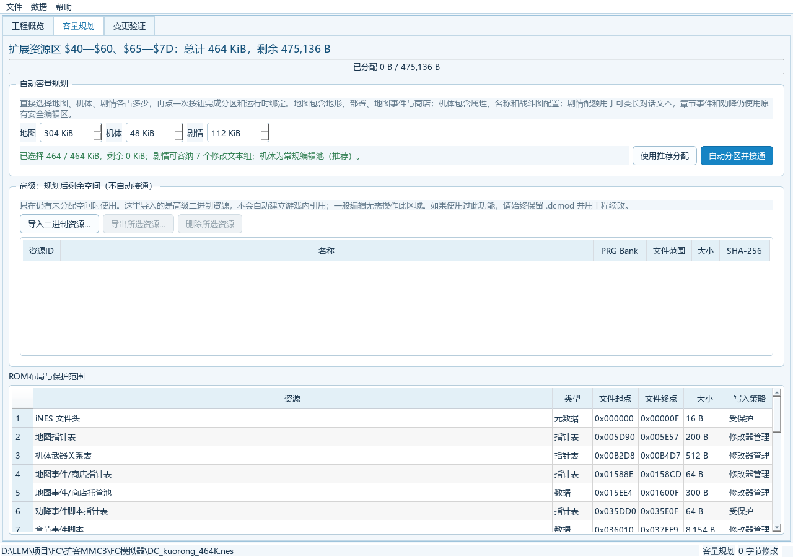

推荐基线共有 464 KiB 托管空间。第一次需要扩展内容时，从“扩展功能 → 扩展容量规划”选择地图、机体和剧情额度，再点击“自动分区并接通”。推荐值为：

| 类别 | 推荐 | 规则 |
|---|---:|---|
| 地图 | `304 KiB` | 8 KiB 递增，共享给地形、部署和触发点 |
| 机体 | `48 KiB` | 可选 48/64/80 KiB；普通编辑选 48 KiB |
| 剧情 | `112 KiB` | 每 16 KiB 对应一个可变长文本组 |

三类配额按完整 Bank 固定边界，分配器会登记占用并禁止相互覆盖。规划完成后不需要手工填写运行时指针。`$61–$63` 是扩展音乐，`$64` 是双音频桥，`$7E–$7F` 是固定程序 Bank，均不会交给普通资源分配。

### 4.2 机体包和 CHR

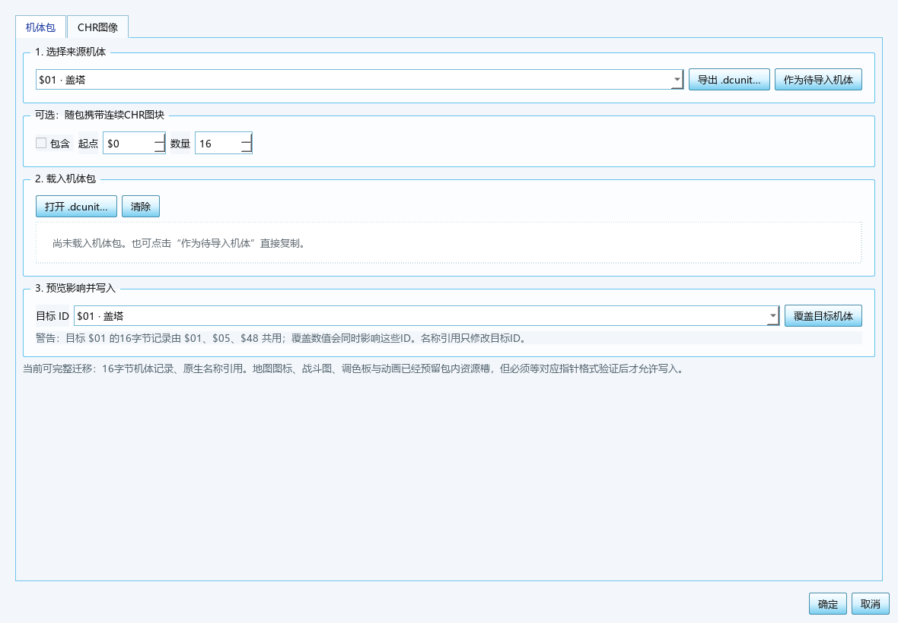

`.dcunit` 当前携带 16 字节机体记录、名称引用和可选连续 CHR 图块。机体的两格独立武器表不在版本 1 包内，导入不会随包覆盖该表；导入前先核对目标 ID 和图块范围。目标当前若使用重复属性指针，导入时会自动拆分，数值与名称均只覆盖目标机体。

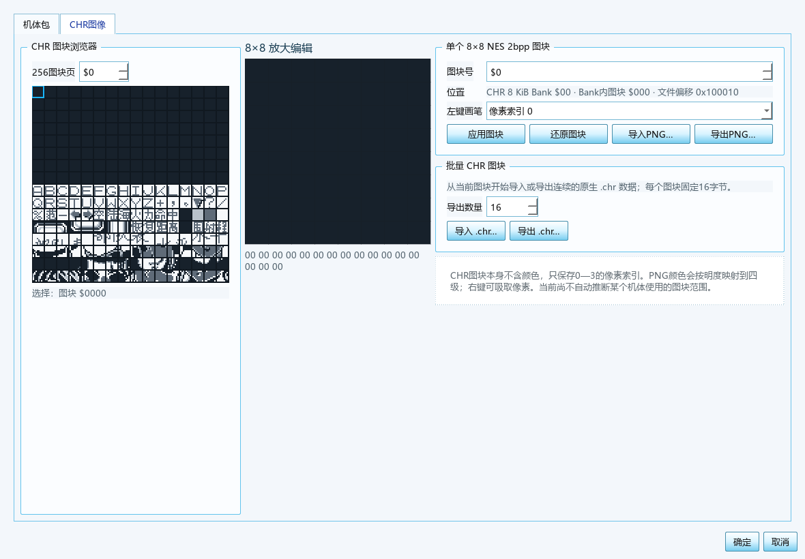

CHR 页提供真实 8×8 图块的放大绘制和 PNG/CHR 导入导出。NES 图块只有 0–3 四级像素索引，不自带颜色；批量导入前必须确认连续图块范围。

单块 CHR 画布属于窗口草稿：切换图块、切换图块页或按外层“确定”时会自动提交合法像素；像素值无效时阻止切换并保留原画布。CHR 和 `.dcunit` 导出会把当前合法画布直接叠加到导出内容，只在文件写入成功后提交草稿；取消文件选择或写入失败不会暗中改动 ROM。导入时会在确认后把已有合法画布作为可撤销基线保留。“取消”仍会回滚本次窗口事务。

### 4.3 战斗音乐

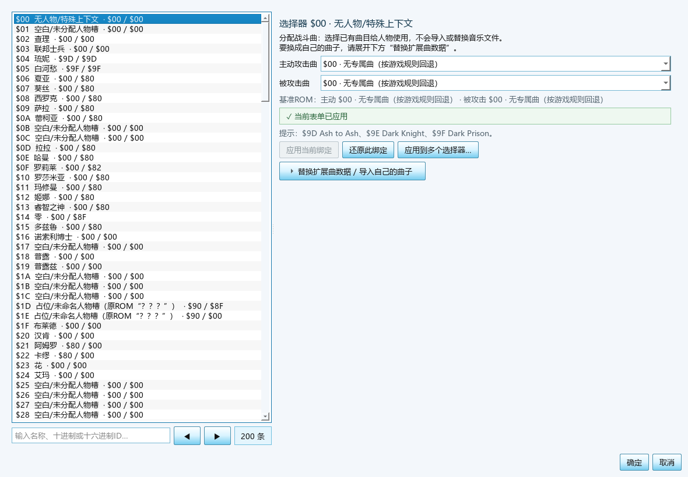

选择器可分别设置主动攻击曲和被攻击曲。扩展曲槽固定为 `$9D`、`$9E`、`$9F`，每槽占一个 8 KiB Bank。导入后必须运行完整检查，并在 Mesen 中验证播放、音效和切回旧曲。

“分配战斗曲”只给人物选择已有曲目，不会导入歌曲。要替换歌曲文件，展开“替换扩展曲数据 / 导入自己的曲子”；它会影响所有使用该曲槽的人物。技术导入区默认折叠，双音频引擎和导入格式不变。

## 5. 工程、撤销、验证与输出

“文件”菜单保持参考工具的打开、保存、退出命令和分隔位置；“完整ROM数据读取”已移至“扩展功能”，不再插入参考“数据”菜单：

- `Ctrl+O` 打开基线 ROM。
- `Ctrl+S` 首次要求选择派生 ROM 文件名（D1 超集安全行为）；之后继续保存到该派生文件，不再选择文件名。覆盖派生文件前自动生成不重复的时间戳 `.bak`。
- `Ctrl+Alt+S` 在“工程”菜单中执行“ROM另存为”。

`.dcmod` 工程、IPS 和构建功能位于“工程”菜单：

1. 使用“工程另存为”建立 `.dcmod`，以后按 `Ctrl+Shift+S` 保存工程。
2. 按 `F7` 打开“变更与验证”，处理全部错误；合法地图草稿会先提交，无效草稿会阻止检查并保留表单。
3. 使用“导出IPS”或 `Ctrl+B` 一键构建 ROM、IPS、工程副本和 JSON 报告。
4. 使用 `tools/vendor/mesen-0.9.9/Mesen.exe` 进入实际关卡、剧情和战斗验证。FCEUX 2.6.6 不适合验证本 1 MiB PRG Mapper 194 ROM。

所有“另存为”和资源导出操作（工程、ROM、IPS、机体包、CHR、音乐 Bank、扩展资源及字库模板）的默认目录均为 `output/exports/`。即使当前打开的是 `references/` 下的旧兼容基线，生成文件也不会默认写回只读参考目录。

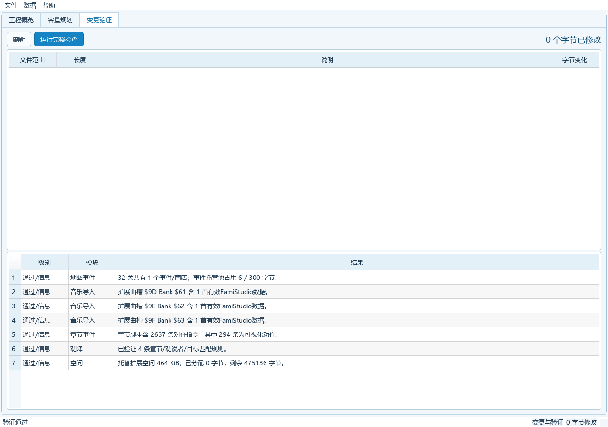

输出前会再次检查 iNES 头、受保护 Bank、分区边界、运行时入口、文本容量和事件长度。有错误时不会生成正式 ROM/IPS。`references/` 内的任何路径均为只读目标；“ROM另存为”仍要求不同于当前打开的路径。覆盖已有派生 ROM 时会先建立唯一时间戳 `.bak`，连续快速保存不会覆盖前一份备份。

按 `Ctrl+Alt+Z` 撤销、`Ctrl+Alt+Y` 重做。撤销当前合法地图草稿时，修改器会先把它作为一个事务提交并立即撤销；无效草稿会被保留并阻止撤销。存在任何地图草稿时，重做会被阻止，避免清空已有重做历史。`Ctrl+Z` 保留给参考工具的“文字转换”，因此不能再作为工程撤销快捷键。

## 6. 草稿、确定与取消

- **记录切换：**机体、人物、武器、文本、事件和 CHR 图块等页面在切换记录前自动提交合法草稿。剧情窗口切换关卡或外层总览时也遵循同一规则；非法草稿会把选中项恢复到原记录。
- **地图切换：**切换关卡或保存前自动提交合法地图草稿。
- **非法输入：**长度、容量、Token、坐标或必选项不合法时，切换和“确定”会被阻止，不会悄悄丢弃表单。
- **确定：**独立数据窗口会先提交各页尚未应用的合法草稿，再保留整个窗口会话。
- **取消：**无论页内是否点过“应用/暂存”，都恢复窗口打开前状态。
- **磁盘保存：**独立数据窗口的“确定”只改变内存；仍需保存 `.dcmod` 或按 `Ctrl+S` 输出派生 ROM，当前载入的基线不原地覆盖。

## 7. 常见问题

### 如何判断某个字段能否变长

修改器现在按资源池而不是按单条记录判断容量：已确认“指针表＋连续池”或“顺序记录池”的资源，会重排池内记录并同步指针；脚本还会同步已验证的内部跳转。可运行 `\.\.venv\Scripts\python.exe tools\report_legacy_memory_distribution.py`，从旧修改器保存前后 ROM 证据重新生成 `output/verification/legacy-memory-distribution.json` 和 `docs/research/legacy-modifier/旧修改器全模块内存分布.md`。报告里的写入区间只表示旧版实际改过哪些字节，不等于空闲空间；没有增长/缩短、别名和运行时证据的区域仍会保持固定长度或只读。

人物和武器名称按各自名称池的总容量判断，不要求每条名称与原槽等长；只有整个池的净增长超过已验证池尾时才拒绝。机体名称采用原生优先、独立池兜底的两级落盘，但容量门禁只有一套旧版口径：当前 255 个逻辑名称独立展开为 `1456 B`，加旧版净增长余量 `6701 B`，即显示 `1456/8157 B`；名称加长 1 B 后显示 `1457/8157 B`，剩余 `6700 B`。原生 693 B 物理区放不下时才分配 Bank pair，未修改不会预占扩展区。旧版 V5.1 的有效机体名称本来就是逐 ID 独立的；当前推荐 ROM 中 `$09/$0A` 的重复指针只是现有 ROM 布局，改 `$09` 时会自动拆分且不会连带改 `$0A`。总量超过 8157 B 时整次拒绝，不会覆盖武器名、初始配置正文或相邻未知数据。

数据库六个页签各自显示“本模块内存”，逐项列出 ROM 地址、固定结构/可重排池、共用对象、已用、容量、净增长余量和占用比例。固定结构显示“可改值”，含义是记录长度不能增加，但现有字段仍能正常编辑；“净增长 0 B”也不等于不可编辑。人物页摘要直接显示 Bank `$24` 的占用、共享余量以及“人物名称与属性已接通”，明细继续列出八类实际共用对象；“头像配置＋机体战斗外观共享尾区”按当前目录动态显示余量，头像拆分会在该复合区内重排。机体名称超出原生池后，机体页会明确显示“独立扩展池”；初始配置容量保持不变。某池的余量只能在已验证的共享关系内使用，固定区中的零字节、重复指针或旧工具差分间隙不算可用容量。

### 进入修改器后为什么是空白

这是未载入态：三页签空壳仍可见，但关卡列表为 `0 个地图`、编辑区禁用；“文件 → 打开”和 `Ctrl+O` 仍可用。选择兼容 ROM 后，标题追加 ROM 路径、关卡列表载入，地图和数据菜单才会启用。不会为方便操作而自动打开或改写推荐基线。

### 为什么图块是空位、地图没有地形

未载入 ROM 时没有 CHR 图块和地图记录可读；旧空界面出现的一格绿色和纯色方块是占位画面，不是游戏地图，现在不再显示。打开 ROM 后应出现实际图块与关卡地形。若标题已追加 ROM 路径、关卡数大于 0，但图块仍不正确，请提供该画面的截图、ROM SHA-256、所选关卡/图库和任何错误提示，以便按同一基线逐格核对；静态截图不能证明参考版与新修改器逐像素一致。

### 为什么一些看起来完整的按钮不能点

这些按钮按参考工具保留对应布局和入口，但其 ROM 地址或联动语义尚未完成差分验证。查看 tooltip 可以看到只读原因。真实预览不代表已允许写入。

### 点“确定”后原 ROM 为什么没有变化

“确定”只保留到内存会话。按 `Ctrl+S` 首次选择一个新 `.nes` 文件，之后继续保存到该派生文件；也可用工程菜单保存 `.dcmod`。当前载入的基线和 `references/` 下的 ROM 均不会原地覆盖。

### 文本或地图为何阻止切换

先阅读错误提示。常见原因是文本组超过 16 KiB、结束 Token 缺失、地图记录跨 Bank、部署坐标越界，或尚未进行扩展容量规划。

### 载入 ROM 或切换关卡为什么不再长时间卡住

当前版本只立即装载主地图页；机体、人物、武器、剧情、事件、容量等隐藏模块在第一次打开时才填充，之后复用页面内容。地图、初始配置和商店事件的全池容量统计会缓存未修改的编码正文，部署表也保留已创建的单元格控件，切换关卡不再反复扫描 100 张地图或销毁并重建整张表。任何工程写入、撤销或重做都会递增工程修订号并重建受影响 Codec，因此缓存不会掩盖新数据；首次打开大型事件页可能仍有一次性列表填充时间。

数据库和剧情编辑窗口现也按当前标签页延迟填充：打开窗口只准备首个可见页面，人物、武器、文本、商店、行动事件、劝降、地图事件及剧情文字在第一次切入对应标签时读取。已经打开过且工程数据未变化的数据库和剧情窗口会复用已解析页面；从其他模块修改 ROM 后则自动丢弃旧缓存并重建。其余工具窗口仍在关闭时销毁，以保证“取消”后的草稿不会在下次打开时复现，但共享的机体/人物/武器名称、剧情记录、CHR 图块、文字表和动画调用扫描会按工程修订号复用，写入、撤销、重做后自动失效。地图动画的 86 个动画选择框共享同一只读选项模型，不再各自复制 153 项；剧情总览和武器使用关系只在工程或当前记录变化时重算。

“完整 ROM 数据”窗口也采用逐页加载：打开时先显示轻量骨架，机体、人物、武器、地图、文字、动画、关卡事件和完整 HEX 只在第一次切入时解析，已加载页直接复用。大型表格初始保持 ROM 自然顺序，用户第一次点击列标题时才启用排序，避免仅为打开页面先做全表比较；机体页会一次读取全部外观表，文字页会复用已解析记录与共享项，不再逐行重复扫描相同指针池。

离屏/进程内计时只用于定位代码热点，不能当作用户从点击到完整画面出现的耗时。2026-09-28 使用正式单文件 EXE、Windows 原生输入和逐帧截图重新实测：冷启动到启动页约 `2.20 秒`，确认 ROM 到主地图完整绘制约 `2.34 秒`；地图动画首次完整出现约 `2.17 秒`、再次打开约 `1.17 秒`；剧情、字库、其他和文字转换首次分别约 `2.06/1.28/1.43/0.67 秒`。第一轮数据库测试在 `3.22 秒` 时仍出现白色内容区，完整内容约在 `3.2—3.8 秒` 内出现；进一步把五个隐藏标签的控件树改为首次访问才创建后，新正式版约 `2.75 秒` 已完整显示机体页，不再先显示白色内容区，再次打开约 `0.70 秒`。这些数值包含每次约 `0.5—0.7 秒` 的画面和可访问树采集开销，但仍比单纯构造函数计时更接近实际手感。原始离屏数据仅保留在 `output/build/profile-ui-all-modules-after.txt` 供开发诊断，现场数据和方法见 `output/build/profile-ui-actual-windows.md`；可按 `docs/性能与流畅度验收清单.md` 逐项复验。

### 输出 ROM 可以重新打开吗

可以。新 DC 扩容基线保存出的普通派生 ROM 即使没有自动容量规划表，只要固定代码认证、预留扩展区全零及完整性检查通过，也可用“文件 → 打开”或 `Ctrl+O` 在新会话中直接续改。带自动规划表的输出仍按规划布局与完整性检查重开；其他非基准哈希且无规划表的兼容 ROM、或预留区含未登记数据的 ROM 会被拒绝。普通派生 ROM 即使已经由地图页把事件表归一化到内置托管池，重开后也能继续执行首次自动容量规划；程序会先保留全部事件语义，再回收旧托管池安装扩展 Hook。若使用过高级资源分配，仍建议以原 `.dcmod` 续改，以保留资源 ID、名称和分配意图。旧版程序若弹出“只有带有效自动容量表的修改器输出 ROM 可以直接续改”，请换用本次更新的 EXE 重开；无需重复覆盖源 ROM。

## 8. 快捷键速查

| 快捷键 | 功能 |
|---|---|
| `Ctrl+O` | 打开 ROM |
| `Ctrl+S` | 首次选择派生 ROM；之后保存到该派生文件 |
| `Ctrl+D / W / M / Z / J` | 数据库 / 文字库 / 地图动画 / 文字转换 / 剧情事件 |
| `Ctrl+F / L / T` | 批量导出机体 / 批量导出全部人物头像 / 其他 |
| `Ctrl+Shift+O` | 打开 `.dcmod` 工程 |
| `Ctrl+Shift+S` | 保存 `.dcmod` 工程 |
| `Ctrl+Alt+S` | ROM 另存为 |
| `Ctrl+Alt+Z / Ctrl+Alt+Y` | 工程撤销 / 重做 |
| `Ctrl+B` | 一键构建 |
| `F7` | 完整检查 |

最后确认：载入的基线 ROM 仍在原处、派生 ROM 使用新文件名、已有派生文件的 `.bak` 可恢复、工程已保存、完整检查无错误，并已在 Mesen 中覆盖实际修改场景。`references/rom/source/新DC.nes` 是只读源素材，不能作为输出目标。对外发布时优先提供 `output/patches/` 中的 IPS、说明和 `output/reports/rom-build/` 中的报告，不直接分发可能受版权保护的 ROM。

## 9. 项目文档

目录整理不会改变 EXE、ROM、工程或快捷键的使用方式。维护与深入阅读入口如下：

- 根目录 `README.md`：项目概览、快速开始、目录结构和开发命令。
- `docs/新DC修改器已实现需求规格.md`：按需求编号汇总当前已交付能力、限制、非功能要求和验收证据。
- `docs/DC修改器设计与实现方案.md`：分层架构、功能边界和后续扩展条件。
- `docs/ROM定制修改器建设方案.md`：从本项目提炼的跨 ROM 定制修改器方法、风险分级、验证门禁和启动清单。
- `docs/research/legacy-modifier/SRW2一比一复刻差异矩阵.md`：参考 EXE 的逐功能现状、缺口和完成判据。
- `docs/提交记录.md`：已完成改动及对应验证记录。
- `output/pdf/DC修改器使用说明.pdf`：本说明书的生成版 PDF。
- `references/legacy_modifier/`：旧修改器与其配置快照，仅作逆向和交互参考，不是当前修改器源码。

## 机体拼图与碎片拼图的旧版功能对照

- 机体拼图的清空、上下左右移动、调换图库及 `8×8 / 7×9 / 9×7 / 10×6` 四个模板，均按旧修改器保存后的脚本字节执行；移动碰到旧版 16×16 战斗画布边界时保持原脚本，不越界写入。
- 旧修改器的 `7×9` 按钮经黄金样本确认不会改变脚本，新修改器保持同样结果；`8×8 / 9×7 / 10×6` 继续生成旧版同形脚本。
- 碎片拼图的四向移动、清空和整体水平/垂直翻转均按旧版坐标系执行。整体翻转会镜像全部坐标、切换图块翻转状态并重新压缩指令，不是只改一个显示标志。
- 普通上传、压缩上传、偏移、图库尾部保留、清空、确定、取消及越界拒绝仍遵守既有事务规则。机体非整图块尺寸按阵营贴底补背景（我方左下、敌方右下），不缩放或裁剪；压缩导入可为减少图块按用户设定的 `1—7 px` 上限自动无损微移，默认 3 px，状态栏会显示方向和距离。碎片压缩上传仍在不缩放、不重新居中的 128×128 原图上求解并证明全局最少图块数。无法证明或容量不足时整次拒绝，不留下部分草稿。
- 自动黄金报告位于 `output/reports/m05-puzzle-functional-golden-parity.md`，用于核对 17 项旧版动作的输入脚本、旧版结果和当前结果。
- 已验证的正式程序位于 `output/app/新DC篇完整修改器.exe`；2026-10-01 大型机双图库导入修正版 SHA-256 为 `E323DE32A5CBA5C4C3B34BE41663F7DF3D17A2E768A9720E3CA6B7C05A59EDDB`。
- 旧版功能发现分母已扩展到 3376 个稳定递归动作，覆盖左键、右键、双击、拖拽、键盘、上下文菜单、系统文件框和多级子窗口；参考证据为 3376/3376，待办为 0。此数字用于防止旧入口遗漏，实际 ROM 写入仍受各模块保存黄金和容量门禁约束。

### 旧修改器递归功能发现状态

“控件已登记”不再等同于“功能已经找全”。`output/reports/legacy-interaction-frontier.json` 会把参考窗口中的每个标准控件、自绘区域、菜单项和显隐/启用状态变化拆成可执行动作：左键、右键、双击、拖拽、逐项选择、边界输入、键盘激活、快捷键及条件触发均独立计数。动作必须具有旧版实际结果、新版对应结果和保存/取消影响证据后才可从 `pending` 关闭；执行过程中发现的新窗口、新菜单或新状态会继续扩大分母。

武器“光束拼图”和“物理拼图”使用两种不同代码。物理拼图按已验证的 OAM 最短指令流编辑；光束主页面会像旧版一样把可选的初始坐标和下一张图片坐标从代码栏拆出，代码栏只显示绘图正文。例如 `$07` 显示 `78 FF`，并单独显示下一坐标 `X=-2 / Y=0`。光束拼图可解析和编辑直接图块、`F3 DY DX` 相对位移、`FD 20 width` 行宽、`F8 count tile` 重复图块和 `F9 count first` 连续图块；编辑后的紧凑流必须解码回与草稿完全相同的坐标、顺序和图块后才能交回父窗口。打开后不操作并确定不会规范化原码，仍保持原字节不变。含尚未识别控制码、缺结束码或非法参数的记录继续拒绝写入。

2026-09-29 首次状态化扫描读取 252 份窗口快照和 7 份菜单快照，生成 5297 个动作候选，当前全部处于待探索状态。这说明此前 24 个窗口、621 个可见控件和 1040 个交互控件只能作为起始库存，不能作为“旧版功能已全部找全”的证明。

数据库六页的真实右键递归扫描现已接入前沿：页签必须先在不触碰页面内容的第一阶段以自绘头部坐标区分，再在第二阶段复现同一控件签名后逐控件探测，避免把“切换当前机体/人物”等记录变化误判成新页。首份有效扫描完成 319 个右键探测、108 次真实菜单弹出；动作前沿扩大到 7338 项，仍全部是待验证状态。其中旧修改器业务菜单命令 55 项，Windows 输入框自动提供的平台菜单命令 1687 项，报告分开标记，不能用平台菜单夸大产品功能。人物列表右键已恢复旧版“复制人物 / 粘贴人物 / 导出人物”，武器列表右键已恢复“复制武器 / 粘贴武器”；复制内容仍只停留在数据库窗口会话内，按窗口“取消”会随整窗草稿回滚。
- 图库右键“从所选图块导入图片”以红框当前图块作为默认写入起点：主体第二图库会换算为当前页内 `$00—$3F` 偏移。碎片压缩导入会先自动显示图块编号；完成最少分块后询问是否自定义导入位置，选择“是”会对每一个生成图块依次输入 `$00—$7F` 十六进制图库编号，首项默认红框编号，后续默认上一项确认值加一且均可改；选择“否”则直接从当前起点连续写入，任一步取消都不留下图库或脚本草稿。8×8 单块和主体多块仍直接使用红框起点，空间不足时整次拒绝。
- 碎片页列表下方的“添加图块”可连续追加拼图项。每次可直接使用当前选中图块，或按旧修改器流程输入 `$00—$7F` 十六进制图库编号；新增项默认接在上一项右侧，超出一行后换到下一行，随后可在效果图中左键调整精确位置。取消选择或编号输入不会留下脚本草稿。

### 运动规律模拟器的旧版操作顺序

运动规律模拟器是有状态的记录工具，不是单击一次即可播放的预览器。先点“开始”，在提示框点“确定”，再到黑色画布内左键创建物体；随后第二次点“开始”进入记录状态。“移动”会按当前 X/Y 产生两轴运动字节，界面采用十六进制显示，例如十进制 X=12、Y=13 显示为 `0C`、`0D`。“鼠标模拟运动”可勾选后用鼠标轨迹记录，完成后取消勾选并点“结束”。关闭该工具或取消数据库不会写入 ROM。

旧版真实状态链已在隔离 ROM 上自动复验：开始、创建物体、再次开始、移动、鼠标模拟开/关、结束和外层取消全部可达，最终 ROM 完整哈希不变。该验证只证明旧版行为基线和当前入口对照，不代表武器修改模块的全部递归动作已经闭合。

新版现按同一顺序工作：初始黑底红轴画布不预先放置物体；未开始时点“移动”会提示“请先点击开始”。旧版真实桌面输入证明，宽高、X/Y 和采样框不是只能使用微调箭头的窄范围：输入宽度 `0`、`101`、`-1`，以及 X=`-129`、Y=`128`、采样=`0`，失焦后都会原样保留；高度还实际保留了 `2147483648` 与 `-2147483649`，因此这里是自由十进制编辑框，并非有符号 32 位业务门禁。屏幕几何进一步确认旧版 Edit 150 是宽度、Edit 170 是高度，不能按控件树的邻接顺序反推标签。五组上下箭头均有独立的 `0—100` 循环范围：`37→38→37`、`100→0`、`0→100`；越界正值点上箭头归 `0`，越界负值点下箭头归 `100`。新版使用同样的双重语义，并保留 Ctrl+A/C/V 和标准编辑右键菜单。进入记录后一次“移动”分别写出 X=`7F`、Y=`80`，即轴值按低 8 位生成两位十六进制，采样 `0` 视为每次都记录；负宽高在画布上仍按旧版可观察结果至少画一个像素。鼠标模拟记录相邻鼠标位置的增量。“播放代码（增强）”保留此前的离线代码播放能力，但与旧版“开始”录制动作明确分开，不改变旧版动线。

画布手势也按状态解释：只有第一次“开始”并确认后的创建态，画布左键才建立物体；结束后的空闲态双击、右键和拖拽不会修改代码或坐标，也不会弹出功能菜单。递归功能前沿已把可见的运行时 `Afx` 画布 ID 100 单独登记为四类动作；宽度、高度、X/Y、采样五个编辑框及五组箭头也已逐控件取得旧版证据。X/Y 运行规律代码框和旧版一样允许先保留任意多行草稿，支持原生全选、删除及右键编辑菜单；只有点击预览或实际使用代码时才校验两位十六进制字节，不会在键入阶段擅自删除内容。隐藏的 `_EL_DrawPanel` ID 280 已确认只是不可达模板，不再重复计入分母。四个规律页的真实功能分母现已 `266/266` 闭合：20 个常规按钮及 5 个条件/边界按钮、外层确定/取消均分别实跑左键、右键和焦点空格键；其中运行规律的图块增加按钮会稳定复现旧版自身“数组成员引用下标超出定义范围”错误，作为参考行为保留。四个主列表的真实数量为 `255 / 252 / 250 / 255`，共 1012 项均逐项完成左键、双击、右键和键盘 Home/Down 遍历；16 个输入框、4 个微调器、2 个下拉框、页签键盘循环及 62 项条件显隐/启用状态也已逐项实跑，数据库取消后 ROM 零差分。报告器现同时规范化主窗口 ROM 路径，并只为曾经可见且启用的控件生成手势；永久隐藏或禁用的模板仍参与状态发现，但不再制造不可执行动作。Windows 自带 Edit 右键菜单按 83 个已观察入口统计，不把随语言包变化的 27 个 Unicode/输入法命令当成产品功能；输入框右键与快捷键仍逐控件验证，产品自定义菜单命令继续逐项保留。机体拼图 `73/73`、碎片拼图 `62/62` 的按钮三手势、输入框、下拉框、碎片列表与条件状态也已在旧修改器中实跑；武器规律内的光束拼图 `28/28`、物理拼图 `38/38` 同样覆盖按钮三手势、下拉框和物理图块列表。每个会改草稿的按钮都从重新打开的子窗口开始，数据库最终取消，隔离 ROM 前后零字节差异。当前全局真实分母为 `3809` 项、已验证 `590` 项、待验证 `3219` 项，因此这些窗口闭合不代表全修改器已完成。
