# 新旧修改器 UI 布局与可视化黄金对照

> 对照基线为 `references/legacy_modifier/screenshots/`；新版截图由
> `tools/capture_dc_modifier_guide.py` 在固定 Qt 缩放下生成。不同 Windows
> 主题和窗口边框不做逐像素相等判定，核对的是信息架构、可视化内容和操作入口。

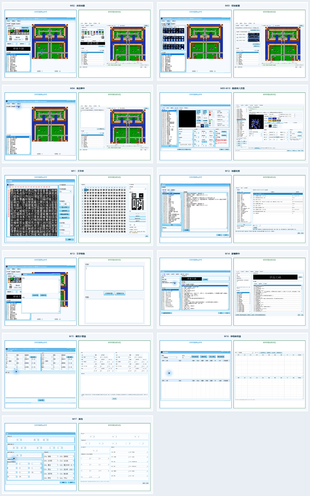

| 模块 | 窗口 | 结论 | 新增能力处理 |
|---|---|---|---|
| M02 | [战场地图](pairs/m02-battlefield-map.png) | legacy_core_plus_extension | 全景适应与缩放；对象叠加；容量规划和显式应用状态 |
| M03 | [初始配置](pairs/m03-initial-config.png) | legacy_core_plus_extension | 图库按需展开；部署明细；地图对象可视化与高级编辑入口 |
| M04 | [商店事件](pairs/m04-shop-event.png) | legacy_core_plus_extension | 事件/商店对象列表；地图标记；批量记录入口 |
| M05-M10 | [数据库六页签](pairs/m05-m10-database.png) | legacy_core_plus_extension | 真实合成预览；复制/粘贴/导入/导出；共享记录提示与事务状态 |
| M11 | [文字库](pairs/m11-font-library.png) | legacy_core_plus_extension | 12×12 直接点阵编辑；网格右键导入/导出与安全分配 |
| M12 | [地图动画](pairs/m12-map-animation.png) | legacy_core_plus_extension | 原始字节列；参数级编辑状态；已验证记录边界提示 |
| M13 | [文字转换](pairs/m13-text-converter.png) | legacy_core_aligned | 无额外可见控件 |
| M14 | [剧情事件](pairs/m14-scenario.png) | legacy_core_plus_extension | 真实 Bank/偏移状态；原始字节与结构化指令；更严格的容量报告 |
| M15 | [属性计算器](pairs/m15-attribute-calculator.png) | legacy_core_plus_extension | 从当前 ROM 联动真实属性；公式只读说明和损坏入口门禁 |
| M16 | [存档修改器](pairs/m16-save-editor.png) | legacy_core_aligned | 格式、校验和与未保存状态提示 |
| M17 | [其他](pairs/m17-other.png) | legacy_core_aligned | 实时工程值和安全校验提示 |

## 判定口径

- `legacy_core_aligned`：旧版主结构、可视化区域和主要操作入口保持一致。
- `legacy_core_plus_extension`：旧版主结构保持一致，新能力放入附加工具条、状态区、右键菜单或新增列，不替换旧入口。
- 图片 SHA-256 用于确认本次审阅使用的确切证据，不代表新旧主题像素必须相同。
- 该报告只证明 UI 结构与可视呈现已审阅；字段保存黄金、模拟器结果和用户签收仍按各模块独立门禁。

## 分窗口可视功能清单

### M02 · 战场地图

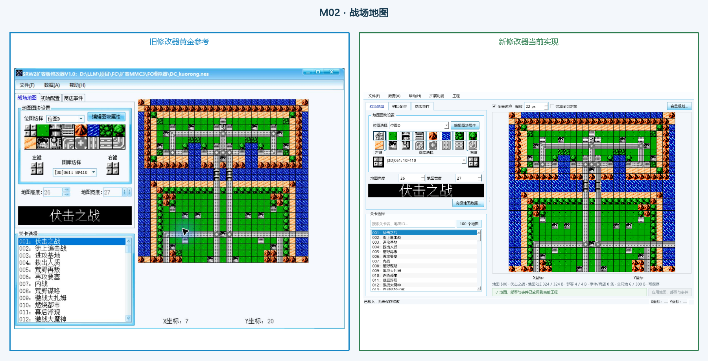

- 旧版可视功能：三张主页签；左侧图块与双画笔；关卡标题和列表；右侧地图画布；X/Y 坐标。
- 新版增强：全景适应与缩放；对象叠加；容量规划和显式应用状态。
- 证据：`references/legacy_modifier/screenshots/01_战场地图.png`（1257×998，SHA-256 `ACDD0C92A98C490C82730CD34E3E8AC88E298404159CD2A6B4CA823CA7E1C276`）对 `docs/images/dc_modifier/01-map-editor.png`（1180×760，SHA-256 `7BB56AC198CBA6C6DE5145663B072A2606DF2239D95A2E51B61294402DCF5779`）。

### M03 · 初始配置

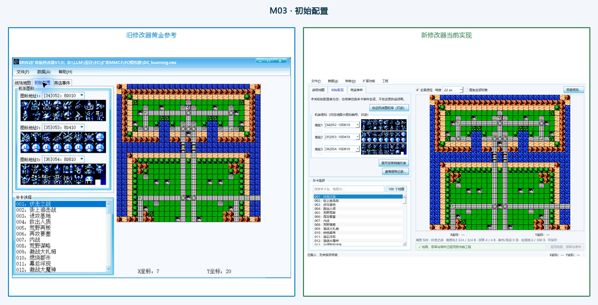

- 旧版可视功能：主窗口第二页签；三组图标图库；关卡共享选择；右侧地图定位。
- 新版增强：图库按需展开；部署明细；地图对象可视化与高级编辑入口。
- 证据：`references/legacy_modifier/screenshots/02_初始配置.png`（1257×998，SHA-256 `963E25152F7C19AA23206A07FAB7B79C9EBF5A0A0DCDEF1B0A7F756370AB4210`）对 `docs/images/dc_modifier/01b-initial-config.png`（1180×760，SHA-256 `A7538EB0E4AFCB5A944FF827F33A6B0AE233ABAB6B654DEC0A4DCE67614E17F7`）。

### M04 · 商店事件

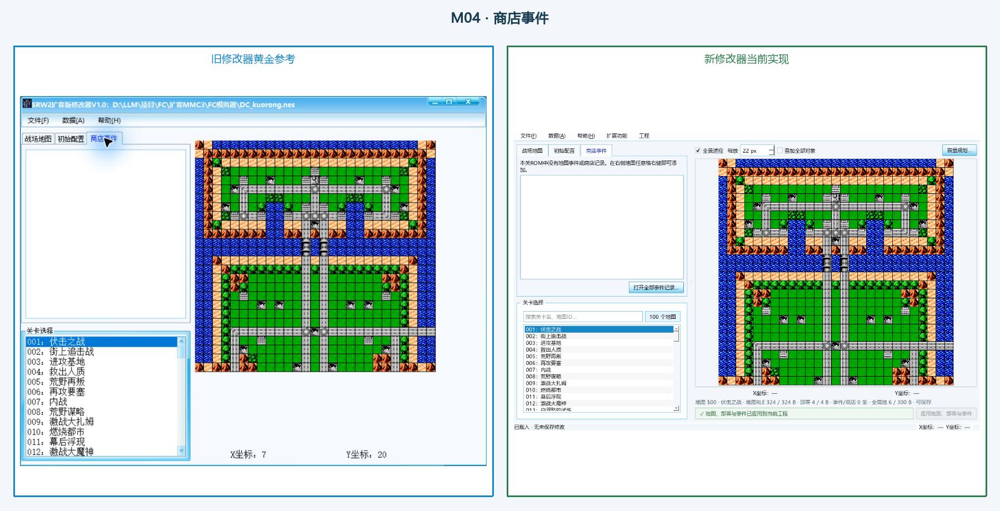

- 旧版可视功能：主窗口第三页签；关卡共享选择；空记录可辨识；右侧地图定位。
- 新版增强：事件/商店对象列表；地图标记；批量记录入口。
- 证据：`references/legacy_modifier/screenshots/03_商店事件.png`（1257×998，SHA-256 `20498A1C65E4772926BC1A8327194CB7ABECDAE98F6219D22891CB9DA671F483`）对 `docs/images/dc_modifier/01c-shop-event.png`（1180×760，SHA-256 `717CCA7012E72B89FA24FE52876D104DF25F0543644B800889E862CC5CC35AE7`）。

### M05-M10 · 数据库六页签

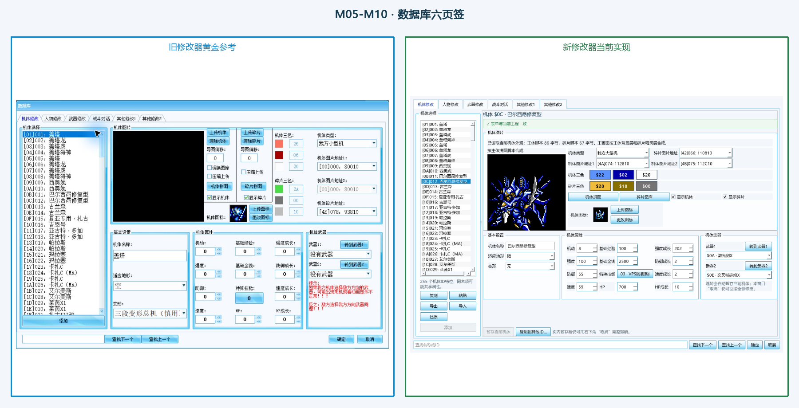

- 旧版可视功能：六个一级页签；左侧记录列表；图像区；属性分组；查找与确定/取消。
- 新版增强：真实合成预览；复制/粘贴/导入/导出；共享记录提示与事务状态。
- 证据：`references/legacy_modifier/screenshots/04_数据库.png`（1578×1053，SHA-256 `0B4ECF6CA1816493557FDB2DF80CAEF6443764C3862B7CDAA86FA995C5F4A94C`）对 `docs/images/dc_modifier/02-database.png`（1220×840，SHA-256 `6FF004848C5A0F550F1807F87A109D8F7AE0382F8C7BAEFC9F72C46787000074`）。

### M11 · 文字库

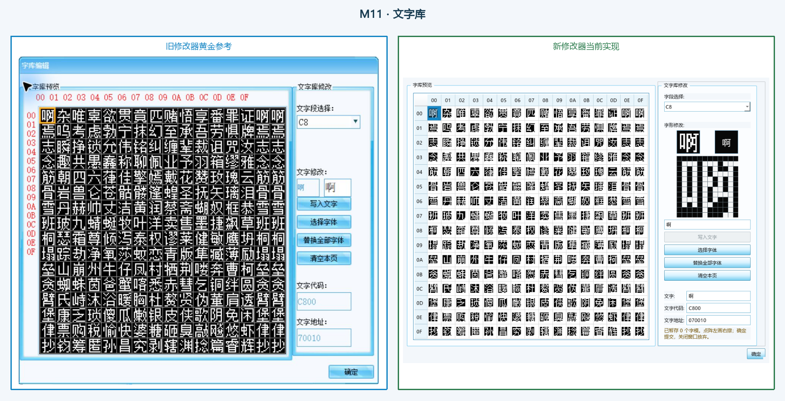

- 旧版可视功能：16×16 字模网格；字段选择；字形替换按钮；代码与地址；单一确定按钮。
- 新版增强：12×12 直接点阵编辑；网格右键导入/导出与安全分配。
- 证据：`references/legacy_modifier/screenshots/05_文字库.png`（951×866，SHA-256 `FB77C29381524E6D6EDE2EA7B24E9898269C4453346A09B00A509A7EB2DA6D30`）对 `docs/images/dc_modifier/04-font-library.png`（1000×780，SHA-256 `BFF2B6565F7BD0085A57E460584DC04CD078A328DB0BE6F878798C77AC13DCBD`）。

### M12 · 地图动画

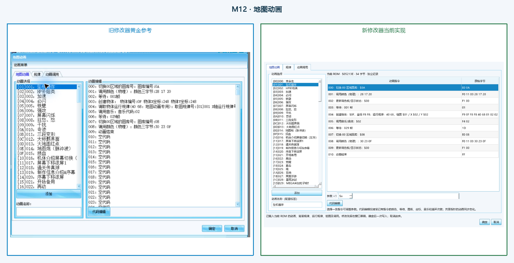

- 旧版可视功能：地图动画/规律/调用三页签；左侧记录选择；右侧指令列表；添加/名称/代码编辑；确定/取消。
- 新版增强：原始字节列；参数级编辑状态；已验证记录边界提示。
- 证据：`references/legacy_modifier/screenshots/06_地图动画.png`（1271×981，SHA-256 `B4B46EB3C49956C5968290E60A5931BD7E1D3FF34CCC0A7B46B036946A263EDC`）对 `docs/images/dc_modifier/05-map-animation.png`（1160×800，SHA-256 `30B3D2900C2010FCACD088D395ABDD574944ADBC8AADD69B1E08174A3D225444`）。

### M13 · 文字转换

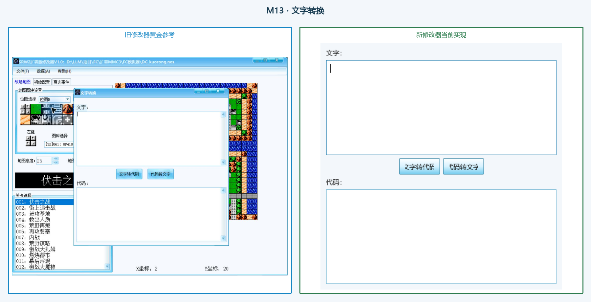

- 旧版可视功能：文字与代码双编辑区；居中的双向转换按钮；无 ROM 写入控件。
- 新版增强：无；保持旧版紧凑结构。
- 证据：`references/legacy_modifier/screenshots/07_文字转换.png`（1257×998，SHA-256 `C9143F9686D819B15530C17153D69DD40ABCBEAAF7F9819D708614112BFA7142`）对 `docs/images/dc_modifier/06-text-converter.png`（473×483，SHA-256 `5D9792591319671DD4CFED93490B6AF8198C93B8E68E2549BA7F840F98EEC8C3`）。

### M14 · 剧情事件

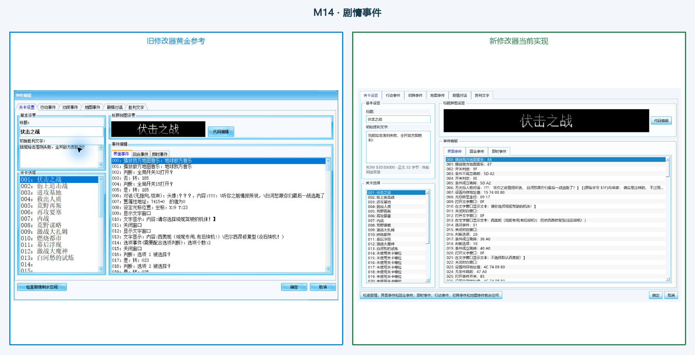

- 旧版可视功能：六个一级页签；章节设置与三类事件；标题预览；关卡列表；空间检查与确定/取消。
- 新版增强：真实 Bank/偏移状态；原始字节与结构化指令；更严格的容量报告。
- 证据：`references/legacy_modifier/screenshots/08_剧情事件.png`（1490×966，SHA-256 `527B8154EA6B1A7949F9FC9FB79607891CB94D2335979175F4766A73BBEE7505`）对 `docs/images/dc_modifier/03-scenario-editor.png`（1180×780，SHA-256 `3DD274D81AF8ABF338295ABD4A5F7FEF93CC4E791BE24194910F3AC377C75B45`）。

### M15 · 属性计算器

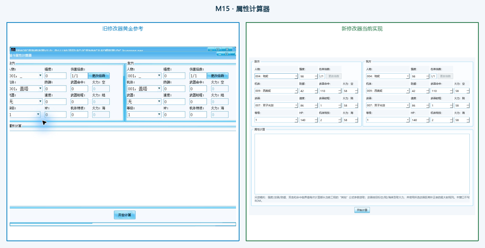

- 旧版可视功能：敌我双栏；人物/机体/武器/等级；属性计算结果区；开始计算。
- 新版增强：从当前 ROM 联动真实属性；公式只读说明和损坏入口门禁。
- 证据：`references/legacy_modifier/screenshots/09_属性计算器.png`（1257×998，SHA-256 `8250D9C53D47713123A190640F9634E011270D5E1BFA7F2261727C768B376694`）对 `docs/images/dc_modifier/07-attribute-calculator.png`（1120×780，SHA-256 `3B49CE56B08785250AC34DE1979A8D9022ECD485B69EBA7B8E98441C0D8CE391`）。

### M16 · 存档修改器

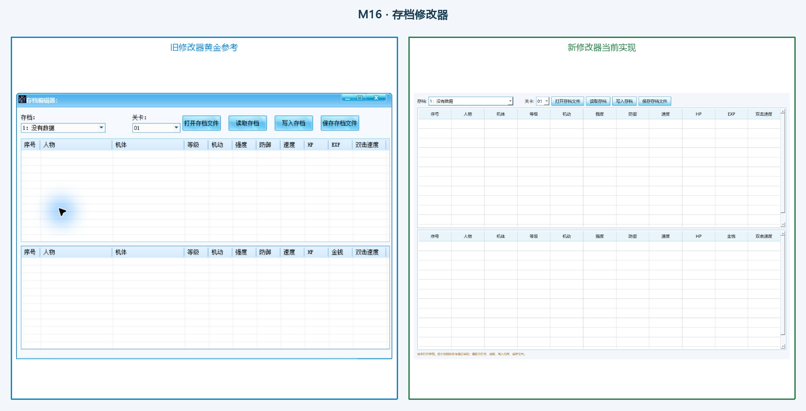

- 旧版可视功能：存档槽与关卡选择；打开/读取/写入/保存四步；上下两张十一列表。
- 新版增强：格式、校验和与未保存状态提示。
- 证据：`references/legacy_modifier/screenshots/10_存档修改器.png`（1175×834，SHA-256 `EAA6742E31DE6677F6035DCA9024843E6516D724C55B8707565499A71CB41CEB`）对 `docs/images/dc_modifier/08-save-editor.png`（1175×834，SHA-256 `BC280FB6F3A1F925CC1471F50738D1DB7A1D3D5773D6EA2D2CBBCE7067348780`）。

### M17 · 其他

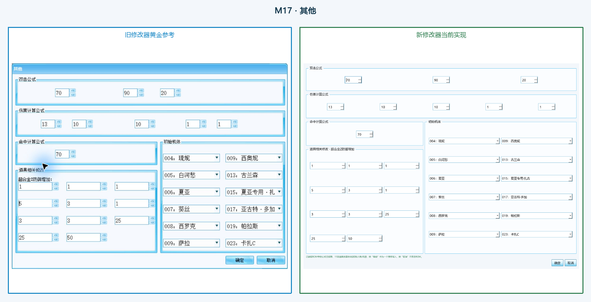

- 旧版可视功能：双击公式；伤害公式；命中公式；十一项道具参数；六组初始机体；确定/取消。
- 新版增强：实时工程值和安全校验提示。
- 证据：`references/legacy_modifier/screenshots/11_其他.png`（1166×870，SHA-256 `F1783345F6F647BBB45D29846D64D5F31CB93698483FD8082C0AEE53ABE261F8`）对 `docs/images/dc_modifier/09-other-settings.png`（1166×870，SHA-256 `060CC4D58BB8481D595A132B5B5707453C7910044033DA678CAB70D4F8D2B4A0`）。
